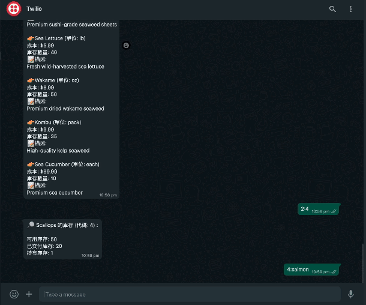
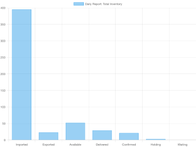
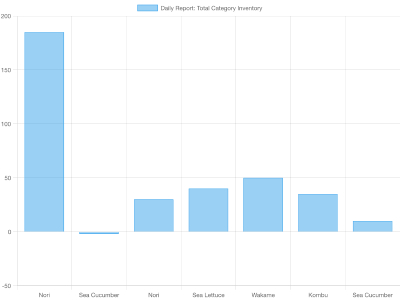

# Winful fish restaurant Automation Solution

## Background
Winful fish restaurant is a family-owned business with over a decade of experience in the seafood industry. The company heavily relies on QuickBooks for essential tasks such as invoicing, stocking, and accounting. However, manual processes have led to frequent errors in daily operations, prompting the need for an automated solution.

## Challenges
- Lack of a defined and automated process from order-taking to packaging, resulting in a notable number of human errors.
- Absence of a digital product catalog, limiting customer engagement and sales opportunities.

## Solution
To address these challenges, we have developed a Node.js application integrated with Twilio for real-time inventory tracking and order processing. The solution allows sales, warehouse, and admin personnel to use their smartphones to interact with a WhatsApp chatbot, enabling seamless communication and access to inventory information and reports.

## Benefits of WhatsApp Integration
- **Platform Portability**: WhatsApp is available on various platforms, ensuring accessibility for users regardless of their device.
- **No UI/UX Design Needed**: Utilizing WhatsApp's existing interface eliminates the need for additional design efforts, saving time and resources.
- **Low Cost**: Integrating WhatsApp is cost-effective, with affordable pricing plans for WhatsApp Business API and free usage for personal or small-scale business purposes.
- **Flexibility**: Leveraging WhatsApp's features such as text messaging, image sharing, and group chats offers flexibility in communication within the application.
- **Availability**: WhatsApp has a large user base worldwide, making it an accessible communication channel for your application's users.

## Video Demonstration
- **[Link to Video Demonstration](https://drive.google.com/file/d/1PZkC4S7X-VxIHeRyu2QMBo1XIYu1vxxM/view?usp=sharingw)**
- 

## Bar Chart

## Features
- Real-time inventory tracking: Keep track of available stock levels and receive notifications for low stock.
- Automated order processing: Streamline the order-taking process from initiation to packaging, reducing human errors.
- Digital product catalog: Provide customers with a digital catalog for easy browsing and ordering.
- WhatsApp chatbot: Enable sales, warehouse, and admin personnel to interact with the system via WhatsApp for convenience and efficiency.

## How to Use
1. **Setup Twilio Integration**: Configure Twilio to enable communication between the Node.js application and WhatsApp.
2. **Install Dependencies**: Install the necessary dependencies by running `npm install`.
3. **Configure QuickBooks Integration**: Integrate the application with QuickBooks to enable seamless data exchange.
4. **Run the Application**: Start the Node.js application using `npm start`.
5. **Interact via WhatsApp**: Sales, warehouse, and admin personnel can now interact with the system via WhatsApp to access inventory information, place orders, and generate reports.

## Contributors
- Calvin Tsang - Backend Developer / Leader
- Farouq Khan - Backend developer
- Christa Cheung - QA Tester / BA
- Lavi Leung - UI/UX Designer

