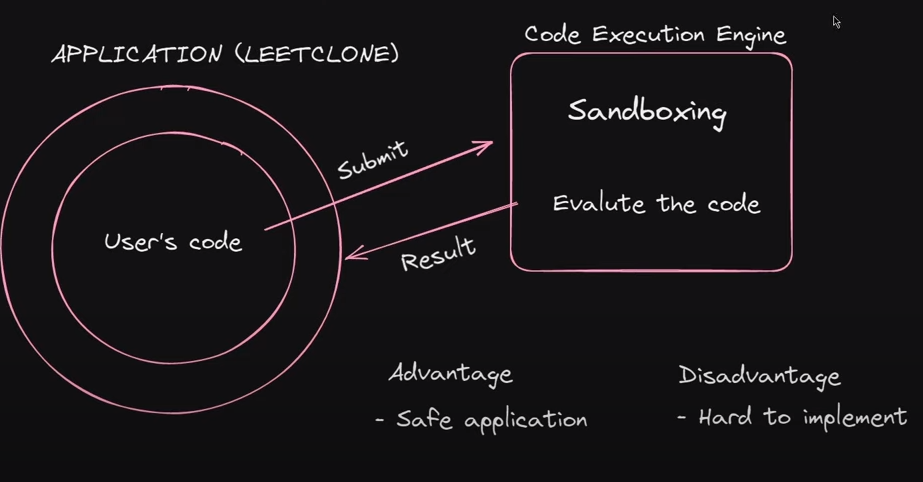

# LeetCode Clone

This project is a clone of LeetCode, built with a tech stack of Next.js, Firebase, React, TypeScript, and Tailwind CSS. It also uses several important libraries for various functionalities.

## Tech Stack

<div align="left">


  
  
</div>

## Libraries

- [**react-firebase-hooks**](https://recoiljs.org/docs/introduction/core-concepts/): A set of reusable React hooks for Firebase. react-firebase-hooks Documentation

- [**Recoil**](https://recoiljs.org/docs/introduction/core-concepts/): A state management library for React.

- [**react-toastify**](https://www.npmjs.com/package/react-toastify): Allows you to add notifications to your app with ease.

- [**react-confetti**](https://www.npmjs.com/package/react-confetti): Uses the canvas element to create a variety of confetti effects.

- [**react-icons**](https://react-icons.github.io/react-icons/): Include popular icons in your React projects easily with react-icons.

- [**react-split**](https://www.npmjs.com/package/react-split): React wrapper for Split.js.

- [**react-youtube**](https://www.npmjs.com/package/react-youtube): A React component for playing YouTube videos.

## Implementation

<div align="center">

</div>

## Getting Started

This is a Next.js project bootstrapped with `create-next-app`.

First, run the development server:

```bash
npm run dev
```
