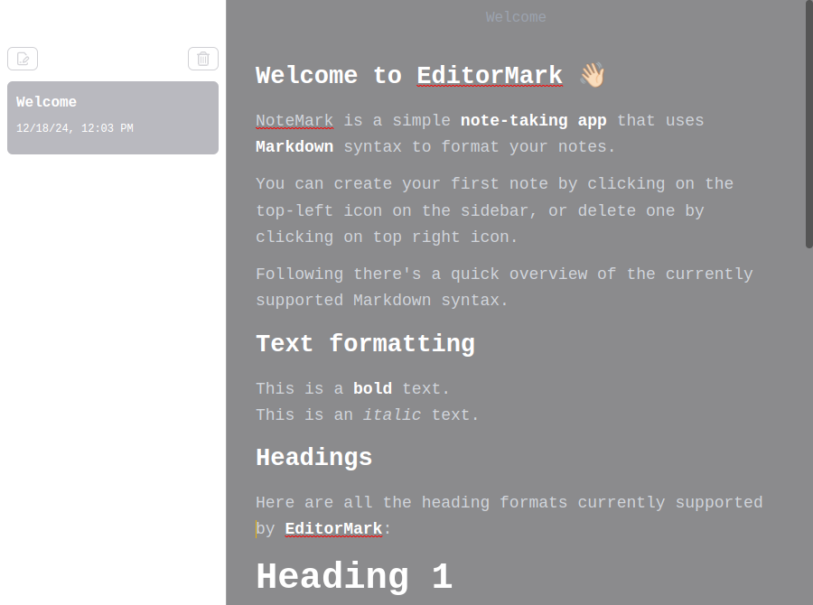

# EditorMark

A Note taking desktop app with out-of-the-box markdown support. Built with Electron and React.



You can follow along the entire development of this project here 👇


## Project Setup

### Install

```bash
$ npm
```

### Development

```bash
$ npm dev
```

### Build

```bash
# For windows
$ npm build:win

# For macOS
$ npm build:mac

# For Linux
$ npm build:linux
```
