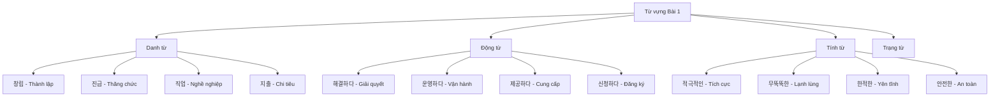
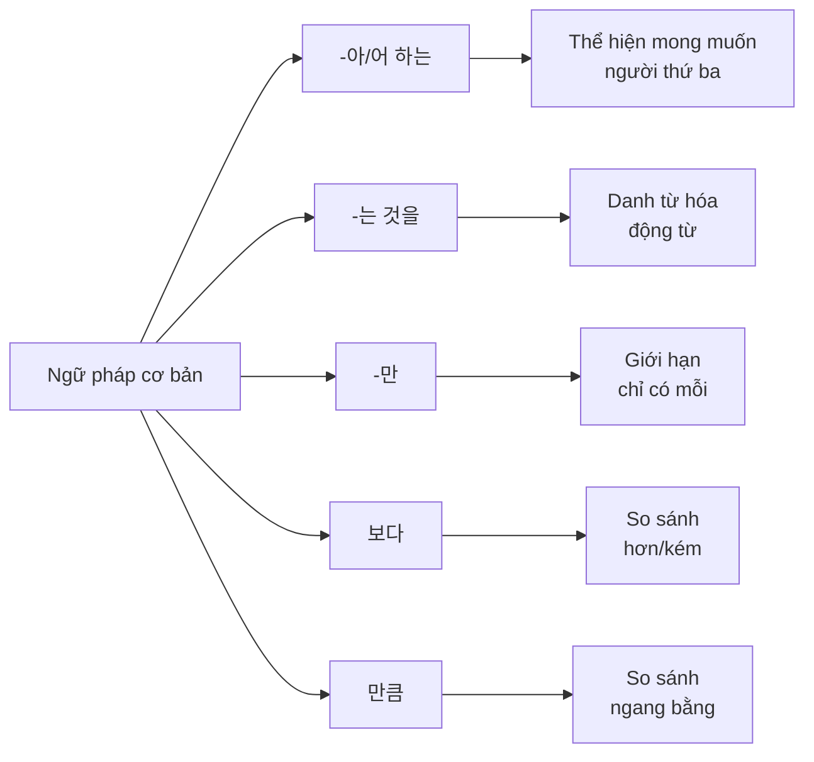
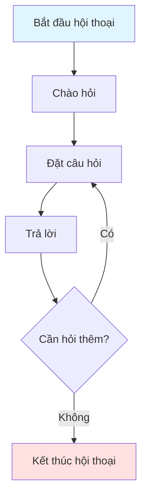
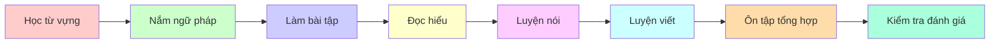

# 복습 1 - Ôn tập 1

## 📚 Giới thiệu

Bài ôn tập này tập trung vào việc củng cố kiến thức từ vựng và ngữ pháp đã học. Nội dung được trình bày theo phong cách sư phạm, giúp người học hệ thống hóa kiến thức một cách logic và dễ hiểu.

---

## 📖 Phần 1: TỪ VỰNG (어휘)

### 1.1. Bảng từ vựng theo chủ đề

#### 🏢 Chủ đề: Doanh nghiệp và Công việc

| Từ vựng | Nghĩa tiếng Việt | Ví dụ |
|---------|------------------|-------|
| 창립 | Thành lập | 창립 기념일이 다음 주에 있습니다 |
| 등록 | Đăng ký | 대학교 등록금이 많이 올랐어요 |
| 진급 | Thăng chức | 열심히 일해서 과장으로 진급했어요 |
| 적극적인 | Tích cực | 가: 제 딸은 성격이 적극적이 편이에요 |
| 무뚝뚝한 | Lạnh lùng, cộc cằn | 무뚝뚝한 사람들 앞에 서는 것도 좋아해요 |

#### 💼 Chủ đề: Thái độ và Tính cách

| Từ vựng | Nghĩa tiếng Việt | Ví dụ |
|---------|------------------|-------|
| 적극적인 | Tích cực | 제 딸은 성격이 적극적인 편이에요 |
| 무뚝뚝한 | Lạnh lùng, cộc cằn | 그 사람은 좀 무뚝뚝한 성격이에요 |
| 외향적인 | Hướng ngoại | 외향적인 사람들은 친구가 많아요 |
| 내성적인 | Nội hướng | 내성적인 성격이라 사람들과 잘 어울리지 못해요 |

#### 🏠 Chủ đề: Địa điểm và Phương hướng

| Từ vựng | Nghĩa tiếng Việt | Ví dụ |
|---------|------------------|-------|
| 한적하다 | Yên tĩnh | 이 동네는 한적해서 살기 좋아요 |
| 안전하다 | An toàn | 이 지역은 안전해서 밤에도 걸을 수 있어요 |
| 탁하다 | Đục | 물이 탁해서 마실 수 없어요 |
| 밝다 | Sáng sủa | 방이 밝아서 기분이 좋아요 |

#### 📞 Chủ đề: Giao tiếp

| Từ vựng | Nghĩa tiếng Việt | Ví dụ |
|---------|------------------|-------|
| 죄송해 | Xin lỗi | 가: 이 티셔츠 지난주에 산 건데 얼룩이 있어서요 |
| 환불해 | Hoàn tiền | 나: 아, 죄송합니다. 그럼 다른 걸로 교환해 드릴까요? |
| 교환해 | Đổi hàng | 가: 환불 대신 교환해 주세요 |
| 문의해 | Hỏi thăm | 나: 궁금한 것이 있으면 언제든지 문의해 주세요 |

#### 🎯 Chủ đề: Hành động

| Từ vựng | Nghĩa tiếng Việt | Ví dụ |
|---------|------------------|-------|
| 해결했다 | Đã giải quyết | 어려운 문제를 성공적으로 해결했어요 |
| 운영했다 | Đã vận hành | 우리 동네 복지 센터를 잘 운영했어요 |
| 제공했다 | Đã cung cấp | 학생들에게 좋은 프로그램을 제공했어요 |
| 신청했다 | Đã đăng ký | 대학교에 입학 신청했어요 |

#### 🔢 Chủ đề: Tài chính

| Từ vựng | Nghĩa tiếng Việt | Ví dụ |
|---------|------------------|-------|
| 직업 | Nghề nghiệp | 어떤 직업을 가지고 싶어요? |
| 지출 | Chi tiêu | 이번 달 지출이 너무 많아요 |
| 구입 | Mua sắm | 새 컴퓨터를 구입했어요 |
| 절약 | Tiết kiệm | 돈을 절약하려고 노력해요 |

### 1.2. Biểu đồ phân loại từ vựng

---

## 📘 Phần 2: NGỮ PHÁP (문법)

### 2.1. Cấu trúc ngữ pháp chính

#### 📌 Ngữ pháp 1: **-아/어 하는**

**Chức năng:** Biểu thị mong muốn, sở thích của người thứ ba (không phải bản thân người nói)

**Cấu trúc:**
- Động từ/Tính từ + -아/어 하는 + Danh từ

**Bảng chia động từ:**

| Gốc động từ | Dạng -아/어 하다 | Ý nghĩa |
|-------------|-----------------|---------|
| 좋다 | 좋아하는 | Thích |
| 먹다 | 먹고 싶어하는 | Muốn ăn |
| 가다 | 가고 싶어하는 | Muốn đi |

**Ví dụ minh họa:**

| Câu tiếng Hàn | Nghĩa tiếng Việt |
|---------------|------------------|
| 아나이스 씨가 제일 ( ) 음식은 불고기예요 | Món ăn mà Anaïs thích nhất là thịt nướng bulgogi |
| **좋아하는** (Đáp án đúng) | **thích** |

#### 📌 Ngữ pháp 2: **-는 것을**

**Chức năng:** Danh từ hóa động từ, biến động từ thành danh từ trong câu

**Cấu trúc:**
- Động từ + -는 것을

**Bảng chia động từ:**

| Động từ gốc | Dạng danh từ hóa | Ý nghĩa |
|-------------|------------------|---------|
| 듣다 | 듣는 것을 | Việc nghe |
| 통화하다 | 통화하는 것을 | Việc gọi điện thoại |
| 좋아하다 | 좋아하는 것을 | Việc thích |

**Ví dụ minh họa:**

| Câu tiếng Hàn | Nghĩa tiếng Việt |
|---------------|------------------|
| 회사에 처음 들어왔을 때는 일이 조금 어려웠는데 지금은 직응되어서 ( ) | Khi mới vào công ty, công việc hơi khó nhưng bây giờ đã quen nên... |
| **할 만해요** (Đáp án đúng) | **có thể làm được** |

#### 📌 Ngữ pháp 3: **-만**

**Chức năng:** Biểu thị giới hạn, chỉ có mỗi

**Cấu trúc:**
- Danh từ + -만

**Ví dụ minh họa:**

| Câu tiếng Hàn | Nghĩa tiếng Việt |
|---------------|------------------|
| 이번 달에는 통화를 적게 해서 통신비가 25,000원( ) 안 나왔어요 | Tháng này vì gọi ít nên tiền điện thoại chỉ có 25,000 won |
| **만** (Đáp án đúng) | **chỉ có** |

#### 📌 Ngữ pháp 4: **-쉬-**

**Chức năng:** Tiền tố thể hiện sự dễ dàng

**Ví dụ minh họa:**

| Câu tiếng Hàn | Nghĩa tiếng Việt |
|---------------|------------------|
| 가: 왜 오늘 학교에 안 갔어요? | Tại sao hôm nay không đi học? |
| 나: 의사 선생님께서 약을 먹고 꼭 ( ) 하셨어요 | Bác sĩ bảo uống thuốc và nhất định phải... |
| **쉬어야** (Đáp án đúng) | **nghỉ ngơi** |

#### 📌 Ngữ pháp 5: **-보다**

**Chức năng:** So sánh giữa hai đối tượng

**Cấu trúc:**
- A + 보다 + B

**Bảng so sánh:**

| Cấu trúc | Ví dụ | Nghĩa |
|----------|-------|-------|
| A보다 B가 크다 | 형보다 동생이 크다 | Em cao hơn anh |
| A보다 B가 좋다 | 어제보다 오늘이 좋다 | Hôm nay tốt hơn hôm qua |

**Ví dụ minh họa:**

| Câu tiếng Hàn | Nghĩa tiếng Việt |
|---------------|------------------|
| 가: 이번 주말에 영화 보러 갈까요? | Cuối tuần này đi xem phim nhé? |
| 나: 이번 주말은 날씨가 좋다고 하니까 영화를 ( ) 공원에서 산책하면 어때요? | Cuối tuần này nghe nói thời tiết đẹp nên thay vì xem phim, đi dạo công viên thì sao? |
| **보는 대신에** (Đáp án đúng) | **thay vì xem** |

#### 📌 Ngữ pháp 6: **한국 사람만큼**

**Chức năng:** So sánh ngang bằng (như/bằng)

**Cấu trúc:**
- A + 만큼

**Ví dụ minh họa:**

| Câu tiếng Hàn | Nghĩa tiếng Việt |
|---------------|------------------|
| 열심히 공부해서 한국 사람만큼 한국어를 잘하고 싶어요 | Học chăm chỉ để nói tiếng Hàn giỏi như người Hàn |
| **한국 사람만큼** | **như người Hàn** |

### 2.2. Biểu đồ cấu trúc ngữ pháp

### 2.3. Bảng so sánh các dạng ngữ pháp

| Ngữ pháp | Chức năng | Ví dụ | Nghĩa |
|----------|-----------|-------|-------|
| -아/어 하는 | Mong muốn người khác | 좋아하는 음식 | Món ăn thích |
| -는 것을 | Danh từ hóa | 먹는 것을 좋아해요 | Thích ăn |
| -만 | Giới hạn | 물만 마셔요 | Chỉ uống nước |
| 보다 | So sánh hơn/kém | 형보다 크다 | Cao hơn anh |
| 만큼 | So sánh ngang bằng | 너만큼 좋아해 | Thích bằng bạn |

---

## 📖 Phần 3: BÀI TẬP VẬN DỤNG

### 3.1. Bài tập từ vựng

#### Bài tập 1-5: Chọn từ phù hợp điền vào chỗ trống

**Câu 1:**
학교에 다닐 때는 아주 친했는데 몇 년 동안 ( ) 친구에게서 이메일이 왔다. 아주 반가웠다. 우리는 다음 주에 만나기로 했다.

**Đáp án:**
- ① 연락이 끊긴
- ② 잘 지내는
- ③ 공감대가 생긴
- ④ 사이가 좋은

**Câu 2:**
가: 제 딸은 성격이 ( ) 편이에요.
무슨 일이든지 해 보려고 하고 사람들 앞에 서는 것도 좋아해요.
나: 그래요? 친구들도 많고 학교생활도 잘하겠네요.

**Đáp án:**
- ① 소극적인
- ② 적극적인 
- ③ 꿈꿈한
- ④ 무뚝뚝한

### 3.2. Bài tập ngữ pháp

#### Bài tập 6-10: Chọn dạng ngữ pháp đúng

**Câu 6:**
열심히 공부해서 한국 사람만큼 한국어를 잘하고 싶어요.

**Đáp án:**
- ① 한국 사람만
- ② 한국 사람도
- ③ 한국 사람만큼
- ④ 한국 사람처럼

**Câu 7:**
친구와 통화 중이었는데 감자기 전화가 끊겼어요.

**Đáp án:**
- ① 끊어요
- ② 끊었어요
- ③ 끊어졌어요
- ④ 끊도록 했어요

---

## 🎯 Phần 4: ĐỌC HIỂU (읽기)

### 4.1. Đoạn văn 1: Về sự khác biệt trong giao tiếp

**Nội dung:**

사람들은 제 성격이 적극적이고 외향적이라고 말합니다. 잘 웃는 편이고 친구들도 많기 때문입니다. 하지만 사실 저도 스트레스를 많이 받습니다. 제 감정을 그대로 표현하지 못해서 힘이 들 때가 있습니다. 겉으로 보이는 제 모습과 실제의 제 모습이 다른 것이 제 고민입니다. 앞으로 사회생활을 잘하고 싶은데 제 감정을 어디까지 표현하는 것이 좋을까요?

**Bản dịch:**

Mọi người nói tính cách tôi tích cực và hướng ngoại. Vì tôi hay cười và có nhiều bạn bè. Nhưng thực ra tôi cũng chịu rất nhiều căng thẳng. Có những lúc tôi thấy khó khăn vì không thể bày tỏ cảm xúc của mình một cách thật. Hình ảnh bên ngoài và con người thật của tôi khác nhau là nỗi lo của tôi. Tôi muốn sống tốt trong xã hội, vậy nên bày tỏ cảm xúc đến mức nào là tốt?

**Câu hỏi:**
다음의 내용과 같은 것을 고르세요.

**Đáp án:**
- ① 친구들은 내 성격이 느긋하다고 생각한다
- ② 나는 감정을 솔직하게 표현하지 못해서 힘들다 
- ③ 나는 스트레스를 전혀 받지 않는 편이다
- ④ 남이 보는 내 모습과 내가 생각하는 내 모습은 같다

### 4.2. Đoạn văn 2: Về vấn đề giáo dục

**Nội dung:**

저는 교통이 편리한 곳으로 이사를 가고 싶습니다. 지금 살고 있는 곳이 마음에 들지만 마트와 병원이 멀어서 불편합니다. 장을 보러 가려면 차로 30분 정도 나가야 하고 대중교통 수단을 이용할 수 없습니다. 그래서 연말에 전세 계약이 끝나기 전에 이사 갈 집을 알아볼 생각입니다.

**Bản dịch:**

Tôi muốn chuyển đến nơi giao thông thuận tiện. Mặc dù tôi thích nơi đang sống nhưng siêu thị và bệnh viện xa nên bất tiện. Để đi chợ phải đi xe khoảng 30 phút và không thể sử dụng phương tiện giao thông công cộng. Vì vậy tôi định tìm nhà để chuyển đến trước khi hợp đồng kết thúc vào cuối năm.

**Câu hỏi:**
다음 글에 대한 설명으로 옳지 않은 것을 고르세요.

**Đáp án:**
- ① 집에서 마트까지 가려면 차로 30분 정도 걸린다 
- ② 지금 사는 곳은 대중교통 수단을 이용하기가 불편하다
- ③ 나는 지금 사는 집의 전세 계약을 연장하려고 한다
- ④ 나는 교통이 편리한 곳에서 살고 싶다

### 4.3. Đoạn văn 3: Về văn hóa sinh hoạt

**Nội dung (Poster):**

**행복 문화 센터 2020**
**봄맞이 수강생 모집**

- **비누 만들기**: (월)(수) 10:00~10:50 | 참가비: 2만 원
- **초급 요가**: (화)(목) 9:00~9:50 | 참가비: 5만 원
- **환경 배우기**: (목) 19:00~21:00 | 참가비: 7만 원
- **주부 노래 교실**: (금) 14:00~15:30 | 참가비: 무료

**강좌 기간:** 3/12(월)~5/28(목)
**접수 기간:** 3월 개강 전까지 선착순 사전 접수
**방문 접수:** 평일 오전 9~18시까지
**접수처:** 행복 문화 센터 2층

**Câu hỏi:**
글의 중심 내용으로 옳은 것을 고르세요.

**Đáp án:**
- ① 비누 만들기 수업은 일주일에 두 번 있다 ✓
- ② 모든 수업은 수강료를 지불해야 듣을 수 있다 (✗ - 주부 노래 교실은 무료)
- ③ 요가와 비누 만들기 수업을 둘 다 신청하면 70,000원이 필요하다 ✓
- ④ 수업을 신청하려면 행복 문화 센터에 가야 한다 ✓

---

## 🗣️ Phần 5: LUYỆN NÓI (말하기)

### 5.1. Tình huống 1: Phỏng vấn xin việc

**Chủ đề thảo luận:**
- 주변 사람들과의 관계에서 힘든 점이 뭐예요?
- 상대에게 어떤 조언을 해 주면 좋을까요?

**Khung câu gợi ý:**

| Người | Câu nói |
|-------|---------|
| 가: | _________________________________ |
| 나: | _________________________________ |
| 가: | _________________________________ |
| 나: | _________________________________ |

### 5.2. Tình huống 2: Thảo luận nhóm về sở thích

**Chủ đề thảo luận:**
- 한 달 생활비에서 무엇에 지출을 많이 해요?
- 생활비를 절약할 수 있는 방법이나 노하우가 있어요?

**Khung câu gợi ý:**

| Người | Câu nói |
|-------|---------|
| 가: | _________________________________ |
| 나: | _________________________________ |
| 가: | _________________________________ |
| 나: | _________________________________ |

### 5.3. Sơ đồ luồng hội thoại

---

## ✍️ Phần 6: LUYỆN VIẾT (쓰기)

### 6.1. Bài tập viết 1: Đối thoại về lịch hẹn

**Đề bài:**
가: 컴퓨터를 언제부터 배웠어요?
나: 지난달부터 수업을 듣고 있어요. 우연히 다문화 센터에 _____________ 신청하게 됐어요.
가: 그래요? 수업이 어렵지 않아요?
나: 조금 어렵기는 하지만 재미있어요.

**Yêu cầu:** Điền vào chỗ trống để hoàn thành đoạn hội thoại.

### 6.2. Bài tập viết 2: Viết về thời gian biểu

**Đề bài:**
가: 이번 달 전기세가 지난달보다 5만 원이나 _____________.
나: 어떻게 그렇게 차이가 나지요?
가: 에어컨을 많이 틀어서 그런 것 같아요. 앞으로는 전기를 절약하는 습관을 들여야겠어요.

**Yêu cầu:** Viết hoàn chỉnh câu trả lời.

### 6.3. Bài tập viết 3: Viết bài luận ngắn

**Đề bài:**
다음 내용을 포함하여 '내가 좋아하는 음식'이라는 제목으로 글을 쓰세요.

**Nội dung cần bao gồm:**
- 음식 이름
- 음식의 맛
- 음식의 제료
- 요리 방법

**Khung bài viết:**

|  |  |  |  |  |  |  |  |  |  |  |  |  |  |  |  |  |  |
|--|--|--|--|--|--|--|--|--|--|--|--|--|--|--|--|--|--|
|  |  |  |  |  |  |  |  |  |  |  |  |  |  |  |  |  |  |
|  |  |  |  |  |  |  |  |  |  |  |  |  |  |  |  |  |  |

---

## 📊 Tổng kết và Đánh giá

### Bảng tự đánh giá

| Kỹ năng | Mức độ hoàn thành | Ghi chú |
|---------|-------------------|---------|
| Từ vựng | ☐ Tốt ☐ Khá ☐ Cần cải thiện | |
| Ngữ pháp | ☐ Tốt ☐ Khá ☐ Cần cải thiện | |
| Đọc hiểu | ☐ Tốt ☐ Khá ☐ Cần cải thiện | |
| Nói | ☐ Tốt ☐ Khá ☐ Cần cải thiện | |
| Viết | ☐ Tốt ☐ Khá ☐ Cần cải thiện | |

### Lộ trình học tập

---

## 💡 Lời khuyên cho người học

### Phương pháp học hiệu quả

1. **Học từ vựng:**
   - Học theo chủ đề
   - Tạo câu ví dụ cho mỗi từ
   - Ôn lại thường xuyên

2. **Học ngữ pháp:**
   - Hiểu rõ cấu trúc
   - Làm nhiều bài tập
   - Áp dụng vào giao tiếp

3. **Luyện đọc:**
   - Đọc nhiều loại văn bản
   - Tóm tắt nội dung chính
   - Tra từ điển khi cần

4. **Luyện nói:**
   - Thực hành hàng ngày
   - Ghi âm và nghe lại
   - Tham gia nhóm học

5. **Luyện viết:**
   - Viết nhật ký tiếng Hàn
   - Tập viết các dạng bài khác nhau
   - Nhờ người sửa lỗi

---

**📌 Ghi chú:** Tài liệu này được biên soạn từ "서울종합프로젝트(KIP) 한국어와 한국문화 중급 1" (Trang 108-117)
