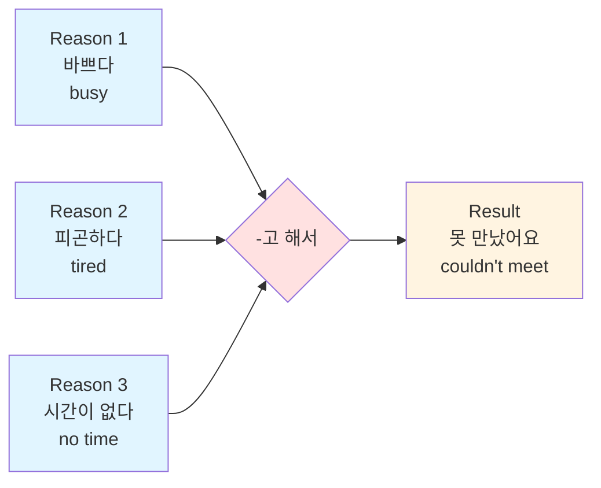
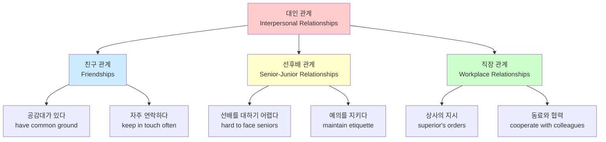
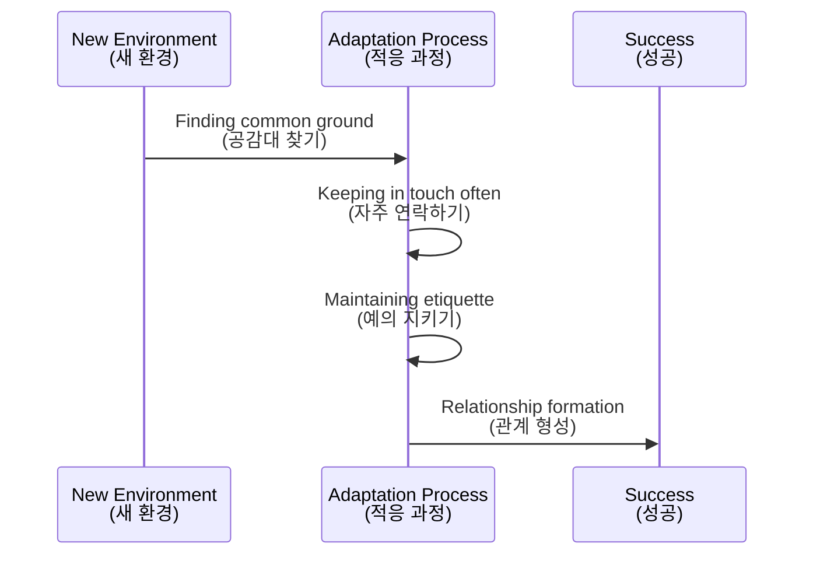

# Lesson 1: 대인 관계 (Interpersonal Relationships)

## 📚 Lesson Introduction

**Topic:** Interpersonal relationships
**Main Content:**

- Learn vocabulary related to interpersonal relationships
- Learn grammar: -고 해서, -으면 되다
- Practice communication and forms of address in Korean

---

## 📖 I. VOCABULARY

### 1. Vocabulary about interpersonal relationships by group

#### **Group 1: Relationships with friends and colleagues**

| Korean          | English Meaning               | Example                                                                                                                                                           |
| --------------- | ----------------------------- | ----------------------------------------------------------------------------------------------------------------------------------------------------------------- |
| 친구            | Friend                        | 새로 사귄 친구하고 친해졌어요? (Have you become close with the new friend you made?)                                                                              |
| 동창            | Alumnus/Schoolmate            | 초등학교 동창들하고 자주 연락을 주고받고 해서 아직도 만나요. (I keep in touch with my elementary school classmates often, so we still meet.)                      |
| 공감대가 있다   | To have common ground/empathy | 공감대도 없고 바쁘고 해서 친해지기가 어려워요. (It's hard to get close because we have no common ground and are busy.)                                            |
| 사이가 멀어지다 | To drift apart                | 고향 친구와 자주 못 만나고 연락도 자주 못하고 해서 사이가 멀어졌어요. (I haven't been able to meet or contact my hometown friends often, so we've drifted apart.) |
| 연락이 끊기다   | To lose touch                 | 자주 연락을 주고받고 해서 연락이 끊기지 않았어요. (We keep in touch often, so we haven't lost touch.)                                                             |

#### **Group 2: Senior - Junior relationships**

| Korean                 | English Meaning                               | Example                                                                    |
| ---------------------- | --------------------------------------------- | -------------------------------------------------------------------------- |
| 선배                   | Senior                                        | 학교에서 선배를 대하기 어렵다. (It's difficult to face seniors at school.) |
| 후배                   | Junior                                        | 후배가 나를 어려워하다. (The junior feels awkward around me.)              |
| 선배를 대하기 어렵다   | To find it difficult to interact with seniors | 학교에서 선배를 대하기 어렵다. (It's difficult to face seniors at school.) |
| 후배가 나를 어려워하다 | Junior feels awkward/uncomfortable around me  | 후배가 나를 어려워하다. (The junior feels awkward around me.)              |

#### **Group 3: Work and social relationships**

| Korean                          | English Meaning                    | Example                                                                                                                                                                           |
| ------------------------------- | ---------------------------------- | --------------------------------------------------------------------------------------------------------------------------------------------------------------------------------- |
| 상사                            | Superior/Boss                      | 상사 지시를 거절하기도 힘들고 일하는 방법도 잘 모르고 해서 참 힘들어요. (It's hard to refuse a boss's orders and I don't know the work methods well, so it's very difficult.)     |
| 동료                            | Colleague/Co-worker                | 동료들하고 함께 시간을 보내면 될 거예요. (It will be fine if you spend time with your colleagues.)                                                                                |
| 부하 직원                       | Subordinate/Junior staff           | 부하 직원과 일하는 방법을 알려주다. (To teach work methods to a subordinate.)                                                                                                     |
| 상사의 지시를 거절하기 힘들다   | Hard to refuse a superior's orders | 상사의 지시를 거절하기 힘들다. (It's hard to refuse a superior's orders.)                                                                                                         |
| 동료에게 도움을 요청하기 어렵다 | Hard to ask colleagues for help    | 동료에게 도움을 요청하기 어렵다. (It's hard to ask colleagues for help.)                                                                                                          |
| 일하는 방법을 잘 모르다         | To not know work methods well      | vẫn còn khó đối mặt với mọi người và cũng không rõ phương pháp làm việc nên hơi vất vả. (Vẫn còn khó đối mặt với mọi người và cũng không rõ phương pháp làm việc nên hơi vất vả.) |

### 2. Vocabulary about communication attitudes

| Korean                 | English Meaning                  | Example                                                                                                                                      |
| ---------------------- | -------------------------------- | -------------------------------------------------------------------------------------------------------------------------------------------- |
| 자주 연락을 주고받다   | To keep in touch frequently      | 초등학교 동창들하고 자주 연락을 주고받고 해서 아직도 만나요. (I keep in touch with my elementary school classmates often, so we still meet.) |
| 이야기를 잘 들어 주다  | To be a good listener            | 친구들 이야기를 잘 들어 주면 된다. (You just need to listen well to your friends' stories.)                                                  |
| 의견을 솔직하게 말하다 | To speak one's mind honestly     | 의견을 솔직하게 말하고 조금씩 양보하다. (Speak your mind honestly and compromise little by little.)                                          |
| 예의를 지키다          | To maintain etiquette/politeness | 인사를 잘하고 예의를 지키면서 말하다. (Greet well and speak while maintaining etiquette.)                                                    |
| 공감을 잘해 주다       | To emphasize/show empathy well   | 공감해 주고 같이 고민해 주다. (Empathize and think through worries together.)                                                                |
| 함께 시간을 보내다     | To spend time together           | 동료들하고 함께 시간을 보내면 될 거예요. (It will be fine if you spend time with your colleagues.)                                           |

### 3. Other important vocabulary

| Korean          | English Meaning            | Example                                                                                                                                          |
| --------------- | -------------------------- | ------------------------------------------------------------------------------------------------------------------------------------------------ |
| 적응하다        | To adapt/adjust            | 좀 힘들지만 적응하려고 노력 중입니다. (It's a bit hard, but I'm trying to adjust.)                                                               |
| 노력 중이다     | To be making an effort     | 적응하려고 노력 중입니다. (I'm trying to adjust.)                                                                                                |
| 관심을 갖다     | To take an interest        | 서로에게 관심을 갖고 이야기를 잘 들어 주다. (Take an interest in each other and listen well.)                                                    |
| 사귀다          | To make friends            | 새로 사귄 친구하고 친해졌어요? (Have you become close with the new friend you made?)                                                             |
| 부족하다        | To be lacking/insufficient | 한국어가 부족하다. (Korean language skills are lacking.)                                                                                         |
| 내성적이다      | To be introverted          | 성격도 내성적이고 혼자 있는 걸 좋아하고 해서 사람을 사귀기가 힘들어요. (I'm introverted and like being alone, so it's hard to make friends.)     |
| 속도            | Speed                      | 기능이 다양하고 속도가 빠르면 돼요. (It's fine as long as there are various features and the speed is fast.)                                     |
| 외우다          | To memorize                | 단어를 외우다. (To memorize words.)                                                                                                              |
| 안부            | Regards/Well-being         | 안부를 묻다. (To ask how someone is doing.)                                                                                                      |
| 문제를 풀다     | To solve a problem         | 문제를 풀다. (To solve a problem.)                                                                                                               |
| 이직            | Changing jobs              | 얼마 전에 회사를 옮겼다. (I changed companies not long ago.)                                                                                     |
| 대부분          | Most/Majority              | 새로 간 직장에는 한국 사람이 대부분이다. (At the new workplace, most people are Korean.)                                                         |
| 피하다          | To avoid                   | 선배들과 대화를 피하다. (To avoid talking with seniors.)                                                                                         |
| 사이좋다        | To be on good terms        | 부부가 사이좋게 지내다. (The couple lives in harmony.)                                                                                           |
| 대하다          | To treat/face/interact     | 아직 사람들을 대하기가 어렵다. (It's still hard to interact with people.)                                                                        |
| 지시            | Order/Instruction          | 상사 지시를 거절하기도 힘들다. (It's hard to refuse a boss's orders.)                                                                            |
| 거절하다        | To refuse/reject           | 상사 지시를 거절하기도 힘들다. (It's hard to refuse a boss's orders.)                                                                            |
| 요청            | Request                    | 동료에게 도움을 요청하기 어렵다. (It's hard to ask colleagues for help.)                                                                         |
| phương pháp     | Method                     | Không rõ phương pháp làm việc. (Don't know work methods well.)                                                                                   |
| 이야기를 나누다 | To converse/talk           | 룸메이트하고 솔직한 대화를 나눠 보다. (Try having an honest conversation with your roommate.)                                                    |
| 솔직하다        | To be honest/frank         | 룸메이트하고 솔직한 대화를 나눠 보다. (Try having an honest conversation with your roommate.)                                                    |
| 공감            | Empathy                    | 공감해 주고 같이 고민해 주다. (Empathize and think through worries together.)                                                                    |
| 말다툼          | Quarrel/Argument           | 룸메이트가 한국 사람인데 생활 방식이 달라서 자주 말다툼을 해요. (My roommate is Korean, and since our lifestyles are different, we argue often.) |
| 동호회          | Hobby club/Society         | 동호회에서 강릉에 가기로 했어요. (The hobby club decided to go to Gangneung.)                                                                    |
| 송년회          | Year-end party             | 송년회에 참석하다. (To attend a year-end party.)                                                                                                 |

---

## 📝 II. GRAMMAR

### **1. Structure: -고 해서**

#### **Meaning:**

- Used to express doing something **for a certain reason** (combining multiple reasons).
- Equivalent to: "because... and...", "since... so..."

#### **Structure:**

```
Verb/Adjective + -고 해서
```

#### **Conjugation Rules:**

| Base Form       | How to add | Example              |
| --------------- | ---------- | -------------------- |
| With Batchim    | + 고 해서  | 먹다 → 먹고 해서     |
| Without Batchim | + 고 해서  | 바쁘다 → 바쁘고 해서 |

#### **Illustrative Examples:**

| Korean Sentence                                                                | English Meaning                                                                                     |
| ------------------------------------------------------------------------------ | --------------------------------------------------------------------------------------------------- |
| 조금 전에 샌드위치도 먹고 해서 그냥 사무실에 있으려고요.                       | I just ate a sandwich and all, so I'm planning to just stay in the office.                          |
| 초등학교 동창들하고 자주 연락을 주고받고 해서 아직도 만나요.                   | I keep in touch with my elementary school classmates often and such, so we still meet.              |
| 상사 지시를 거절하기도 힘들고 일하는 phương pháp도 잘 모르고 해서 참 힘들어요. | It's hard to refuse a boss's orders and I don't know the work methods well, so it's very difficult. |

#### **💡 Note:**

- **'말이다'** becomes **'말이고 해서'**

### **2. Structure: -으면 되다**

#### **Meaning:**

- Expresses that **doing something is sufficient/enough**.
- Used when providing a simple condition or method.
- Equivalent to: "just need to...", "...is all you need to do".

#### **Structure:**

```
Verb + -으면 되다 / -면 되다
```

#### **Conjugation Rules:**

| Base Form       | How to add         | Example            |
| --------------- | ------------------ | ------------------ |
| With Batchim    | -으면 되다         | 읽다 → 읽으면 되다 |
| Without Batchim | -면 되다           | 가다 → 가면 되다   |
| Batchim ㄹ      | -면 되다 (drop ㄹ) | 알다 → 알면 되다   |

#### **Illustrative Examples:**

| Korean Sentence                     | English Meaning                                                        |
| ----------------------------------- | ---------------------------------------------------------------------- |
| 기능이 다양하고 속도가 빠르면 돼요. | It's fine as long as there are various features and the speed is fast. |
| 이 약은 식사 후에 드시면 됩니다.    | You just need to take this medicine after meals.                       |
| 수업 신청은 홈페이지에서 하면 돼요. | You just need to apply for classes on the homepage.                    |

#### **💡 Note:**

- **'말이다'** becomes **'말이면 되다'**

### **3. Comparing -고 해서 and -으면 되다**

| Grammar    | Function                     | Example                                                                       |
| ---------- | ---------------------------- | ----------------------------------------------------------------------------- |
| -고 해서   | Listing multiple reasons     | 바쁘고 피곤하고 해서 못 갔어요. (I couldn't go because I was busy and tired.) |
| -으면 되다 | Providing a simple condition | 전화하면 돼요. (You just need to call.)                                       |

---

## 🗣️ III. PRACTICE CONVERSATION

### **Scenario 1: Talking about relationships with schoolmates**

```
Minsu: 여보세요, 새로 사귄 친구하고 친해졌어요?
Huyen: 공감대도 없고 바쁘고 해서 친해지기가 어려워요.
```

**Translation:**

```
Minsu: Hello, have you become close with the new friend you made?
Huyen: It's hard to get close because we have no common ground and are busy.
```

### **Scenario 2: Using -고 해서 in the office**

```
• Reason why it's hard to make friends: 사람 사귀기가 힘든 이유
• Reason for learning Korean: 한국어를 배우는 이유
```

**Conversation Example:**

```
성격도 내성적이고 혼자 있는 걸 좋아하고 해서 사람을 사귀기가 힘들어요.
```

**Translation:**

```
I'm introverted and like being alone, so it's hard to make friends.
```

### **Scenario 3: Conversation about difficulties at work**

```
Team Leader: 참시드 씨가 고민을 이야기합니다. 다음 대화처럼 이야기해 보세요.

Chanshid: 좀 힘들지만 적응하려고 노력 중입니다.

Team Leader: 힘든 게 있어요? 힘든 게 있으면 말해 봐요.

Chanshid: 아직 사람들을 대하기가 어렵고 일하는 방법도
         잘 모르고 해서 좀 힘듭니다.

Team Leader: 여기 온 지 얼마 안 돼서 그래요. 좀 익숙해지고
         동료들하고 함께 시간을 보내면 될 거예요.

Chanshid: 네, 반장님. 시간이 지나면 괜찮아지겠지요.
         신경 써 주셔서 감사합니다.
```

**Translation:**

```
Team Leader: Chanshid is talking about his worries. Try talking like the following conversation.

Chanshid: It's a bit hard, but I'm trying to adjust.

Team Leader: Is there something difficult? If there is, please tell me.

Chanshid: It's still hard to interact with people and I don't know the
          work methods well, so it's a bit vất vả.

Team Leader: It's because you haven't been here long. Once you get used to it
              and spend time with your colleagues, it will be fine.

Chanshid: Yes, Team Leader. I'm sure it will get better over time.
          Thank you for your concern.
```

### **Speaking Practice Exercises:**

**1) Not knowing work methods well | Spending time with colleagues**

- 일하는 방법을 잘 모르다 | 동료들하고 함께 시간을 보내다

**2) No common ground | Taking an interest in each other and listening well**

- 공감대가 없다 | 서로에게 관심을 갖고 이야기를 잘 들어 주다

---

## 💡 IV. PRACTICE EXERCISES

### **Exercise 1: Complete sentences with -고 해서**

Fill in the blanks following the example:

**Example:**
고향 친구와 자주 못 만나고 연락도 자주 못하고 해서 사이가 멀어졌어요.

1. 새로 사귄 친구와 ********\_******** (no common ground)
2. 학교에서 선배를 ********\_******** (Korean skills are lacking)
3. 외국 친구와 ********\_******** (culture is different)
4. 한국 사람과 ********\_******** (don't know how to speak well)

### **Exercise 2: Choose the correct answer for -으면 되다**

Select the appropriate response:

1. What should a couple do to get along well?

   - a) Method to comfort a friend
   - b) Take interest in each other and listen well to the other person's story

2. How to get close with a senior

   - a) Empathize and worry together
   - b) Greet well and speak while maintaining etiquette

3. How to narrow the gap in opinions with a colleague
   - a) Speak your mind honestly and compromise little by little
   - b) Keep in touch often and exchange contact

---

## 🎧 V. LISTENING EXERCISES

### **Listening 1: How are your relationships with people around you?**

Listen and choose True (○) or False (X):

**Before getting close, I tend to find people a bit difficult.**
(친해지기 전에는 사람을 좀 어려워하는 편이에요.)

❶ Seongmin made many friends at the new school.

- ( )

❷ Seongmin has plans tomorrow with friends who are not around.

- ( )

❸ Seongmin's friends are very interested in China, so they have many questions.

- ( )

---

### **Listening 2: What Seongmin heard from his mother**

Choose the correct sentence after listening:

❶ "You just need to listen well to your friends' stories."

❷ "You just need to spend time with your friends."

❸ "You should get along well with your friends without fighting."

❹ "It's good to tell your friends a lot about China."

---

### **Listening 3: Why do Seongmin's friends ask him many questions about China?**

**Vocabulary Hints:**

- 이야기를 나누다 (to converse)
- 동호회 (hobby club)
- 대통령 (president)

---

### **📝 Pronunciation (발음)**

Practice pronouncing the following words:

```
     ㅗ    +  [ㄹ]   →   ㅗ    +   [ㄴ]

동료 [동뇨]
강릉 [강늉]
대통령 [대통령]
```

**Rules:**

1. I've drifted apart from my work **colleague**.
   직장 **동료**와 사이가 멀어졌어요. → [동뇨]

2. We decided to go to Gangneung with the hobby club.
   동호회에서 **강릉**에 가기로 했어요. → [강늉]

3. There will be a speech from the **President**.
   **대통령**의 말씀이 있겠습니다. → [대통령]

---

## 📊 VI. ILLUSTRATIVE DIAGRAMS

### **1. Grammar Structure -고 해서**



### **2. Grammar Structure -으면 되다**

```mermaid
graph TD
    A[Condition<br/>전화하다<br/>to call] --> B[-으면 되다<br/>just need to... is fine]
    B --> C[Result<br/>연락이 돼요<br/>contact is made]

    style A fill:#e1f5ff
    style B fill:#ffe1e1
    style C:#e8ffe1
```

### **3. Relationships in Communication**



### **4. Process of Adapting to a New Environment**



---

## 📖 VI. READING EXERCISES (읽기)

### **Part 1: Checklist - What difficulties do you have in relationships with Koreans?**

Mark the difficulties you face:

- ☐ Culture is different. (문화가 다르다.)
- ☐ We have prejudices against each other. (서로에게 편견을 갖고 있다.)
- ☐ Lifestyles are different. (생활 방식이 다르다.)
- ☐ Non-verbal expressions are difficult to use. (비언어적 표현 사용이 어렵다.)
- ☐ I don't know what to say or how to say it. (무슨 말을 어떻게 해야 하는지 잘 모르겠다.)
- ☐ It's hard to express my intentions accurately. (내 의도를 정확하게 표현하기 어렵다.)
- ☐ It's hard to keep a conversation going. (대화를 이어 나가기 힘들다.)
- ☐ Koreans say many things with meanings different from the dictionary. (한국 사람은 사전과 다른 의미의 말을 많이 한다.)

---

### **Part 2: Read forum posts**

**Concerns and comments from foreigners about interpersonal relationships posted on an online counseling board.**

#### **Post 1:**

**Title:** My dormitory roommate is Korean, and since our lifestyles are different, we argue often.

**Comment:** Since the cultures are different, there are naturally differences in lifestyles or opinions. How about trying to have an honest conversation with your roommate?

---

#### **Post 2:**

**Title:** Using non-verbal expressions is important in Korea, but they are too difficult for me.

**Comment 1:** That's right. I learned non-verbal expressions, but that alone is not enough.

**Comment 2:** I've lived in Korea for a long time, but it's still hard. So I usually pay attention to how Koreans talk and practice a lot.

---

#### **Post 3:**

**Title:** When talking to Korean friends, I often don't know what to say or how to say it.

**Comment 1:** Me too. Even if I can start a conversation, it's hard to keep it going for long.

**Comment 2:** I was like that when I first came to Korea. Think of listening to others as practice and don't get too stressed.

---

#### **Post 4:**

**Title:** I think it's hard to become friends because I can't have the same conversations as Koreans.

**Comment 1:** That's right. It's frustrating because I can only say simple things since it's hard to express intentions accurately.

**Comment 2:** You can't have the same conversations, but if you always treat people with sincerity, Koreans will recognize that heart.

---

### **Part 3: Read Q&A Post**

**Title:** I want to get along well with my seniors at work.

Hello. I am a Vietnamese person who has been in Korea for about a year.

During that time, I worked at a place with many Vietnamese people, but I recently changed jobs. At my new workplace, there are many Koreans, and most of them are older than me. I spend a lot of time with them, working and eating together every day. But when we talk, they often say, "You shouldn't talk to elders like that." Every time that happens, I feel uncomfortable because it seems I've offended my senior. Since this happens often, these days I want to avoid being in situations with my seniors.

Using honorifics is important in Korea, but they are still too difficult for me. I did learn honorifics when I studied Korean, but it seems that wasn't enough. It's also hard to express my intentions accurately, and I don't know what to say or how to say it.

I want to get along well with the seniors at this workplace. What should I do?

---

### **Reading Comprehension Questions:**

**1) What is this person struggling with?**

**2) Mark ○ if the content matches the text above, and X if it doesn't.**

❶ This person recently moved companies. ( )

❷ This person is upset because the seniors at the new workplace are old. ( )

❸ This person didn't learn non-verbal expressions when studying Korean. ( )

**3) Choose the statement that is DIFFERENT from the text.**

❶ This person came to Korea one year ago.

❷ There are many Koreans at the new workplace.

❸ This person is trying to talk to the seniors a lot these days.

❹ This person struggles to express intentions accurately when talking.

**Vocabulary Hints:**

- 이직 (changing jobs)
- 웃기다 (to be funny)
- 대부분 (most/majority)
- 피하다 (to avoid)

---

## 🎯 VII. REAL-LIFE COMMUNICATION SCENARIOS

### **Scenario 1: When facing difficulties in work relationships**

**Problem:**
What worries do you have regarding relationships with people around you?

**Solutions:**

| Relationship   | Problem               | Solution                                  |
| -------------- | --------------------- | ----------------------------------------- |
| With friends   | No common ground      | Keep in touch often + Be a good listener  |
| With seniors   | Hard to face seniors  | Always maintain etiquette + Greet well    |
| With superiors | Hard to refuse orders | Speak your mind honestly + Ask for advice |

### **Scenario 2: When wanting to improve a relationship**

**Sample Conversation:**

```
A: How are you getting along with your friends?
B: I haven't been able to keep in touch or talk much with my friends.
```

---

## 📚 VIII. KOREAN CULTURE - SOCIAL ACTIVITIES

### **Socializing Activities of Koreans**

Koreans value building close relationships in society, referred to as **"동창회"** (alumni association) or **"동호회"** (hobby club/society).

**Characteristics:**

- 🎓 **Year-end parties, Sports meets**: 송년회, 체육 대회
- 🍽️ **Eating together**: Dining together to bond
- ⚽ **Club activities**: Participating in clubs based on shared interests
- 🏫 **School, Local, Workplace communities**: Schools, regions, work-based communities

**Common types of gatherings:**

1. **동창회** - Alumni association
2. **동호회** - Hobby club
3. **What kind of gatherings are there in your hometown?**

---

## ✏️ IX. WRITING EXERCISES (쓰기)

### **Writing 1: Have you had any difficulties in relationships with Koreans?**

Write about the difficulties you face when communicating with Koreans.

**Guide Template:**

```
Difficulties with Koreans                         How to overcome

┌─────────────────────────┐        ┌─────────────────────────┐
│                         │   →    │                         │
│  (Difficulty 1)         │        │  (Solution 1)           │
│                         │        │                         │
└─────────────────────────┘        └─────────────────────────┘

┌─────────────────────────┐        ┌─────────────────────────┐
│                         │   →    │                         │
│  (Difficulty 2)         │        │  (Solution 2)           │
│                         │        │                         │
└─────────────────────────┘        └─────────────────────────┘
```

---

### **Writing 2: Write a letter of advice to a foreign friend who hasn't been in Korea long on how to make Korean friends.**

Write a guide on how to make friends with Koreans for a newcomer.

**Suggested Article Structure:**

1. **Introduction:** Introduce the situation.
2. **Body:**
   - Difficulties in making friends with Koreans.
   - Specific methods to make friends.
   - Real-life examples.
3. **Conclusion:** Advice and encouragement.

**Useful Phrases:**

- 자주 연락을 주고받다 (to keep in touch frequently)
- 이야기를 잘 들어 주다 (to listen well)
- 의견을 솔직하게 말하다 (to speak honestly)
- 예의를 지키다 (to maintain etiquette)
- 공감을 잘해 주다 (to empathize well)
- 함께 시간을 보내다 (to spend time together)
- 적응하다 (to adapt)
- 노력하다 (to make an effort)

---

## ✍️ X. EXTENSION EXERCISES

### **Reflection Questions:**

1. **Have you had any difficulties in relationships with Koreans?**
2. **Write a letter of advice to a foreign friend who hasn't been in Korea long on how to make Korean friends.**

### **Vocabulary Table for Social Activities**

| Korean          | English Meaning        |
| --------------- | ---------------------- |
| 공감대가 있다   | To have common ground  |
| 사이가 멀어지다 | To drift apart         |
| 사이좋다        | To be on good terms    |
| 위로            | Comfort/Consolation    |
| 선배            | Senior                 |
| 후배            | Junior                 |
| 상사            | Superior               |
| 지시            | Order/Instruction      |
| 거절하다        | To refuse              |
| 요청            | Request                |
| 속도            | Speed                  |
| 관심을 갖다     | To take interest       |
| 사귀다          | To make friends        |
| 안부            | Regards                |
| 문제를 풀다     | To solve a problem     |
| 외우다          | To memorize            |
| 적응하다        | To adapt               |
| 노력 중이다     | To be making an effort |
| 이직            | Changing jobs          |
| 대부분          | Most/Majority          |
| 피하다          | To avoid               |
| 내성적이다      | To be introverted      |

---

## 🎓 XI. LESSON SUMMARY

### **Key Points to Remember:**

1. ✅ **Vocabulary:** Terms for interpersonal relationships (friends, senior-junior, superior-subordinate).
2. ✅ **Grammar 1:** -고 해서 (listing multiple reasons).
3. ✅ **Grammar 2:** -으면 되다 (it's enough to...).
4. ✅ **Culture:** Socializing activities in Korean society.

### **Quick Memory Formula:**

```
🔹 -고 해서 = Reason 1 + 고 해서 + Reason 2 + Result
🔹 -으면 되다 = Condition + (으)면 되다
```

---

## 📖 XII. APPENDIX

### **Full Alphabetical Vocabulary List**

| No  | Korean           | English Meaning        |
| --- | ---------------- | ---------------------- |
| 1   | 거절하다         | To refuse              |
| 2   | 공감             | Empathy                |
| 3   | 공감대가 있다    | To have common ground  |
| 4   | 공감을 잘해 주다 | To empathize well      |
| 5   | 관심을 갖다      | To take interest       |
| 6   | 노력 중이다      | To be making an effort |
| 7   | 내성적이다       | To be introverted      |
| 8   | 대부분           | Most/Majority          |
| 9   | 대하다           | To treat/interact      |
| 10  | 동료             | Colleague              |
| 11  | 동창             | Alumnus                |
| 12  | 동호회           | Hobby club             |
| 13  | 말다툼           | Quarrel                |
| 14  | 방법             | Method                 |
| 15  | 부족하다         | To be lacking          |
| 16  | 부하 직원        | Subordinate staff      |
| 17  | 사귀다           | To make friends        |
| 18  | 사이가 멀어지다  | To drift apart         |
| 19  | 사이좋다         | To be on good terms    |
| 20  | 상사             | Superior               |
| 21  | 선배             | Senior                 |
| 22  | 솔직하다         | To be honest           |
| 23  | 송년회           | Year-end party         |
| 24  | 속도             | Speed                  |
| 25  | 안부             | Regards                |
| 26  | 연락이 끊기다    | To lose touch          |
| 27  | 외우다           | To memorize            |
| 28  | 요청             | Request                |
| 29  | 위로             | Comfort                |
| 30  | 이야기를 나누다  | To converse            |
| 31  | 이직             | Changing jobs          |
| 32  | 적응하다         | To adapt               |
| 33  | 지시             | Order                  |
| 34  | 친구             | Friend                 |
| 35  | 피하다           | To avoid               |
| 36  | 후배             | Junior                 |
| 37  | 문제를 풀다      | To solve a problem     |

---

**Happy learning!** 📚✨
