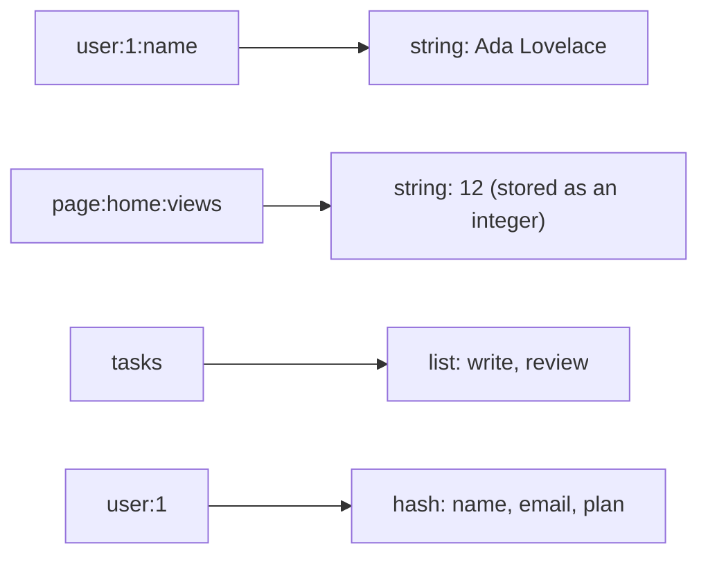

# Lesson 1: Keys, Strings and Counters

## 🎯 Lesson Objectives

After this lesson, you will be able to:

- Explain what the Redis keyspace is and name keys so that it stays navigable
- Read, write and delete string values, including conditional writes that only succeed when a key does or does not exist
- Build counters that stay correct no matter how many clients increment them at once
- Explain why Redis strings are byte arrays and what that means for length and non-ASCII text
- Look inside a key with `TYPE` and `OBJECT ENCODING`
- Find keys in a live database without blocking it

## 📝 Detailed Content

### 1. The Keyspace

A Redis database is one flat namespace of **keys**. Each key maps to exactly one value, and every value has a type. There are no tables, no schemas and no folders — only keys.



Because nothing enforces structure, the structure lives in the key names. The near-universal convention is colon-separated segments running from general to specific: `object-type:id:field`. `user:1:name`, `page:home:views` and `lock:report` all follow it. Redis itself attaches no meaning to the colons — they exist so that people, and pattern matches like `user:*`, can find related keys.

### 2. SET, GET, EXISTS and DEL

`SET` writes a string value; `GET` reads it back. Writing to a key that already exists replaces its value without complaint. Reading a key that does not exist is not an error — it returns `(nil)`.

```text
127.0.0.1:6379> SET user:1:name "Ada Lovelace"
OK
127.0.0.1:6379> GET user:1:name
"Ada Lovelace"
127.0.0.1:6379> GET user:2:name
(nil)
127.0.0.1:6379> SET user:1:name "Ada King"
OK
127.0.0.1:6379> GET user:1:name
"Ada King"
127.0.0.1:6379> EXISTS user:1:name user:2:name
(integer) 1
127.0.0.1:6379> DEL user:1:name
(integer) 1
127.0.0.1:6379> EXISTS user:1:name
(integer) 0
```

Note what `EXISTS` returns when given two keys: not true or false, but a **count** of how many of them exist. `DEL` likewise returns how many keys it actually removed, which is how you tell "deleted" from "was never there".

### 3. Conditional Writes: NX, XX and GET

Plain `SET` always overwrites. Two options make it conditional:

- `NX` — only set if the key does **not** exist
- `XX` — only set if the key **already** exists

When the condition fails, nothing is written and the reply is `(nil)` instead of `OK`.

```text
127.0.0.1:6379> SET lock:report "worker-a" NX
OK
127.0.0.1:6379> SET lock:report "worker-b" NX
(nil)
127.0.0.1:6379> GET lock:report
"worker-a"
127.0.0.1:6379> SET session:99 "active" XX
(nil)
127.0.0.1:6379> SET lock:report "worker-b" XX
OK
127.0.0.1:6379> GET lock:report
"worker-b"
```

`SET ... NX` is the primitive under most Redis locks: two workers race to create the same key, and exactly one gets `OK`. Lesson 6 builds a real one on top of it.

The `GET` option makes `SET` return the value it is replacing, in the same step:

```text
127.0.0.1:6379> SET config:mode "blue"
OK
127.0.0.1:6379> SET config:mode "green" GET
"blue"
127.0.0.1:6379> GET config:mode
"green"
```

Doing this as a separate `GET` followed by `SET` leaves a gap in which another client can write — and then the value you read is not the value you replaced. One command, no gap.

### 4. Counters

`INCR` treats a string as a 64-bit signed integer, adds one, stores it and returns the new value. A missing key counts as `0`, so the first `INCR` returns `1` without any setup.

```text
127.0.0.1:6379> INCR page:home:views
(integer) 1
127.0.0.1:6379> INCR page:home:views
(integer) 2
127.0.0.1:6379> INCRBY page:home:views 10
(integer) 12
127.0.0.1:6379> DECR page:home:views
(integer) 11
127.0.0.1:6379> INCRBYFLOAT price:coffee 2.5
"2.5"
127.0.0.1:6379> INCRBYFLOAT price:coffee 0.1
"2.6"
127.0.0.1:6379> SET page:about:views "many"
OK
127.0.0.1:6379> INCR page:about:views
(error) ERR value is not an integer or out of range
```

Two details worth noticing. `INCRBYFLOAT` replies with a **string** (`"2.6"`), not an integer, because the result is not one. And incrementing a value that does not parse as an integer is an error, not a silent reset — Redis will not guess.

The reason counters live in Redis at all is that `INCR` is **atomic**. Redis executes commands one at a time, so a single `INCR` can never interleave with another. A thousand clients each calling `INCR` once always produce exactly `1000`. Compare the naive version in application code:

```text
value = GET counter     # client A reads 5      client B reads 5
SET counter value + 1   # client A writes 6     client B writes 6   -> one increment lost
```

That lost update is not a rare edge case; under load it is the normal case. Lesson 5 is entirely about this class of bug.

### 5. Many Keys at Once: MSET and MGET

`MSET` writes several keys in one command and `MGET` reads several. A missing key in `MGET` does not fail the command — its slot in the reply is `(nil)`, and the reply keeps the order you asked in.

```text
127.0.0.1:6379> MSET user:1:name "Ada" user:2:name "Grace" user:3:name "Alan"
OK
127.0.0.1:6379> MGET user:1:name user:2:name user:4:name user:3:name
1) "Ada"
2) "Grace"
3) (nil)
4) "Alan"
```

One `MGET` of 100 keys is one network round trip; 100 `GET`s are 100 round trips. When the server is a millisecond away and the command itself takes microseconds, round trips are almost the entire cost.

### 6. Strings Are Byte Arrays

A Redis string is a sequence of **bytes**, up to 512 MB, not a sequence of characters. It can hold text, a serialized JSON document, a number or a JPEG. Redis never interprets the bytes — which has consequences for anything that is not plain ASCII.

The word "café" is four characters but five bytes in UTF-8, because `é` encodes as the two bytes `0xC3 0xA9`. Here it is written with `redis-cli`'s `\x` escapes so the bytes are explicit:

```text
127.0.0.1:6379> SET word "caf\xc3\xa9"
OK
127.0.0.1:6379> GET word
"caf\xc3\xa9"
127.0.0.1:6379> STRLEN word
(integer) 5
127.0.0.1:6379> APPEND word "s"
(integer) 6
127.0.0.1:6379> GET word
"caf\xc3\xa9s"
127.0.0.1:6379> GETRANGE word 0 2
"caf"
```

`STRLEN` counts bytes, so it says `5`. `redis-cli` prints any non-printable byte as a `\x` escape, which is why `GET` does not show `é` — the data is intact, the terminal is just being honest about what is stored. `GETRANGE` also slices by byte offset: `GETRANGE word 0 3` would cut `é` in half and hand you an invalid UTF-8 sequence.

::tip-item{title="Length and slicing are in bytes" type="warning"}
Never use `STRLEN` as a character count or `GETRANGE` to truncate user-facing text. Both operate on bytes, and multi-byte characters will be miscounted or split.
::

### 7. Looking Inside a Key: TYPE and OBJECT ENCODING

`TYPE` tells you which data structure a key holds. Every command only works on its own type — `GET` on a list is an error, not an empty result:

```text
127.0.0.1:6379> SET n 42
OK
127.0.0.1:6379> SET short "hello"
OK
127.0.0.1:6379> SET long "this value is exactly forty-five bytes long.."
OK
127.0.0.1:6379> STRLEN long
(integer) 45
127.0.0.1:6379> TYPE n
string
127.0.0.1:6379> OBJECT ENCODING n
"int"
127.0.0.1:6379> OBJECT ENCODING short
"embstr"
127.0.0.1:6379> OBJECT ENCODING long
"raw"
127.0.0.1:6379> RPUSH tasks "write" "review"
(integer) 2
127.0.0.1:6379> TYPE tasks
list
127.0.0.1:6379> GET tasks
(error) WRONGTYPE Operation against a key holding the wrong kind of value
```

`OBJECT ENCODING` shows how Redis stores the value internally, which is separate from its type. All three of `n`, `short` and `long` are strings, stored three different ways:

| Encoding | When Redis uses it | Why |
| -------- | ------------------ | --- |
| `int` | the value is a signed 64-bit integer | stored as a number — no string bytes at all |
| `embstr` | a string of 44 bytes or fewer | object header and bytes in one allocation |
| `raw` | anything longer, or a string that has been modified (e.g. by `APPEND`) | a separate buffer that can grow |

These encodings are an implementation detail and have changed between releases — the ones above are what Redis 7.0 reports. The lesson that does not change is that Redis picks compact representations for small values automatically, which is a large part of why it fits so much in memory.

### 8. Finding Keys: SCAN, Not KEYS

`KEYS pattern` returns every matching key. It also walks the **entire** keyspace in one go, and because Redis runs one command at a time, every other client waits until it finishes. On a database with millions of keys that is a production outage caused by a debugging command.

`SCAN` does the same job incrementally. Each call returns a **cursor** and a batch of keys; you pass the cursor back to get the next batch, and you are done when the cursor comes back as `"0"`:

```text
127.0.0.1:6379> SCAN 0 MATCH user:2:* COUNT 100
1) "0"
2) 1) "user:2:name"
127.0.0.1:6379> DBSIZE
(integer) 13
127.0.0.1:6379> UNLINK user:1:name user:2:name user:3:name
(integer) 3
127.0.0.1:6379> DBSIZE
(integer) 10
```

Here the whole keyspace fits in one batch, so the cursor returns `"0"` straight away. On a real database you loop until it does. `COUNT` is a hint about how much work to do per call, not a limit on results, and a key can appear in more than one batch — so treat `SCAN` results as a set, not a list.

`UNLINK` removes keys like `DEL`, but frees the memory in a background thread. For a single small string the difference is nothing; for a list with millions of elements, `DEL` would block the server while it frees them and `UNLINK` does not.

::tip-item{title="KEYS is for your laptop" type="warning"}
`KEYS *` is fine against a local database with a hundred keys. Against production it blocks every client until it has walked the whole keyspace. Use `SCAN`.
::

## 🏆 Hands-on Exercise with Detailed Solutions

### Exercise 1: A Page-View Counter

Track views for two pages, `home` and `pricing`. Each view is one command, the count must never lose an increment under concurrency, and you should be able to read both counts in one round trip.

**Solution:**

```text
127.0.0.1:6379> INCR views:home
(integer) 1
127.0.0.1:6379> INCR views:home
(integer) 2
127.0.0.1:6379> INCR views:pricing
(integer) 1
127.0.0.1:6379> MGET views:home views:pricing views:about
1) "2"
2) "1"
3) (nil)
```

`INCR` needs no initialisation and cannot lose updates because it is a single atomic command. `MGET` reads every page in one round trip, and a page nobody has visited reads as `(nil)` rather than failing. Note that `MGET` returns the counts as strings — the integer encoding is internal, and your client code converts them back.

### Exercise 2: "Who Was Here Before Me?"

Keep a key `last:visitor` holding the most recent visitor's name. When a visitor arrives, record them **and** learn who the previous visitor was, with no window in which another visitor can slip between the read and the write.

**Solution:**

```text
127.0.0.1:6379> SET last:visitor "alice" GET
(nil)
127.0.0.1:6379> SET last:visitor "bob" GET
"alice"
127.0.0.1:6379> SET last:visitor "carol" GET
"bob"
```

`SET ... GET` writes the new value and returns the old one in one atomic step. The first visitor sees `(nil)` because there was nobody before them.

## 🔑 Key Points to Remember

1. **The keyspace is flat.** Structure lives in key names — use `object:id:field`.
2. **Missing keys are not errors.** `GET` returns `(nil)`, `EXISTS` and `DEL` return counts.
3. **`NX` / `XX` make writes conditional;** a failed condition replies `(nil)` and writes nothing.
4. **`INCR` is atomic** and treats a missing key as `0`. Read-then-write in application code is not atomic and loses updates.
5. **Strings are bytes.** `STRLEN` and `GETRANGE` count and cut bytes, not characters.
6. **Every command works on one type;** the wrong type is a `WRONGTYPE` error.
7. **Never run `KEYS` in production.** `SCAN` with a cursor does the same job without blocking.

## 📝 Homework

1. Write a transcript that uses `SET ... NX` so two "workers" try to claim the same job ID and exactly one succeeds. What does the losing worker see?
2. Store the number `9223372036854775807` (the largest signed 64-bit integer) and call `INCR` on it. What does Redis reply, and why is that better than wrapping around to a negative number?
3. Store a 44-byte string and a 45-byte string and compare their `OBJECT ENCODING`. Then `APPEND` one character to a short string and check its encoding again. What changed, and why would Redis make that switch?
