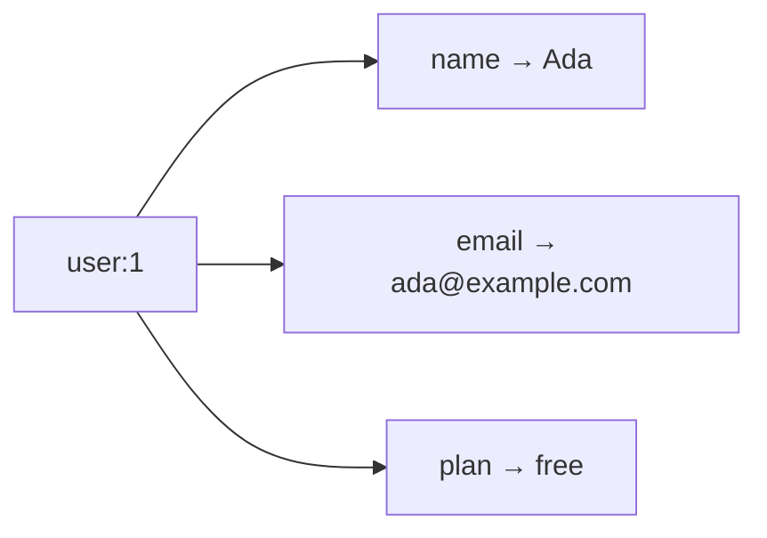
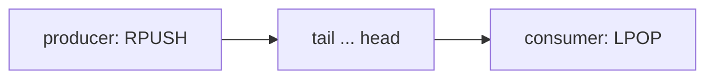

# Lesson 2: Hashes and Lists

## 🎯 Lesson Objectives

After this lesson, you will be able to:

- Model a record as a hash and read or update individual fields without touching the rest
- Decide between a hash and a serialized JSON string for a given object
- Use a list as a first-in-first-out queue and as a newest-first timeline
- Keep a list at a fixed maximum length with `LTRIM`
- Explain what a blocking pop is and when a consumer should use one

## 📝 Detailed Content

### 1. Hashes: One Key, Many Fields

A **hash** is a key whose value is itself a small map of field → value. It is the natural shape for a record: one key per user, one field per attribute.



`HSET` writes one or more fields and returns how many of them were **new**. `HGET` reads one field, `HMGET` several, `HGETALL` all of them as alternating field/value pairs:

```text
127.0.0.1:6379> HSET user:1 name "Ada" email "ada@example.com" plan "free"
(integer) 3
127.0.0.1:6379> HGET user:1 name
"Ada"
127.0.0.1:6379> HMGET user:1 name plan phone
1) "Ada"
2) "free"
3) (nil)
127.0.0.1:6379> HGETALL user:1
1) "name"
2) "Ada"
3) "email"
4) "ada@example.com"
5) "plan"
6) "free"
127.0.0.1:6379> HSET user:1 plan "pro"
(integer) 0
127.0.0.1:6379> HGET user:1 plan
"pro"
127.0.0.1:6379> HLEN user:1
(integer) 3
```

The second `HSET` returns `0`: it **updated** an existing field rather than adding one. That count is how you tell an insert from an update without a separate check. As with `MGET`, a missing field in `HMGET` is a `(nil)` slot, not an error.

### 2. Updating Fields Independently

The real advantage of a hash is that each field is addressable on its own. You can increment one field, test for another and delete a third, and none of those operations reads or rewrites the rest of the record:

```text
127.0.0.1:6379> HINCRBY user:1 logins 1
(integer) 1
127.0.0.1:6379> HINCRBY user:1 logins 1
(integer) 2
127.0.0.1:6379> HEXISTS user:1 phone
(integer) 0
127.0.0.1:6379> HDEL user:1 email phone
(integer) 1
127.0.0.1:6379> HKEYS user:1
1) "name"
2) "plan"
3) "logins"
127.0.0.1:6379> OBJECT ENCODING user:1
"listpack"
127.0.0.1:6379> CONFIG GET hash-max-listpack-entries
1) "hash-max-listpack-entries"
2) "512"
127.0.0.1:6379> CONFIG GET hash-max-listpack-value
1) "hash-max-listpack-value"
2) "64"
```

`HINCRBY` is atomic in exactly the way `INCR` is (Lesson 1), and it creates the field at `0` if it is missing. `HDEL` returns how many fields it removed: it was asked for two, but `phone` never existed.

Small hashes are stored as a **listpack** — one compact, contiguous block of memory — which is why a hash of a few fields costs far less than the same fields as separate keys. It also means a small hash replies in insertion order. The two `CONFIG GET` replies are the limits: on the server this course is verified against, a hash stays a listpack up to 512 fields with no value longer than 64 bytes, and the 513th field — or a single 65-byte value — converts it to a real hash table, after which `HGETALL`'s order stops being predictable. The limits are configurable and differ between builds, so check your own server rather than trusting a remembered number. Either way, never write code that depends on the order.

### 3. Hash or JSON String?

You could store the same user as one string: `SET user:1 '{"name":"Ada","plan":"free","logins":2}'`. Both are reasonable; they fail in different places.

| Question | Hash | JSON string |
| -------- | ---- | ----------- |
| Update one field | `HSET` / `HINCRBY` — one atomic command | read, parse, modify, re-serialize, write — a read-modify-write race |
| Read the whole object | `HGETALL`, flat field/value pairs | `GET`, then parse |
| Nested data (arrays, sub-objects) | not supported — values are flat strings | natural |
| Field types | every value is a string | numbers, booleans, null survive the round trip |
| Expire part of the object | no — expiry is per key (Lesson 4), and the Redis 7.0 server this course targets has no per-field expiry | no |

The rule of thumb: if fields are **updated independently** — counters, status flags, a profile edited one setting at a time — use a hash. If the object is **written and read as a unit** and has nesting, a JSON string is simpler. The race in the JSON column is the one from Lesson 1's counter, and it is the most common real bug in this area.

### 4. Lists as Queues

A **list** is an ordered sequence of strings. You add to either end with `LPUSH` (left, the head) or `RPUSH` (right, the tail), and remove from either end with `LPOP` or `RPOP`. Pushing on one end and popping from the other gives you a first-in-first-out **queue**:



```text
127.0.0.1:6379> RPUSH queue:email "welcome:ada" "welcome:grace"
(integer) 2
127.0.0.1:6379> RPUSH queue:email "reset:alan"
(integer) 3
127.0.0.1:6379> LLEN queue:email
(integer) 3
127.0.0.1:6379> LRANGE queue:email 0 -1
1) "welcome:ada"
2) "welcome:grace"
3) "reset:alan"
127.0.0.1:6379> LPOP queue:email
"welcome:ada"
127.0.0.1:6379> LPOP queue:email
"welcome:grace"
127.0.0.1:6379> LRANGE queue:email 0 -1
1) "reset:alan"
```

Push commands return the list's **new length**. `LRANGE key 0 -1` reads the whole list — indices are zero-based, and negative indices count back from the end, so `-1` is the last element. `LRANGE` does not remove anything; `LPOP` does, and returns what it removed.

::tip-item{title="LRANGE on a big list is expensive" type="warning"}
`LRANGE key 0 -1` returns every element. On a list with millions of entries that is a huge reply and a long-running command. Read bounded ranges, such as `LRANGE key 0 99`.
::

### 5. Lists as Capped Timelines

Push onto the **head** and the newest item is always at index `0` — the shape of an activity feed. Pair each push with `LTRIM` and the list can never grow past a fixed size:

```text
127.0.0.1:6379> LPUSH timeline:ada "joined"
(integer) 1
127.0.0.1:6379> LPUSH timeline:ada "posted" "liked" "followed" "posted-again" "commented" "shared"
(integer) 7
127.0.0.1:6379> LRANGE timeline:ada 0 -1
1) "shared"
2) "commented"
3) "posted-again"
4) "followed"
5) "liked"
6) "posted"
7) "joined"
127.0.0.1:6379> LTRIM timeline:ada 0 4
OK
127.0.0.1:6379> LRANGE timeline:ada 0 -1
1) "shared"
2) "commented"
3) "posted-again"
4) "followed"
5) "liked"
127.0.0.1:6379> LINDEX timeline:ada 0
"shared"
127.0.0.1:6379> LINDEX timeline:ada -1
"liked"
127.0.0.1:6379> LLEN timeline:ada
(integer) 5
```

Look at the order after the multi-value `LPUSH`: `"shared"` is first even though it was listed last. `LPUSH a b c` pushes `a`, then `b`, then `c` onto the head one at a time, so the last argument ends up in front.

`LTRIM key 0 4` keeps indices 0 through 4 and discards everything else, so the two oldest events are gone. Trimming after every push keeps the list bounded at five no matter how long the application runs.

### 6. Blocking Pops

A queue consumer that calls `LPOP` in a loop on an empty list spins, hammering the server with requests that return `(nil)`. `BLPOP` solves that: if the list has an item it returns immediately; if it is empty, the connection **waits** until an item arrives or the timeout (in seconds) passes.

```text
127.0.0.1:6379> BLPOP queue:email 1
1) "queue:email"
2) "reset:alan"
127.0.0.1:6379> BLPOP queue:email 1
(nil)
(1.07s)
127.0.0.1:6379> OBJECT ENCODING timeline:ada
"quicklist"
```

The first `BLPOP` found `"reset:alan"` waiting and returned at once — with the **key name** as well as the value, because `BLPOP` can watch several lists and has to tell you which one produced the item. The second found the list empty, waited the full second and returned `(nil)`. The `(1.07s)` line is not part of the reply: `redis-cli` adds it to show how long a command blocked, and the figure will differ on your machine.

A timeout of `0` means wait forever, which is what a dedicated worker usually wants. Because a blocked connection can do nothing else, give each consumer its own connection.

Lists report the `quicklist` encoding on Redis 7.0: a linked list of small listpack blocks, which keeps push and pop at either end cheap however long the list grows.

::tip-item{title="A list queue can lose work" type="info"}
`LPOP` removes the item before the consumer has processed it. If the worker crashes mid-job, the job is gone. Production queues either move the item to an in-progress list atomically (`LMOVE`) or use Redis Streams, which track acknowledgements. A plain list is the right tool while losing the occasional job is acceptable.
::

## 🏆 Hands-on Exercise with Detailed Solutions

### Exercise 1: A Profile With Independent Fields

Create `user:2` for Grace with a `name`, a `plan` of `free` and `credits` of `0`. Then, as three separate actions that could come from three different requests: grant 50 credits, upgrade the plan to `team`, and read back all three fields in one command.

**Solution:**

```text
127.0.0.1:6379> HSET user:2 name "Grace" plan "free" credits 0
(integer) 3
127.0.0.1:6379> HINCRBY user:2 credits 50
(integer) 50
127.0.0.1:6379> HSET user:2 plan "team"
(integer) 0
127.0.0.1:6379> HMGET user:2 name plan credits
1) "Grace"
2) "team"
3) "50"
```

The credit grant and the plan change touch different fields, so even if they ran at the same instant from different clients neither could overwrite the other. With a JSON string, whichever request wrote last would silently discard the other's change.

### Exercise 2: "Latest 5 Events"

Record shop events for a session in `events:shop` so that only the five most recent are ever kept, newest first.

**Solution:**

```text
127.0.0.1:6379> LPUSH events:shop "view:hat"
(integer) 1
127.0.0.1:6379> LTRIM events:shop 0 4
OK
127.0.0.1:6379> LPUSH events:shop "view:scarf" "cart:hat" "view:gloves" "cart:scarf" "checkout"
(integer) 6
127.0.0.1:6379> LTRIM events:shop 0 4
OK
127.0.0.1:6379> LRANGE events:shop 0 -1
1) "checkout"
2) "cart:scarf"
3) "view:gloves"
4) "cart:hat"
5) "view:scarf"
127.0.0.1:6379> LLEN events:shop
(integer) 5
```

The push briefly made the list six long; the `LTRIM` straight after cut it back to five, dropping `"view:hat"`, the oldest. Always trim immediately after pushing. Between the two commands another client can observe the six-element list — Lesson 5 shows how to send the pair as one atomic unit so nobody can.

## 🔑 Key Points to Remember

1. **A hash is a record.** Use it when fields are read or updated independently.
2. **`HSET` returns the number of new fields**, `0` for a pure update.
3. **`HINCRBY` is atomic** — updating one field never races with updates to another.
4. **Hash field order is only predictable while the hash is small.** Never depend on it.
5. **`RPUSH` + `LPOP` is a FIFO queue; `LPUSH` + `LTRIM` is a capped, newest-first timeline.**
6. **`LPUSH a b c` leaves `c` at the head** — pushes happen one argument at a time.
7. **Consumers should block (`BLPOP`) rather than poll**, each on its own connection.

## 📝 Homework

1. Store a product as a hash with `name`, `price_cents` and `stock`. Sell three units with a single command. What does that command return, and what stops two simultaneous sales from both reading the same stock level?
2. `RPUSH` five jobs onto a list, then take them off with `RPOP` instead of `LPOP`. In what order do they come out, and what structure have you built?
3. Look up `LMOVE` in the Redis command reference. Sketch how it would let a worker take a job from `queue:pending` and park it in `queue:processing` so that a crash cannot lose it.
