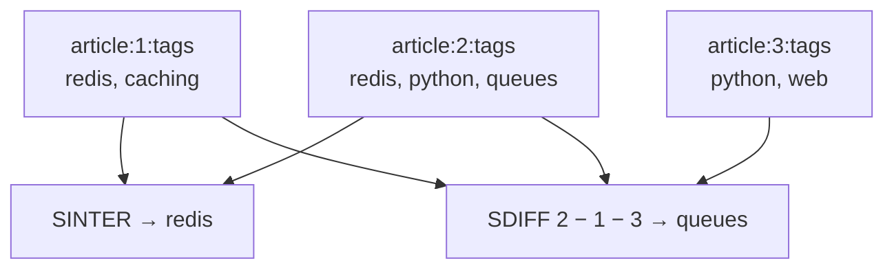

# Lesson 3: Sets and Sorted Sets

## 🎯 Lesson Objectives

After this lesson, you will be able to:

- Use a set to answer "is this a member?" and "how many unique items?" in constant time
- Combine sets with intersection, union and difference
- Explain why a set's reply order is not something you can depend on, and how to get a stable order when you need one
- Keep members ranked by a score with a sorted set
- Read a sorted set by position, by score range and by rank — the queries behind every leaderboard

## 📝 Detailed Content

### 1. Sets: Unique, Unordered Members

A **set** is a collection of unique strings. Adding a member that is already there does nothing, and there is no notion of position — only "in" or "out". That makes a set the right structure for tags, permissions, "users who liked this", or deduplicating anything.

```text
127.0.0.1:6379> SADD article:1:tags "redis" "databases" "caching"
(integer) 3
127.0.0.1:6379> SADD article:1:tags "redis"
(integer) 0
127.0.0.1:6379> SCARD article:1:tags
(integer) 3
127.0.0.1:6379> SISMEMBER article:1:tags "caching"
(integer) 1
127.0.0.1:6379> SMISMEMBER article:1:tags "redis" "python"
1) (integer) 1
2) (integer) 0
127.0.0.1:6379> SREM article:1:tags "databases"
(integer) 1
127.0.0.1:6379> SORT article:1:tags ALPHA
1) "caching"
2) "redis"
```

`SADD` returns how many members were **new**, so the second one — adding `"redis"` again — returns `0`. `SCARD` counts members; `SISMEMBER` tests one and `SMISMEMBER` tests several in one round trip. Both membership checks are constant-time: asking whether one member is in a set of ten million costs the same as asking a set of three.

Notice the last command. To show the set's contents this lesson uses `SORT ... ALPHA` rather than `SMEMBERS`, and the reason matters enough to get its own section.

### 2. Set Replies Have No Order

A set has no order, and Redis does not pretend otherwise. `SMEMBERS`, and the replies from `SINTER`, `SUNION` and `SDIFF`, come back in whatever order the internal hash table happens to hold them — and that depends on a random seed chosen when the server starts. The same set can list its members in a different order after a restart. This is not a theoretical risk: running `SADD t redis databases caching python web queues` followed by `SMEMBERS t` on six freshly started Redis 7.0 servers produced six different orders.

::tip-item{title="Never depend on SMEMBERS order" type="warning"}
If your code or your tests expect set members in a particular order, they will pass on one run and fail on the next. When you need a stable order, sort: `SORT key ALPHA` for strings, or sort in your application.
::

This is a real constraint for this course, too: every transcript here is replayed against a fresh server, so a transcript that printed an unordered set reply would pass or fail at random. That is why multi-member set replies below always go through `SORT`.

There is one exception worth knowing. A small set containing **only integers** is stored as an **intset** — a sorted array of numbers — and that one does reply in ascending order:

```text
127.0.0.1:6379> SADD article:2:tags "redis" "python" "queues"
(integer) 3
127.0.0.1:6379> SADD article:3:tags "python" "web"
(integer) 2
127.0.0.1:6379> SINTER article:1:tags article:2:tags
1) "redis"
127.0.0.1:6379> SUNIONSTORE tags:all article:1:tags article:2:tags article:3:tags
(integer) 5
127.0.0.1:6379> SORT tags:all ALPHA
1) "caching"
2) "python"
3) "queues"
4) "redis"
5) "web"
127.0.0.1:6379> SDIFF article:2:tags article:1:tags article:3:tags
1) "queues"
127.0.0.1:6379> SINTERCARD 2 article:2:tags article:3:tags
(integer) 1
```

```text
127.0.0.1:6379> SADD ids 42 7 1000 3
(integer) 4
127.0.0.1:6379> SMEMBERS ids
1) "3"
2) "7"
3) "42"
4) "1000"
127.0.0.1:6379> OBJECT ENCODING ids
"intset"
127.0.0.1:6379> OBJECT ENCODING tags:all
"hashtable"
```

The integers went in as `42 7 1000 3` and came out sorted, because an intset is a sorted array. `tags:all` holds strings, so it is a `hashtable`, and its natural order is arbitrary. Treat the intset ordering as a curiosity, not a contract — add a single non-integer member and the set converts to a hash table.

### 3. Set Algebra

The commands in the transcript above are what make sets more than deduplicated lists:

- `SINTER a b` — members in **every** set. `article:1` and `article:2` share only `"redis"`.
- `SUNION a b c` — members in **any** set. The three articles use five distinct tags between them.
- `SDIFF a b c` — members of the **first** set that are in none of the others. `"queues"` is the only tag of `article:2` that neither other article uses.
- `SINTERCARD n key ...` — only the **size** of the intersection (new in Redis 7.0), without transferring the members. Useful when you want "how many in common?" and not the list.

Each has a `...STORE` form — `SUNIONSTORE tags:all ...` above — that writes the result to a new key instead of returning it, returning just the count. Storing is how you keep a computed set around, or sort it with `SORT`.



### 4. Sorted Sets: Members Ranked by Score

A **sorted set** is a set in which every member carries a numeric **score**, and members are always kept ordered by it. Members are still unique; the score is what ranks them. It is the structure behind leaderboards, priority queues, and anything that needs "top N" or "everything between X and Y".

```text
127.0.0.1:6379> ZADD leaderboard 1500 "ada" 1200 "grace" 1800 "alan" 1200 "barbara"
(integer) 4
127.0.0.1:6379> ZSCORE leaderboard "ada"
"1500"
127.0.0.1:6379> ZRANGE leaderboard 0 -1 WITHSCORES
1) "barbara"
2) "1200"
3) "grace"
4) "1200"
5) "ada"
6) "1500"
7) "alan"
8) "1800"
127.0.0.1:6379> ZRANGE leaderboard 0 1 REV WITHSCORES
1) "alan"
2) "1800"
3) "ada"
4) "1500"
127.0.0.1:6379> ZINCRBY leaderboard 400 "grace"
"1600"
127.0.0.1:6379> ZRANGE leaderboard 0 2 REV WITHSCORES
1) "alan"
2) "1800"
3) "grace"
4) "1600"
5) "ada"
6) "1500"
```

Unlike a plain set, a sorted set's order **is** defined, and reliably so. `ZRANGE` returns members lowest score first; `REV` flips that, so `ZRANGE key 0 2 REV` is "top three". When scores tie — `barbara` and `grace` both at 1200 — members are ordered lexicographically, which is why `barbara` comes first. That tie-break is part of the contract, so this transcript is stable across restarts in a way the set replies above are not.

Scores come back as strings (`"1500"`) because they are double-precision floats underneath. `ZINCRBY` adds to a member's score atomically and returns the new one — one call moved `grace` from last place to second.

### 5. Ranks

`ZRANK` gives a member's zero-based position in ascending order; `ZREVRANK` in descending order — which, on a leaderboard where high scores win, is the one you want:

```text
127.0.0.1:6379> ZREVRANK leaderboard "ada"
(integer) 2
127.0.0.1:6379> ZRANK leaderboard "ada"
(integer) 1
127.0.0.1:6379> ZREVRANK leaderboard "nobody"
(nil)
127.0.0.1:6379> ZCARD leaderboard
(integer) 4
```

`ada` is third from the top, so `ZREVRANK` says `2` — zero-based, so a "you are #3" display adds one. A member that is not in the set has no rank, and replies `(nil)` rather than an error.

### 6. Reading by Score Range

`ZRANGE` indexes by position by default. With `BYSCORE`, the two bounds become **scores** instead:

```text
127.0.0.1:6379> ZRANGE leaderboard 1300 1700 BYSCORE WITHSCORES
1) "ada"
2) "1500"
3) "grace"
4) "1600"
127.0.0.1:6379> ZRANGE leaderboard +inf 1300 BYSCORE REV LIMIT 0 2
1) "alan"
2) "grace"
127.0.0.1:6379> ZCOUNT leaderboard 1500 +inf
(integer) 3
```

The first command is "everyone scoring between 1300 and 1700". The second is "the two highest scorers above 1300": with `REV` the bounds are given high-then-low, `+inf` means no upper limit, and `LIMIT offset count` pages through the result. `ZCOUNT` counts members in a score range without returning them.

These range queries are fast because a sorted set is indexed by score: finding where a range starts costs `O(log N)`, however large the set. It is the same shape of query you would otherwise need a database index for.

### 7. Conditional Score Updates

For a "personal best" board you only want to store a score if it **beats** the one already there. `ZADD` takes the options `GT` (only update if the new score is greater) and `LT` (only if less), alongside the `NX` / `XX` you met with `SET`:

```text
127.0.0.1:6379> ZADD best 900 "ada"
(integer) 1
127.0.0.1:6379> ZADD best GT 700 "ada"
(integer) 0
127.0.0.1:6379> ZSCORE best "ada"
"900"
127.0.0.1:6379> ZADD best GT 950 "ada"
(integer) 0
127.0.0.1:6379> ZSCORE best "ada"
"950"
127.0.0.1:6379> OBJECT ENCODING leaderboard
"listpack"
```

The worse score of 700 was ignored; 950 replaced 900. But look at the replies: both `GT` calls returned `0`, even though the second one **did** change the score. `ZADD` counts members **added**, not members updated. To learn whether a score changed, add the `CH` flag, and `ZADD` counts changed members as well.

Like small hashes, small sorted sets are stored as a compact `listpack`, and convert to a skip list plus hash table as they grow.

## 🏆 Hands-on Exercise with Detailed Solutions

### Exercise 1: Articles That Share Tags

Lesson-style tag sets (`article:N:tags`) answer "which tags does this article have?". To answer "which articles have this tag?", keep the **reverse** index: one set per tag, holding article IDs. Build it for articles 1–4, then find the articles tagged both `redis` and `python`, then the ones tagged `redis`, `python` **and** `web`.

**Solution:**

```text
127.0.0.1:6379> SADD tag:redis 1 2 4
(integer) 3
127.0.0.1:6379> SADD tag:python 2 3 4
(integer) 3
127.0.0.1:6379> SADD tag:web 3
(integer) 1
127.0.0.1:6379> SINTER tag:redis tag:python
1) "2"
2) "4"
127.0.0.1:6379> SINTER tag:redis tag:python tag:web
(empty array)
127.0.0.1:6379> SUNION tag:python tag:web
1) "2"
2) "3"
3) "4"
```

Articles 2 and 4 carry both tags. No article carries all three, so that intersection is an `(empty array)` — an empty result, not an error. The IDs happen to come back sorted because these sets hold only integers and are intsets; with string members you would sort before displaying.

In a real application you update both indexes together whenever an article's tags change. Lesson 5 shows how to make that pair of writes atomic.

### Exercise 2: A Tournament Leaderboard

Three players score points across two rounds. Accumulate their totals, show the top two, find Alan's position, then record a corrected score for Alan only if it is an improvement — and learn from the reply whether it was.

**Solution:**

```text
127.0.0.1:6379> ZINCRBY tournament 30 "ada"
"30"
127.0.0.1:6379> ZINCRBY tournament 45 "grace"
"45"
127.0.0.1:6379> ZINCRBY tournament 40 "ada"
"70"
127.0.0.1:6379> ZINCRBY tournament 10 "grace"
"55"
127.0.0.1:6379> ZINCRBY tournament 50 "alan"
"50"
127.0.0.1:6379> ZRANGE tournament 0 1 REV WITHSCORES
1) "ada"
2) "70"
3) "grace"
4) "55"
127.0.0.1:6379> ZREVRANK tournament "alan"
(integer) 2
127.0.0.1:6379> ZADD tournament CH GT 60 "alan"
(integer) 1
127.0.0.1:6379> ZSCORE tournament "alan"
"60"
```

`ZINCRBY` both creates a member at `0` and accumulates, so no player needs registering first. Alan is at zero-based rank `2` — third place. With `CH`, the `GT` update replies `1`, confirming it changed something; without `CH` it would have replied `0`, as in section 7.

## 🔑 Key Points to Remember

1. **Sets hold unique members with no order.** Membership tests are constant-time.
2. **Never depend on the order of `SMEMBERS`, `SINTER`, `SUNION` or `SDIFF` replies** — it can change between server restarts. Sort when order matters.
3. **`SINTER` / `SUNION` / `SDIFF`** combine sets; `...STORE` saves the result; `SINTERCARD` returns only the size.
4. **Sorted sets are always ordered by score**, ties broken lexicographically — that order is reliable.
5. **`ZRANGE ... REV` is "top N"; `ZREVRANK` is "my position", zero-based.**
6. **`BYSCORE` turns `ZRANGE` into a range query**, fast however large the set.
7. **`ZADD` counts additions, not updates** — add `CH` to count changes. `GT` / `LT` make updates conditional.

## 📝 Homework

1. Record which users viewed an article today in a set, then use `SCARD` for the unique-viewer count. Why is a set better than `INCR` for this number, and when would the set become too expensive?
2. Build a priority queue: `ZADD` five jobs with priorities as scores, then remove the most urgent one. Look up `ZPOPMIN` and `ZPOPMAX` — which one is correct if a lower number means more urgent?
3. For the tournament above, write the single command that returns everyone who scored at least 55, highest first, without their scores.
