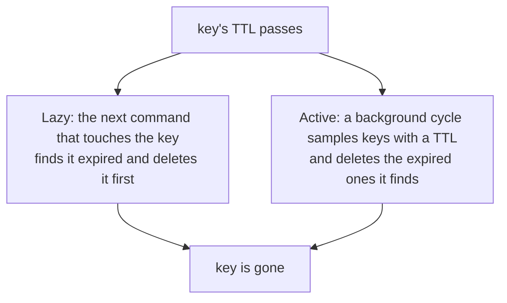

# Lesson 4: Expiry

## 🎯 Lesson Objectives

After this lesson, you will be able to:

- Give a key a time to live, read how long it has left, and remove its expiry
- Interpret the two special answers `TTL` gives: `-1` and `-2`
- Explain which writes keep a key's expiry and which silently remove it — the most common expiry bug
- Update an expiry conditionally with `NX`, `XX`, `GT` and `LT`
- Set an absolute deadline rather than a relative one
- Describe how Redis actually removes expired keys, and why "expired" and "freed" are not the same moment

## 📝 Detailed Content

### 1. Time to Live

Any key can be given a **time to live** (TTL). When it runs out, the key is deleted as if you had called `DEL`. This is what makes Redis useful for sessions, one-time codes, caches and rate limits: data that should stop existing on its own.

```text
127.0.0.1:6379> SET session:ada "cart=3"
OK
127.0.0.1:6379> TTL session:ada
(integer) -1
127.0.0.1:6379> EXPIRE session:ada 60
(integer) 1
127.0.0.1:6379> TTL session:ada
(integer) 60
127.0.0.1:6379> TTL session:nobody
(integer) -2
127.0.0.1:6379> PERSIST session:ada
(integer) 1
127.0.0.1:6379> TTL session:ada
(integer) -1
```

`TTL` returns the seconds remaining, or one of two sentinel values that are easy to confuse:

| `TTL` reply | Meaning |
| ----------- | ------- |
| a positive number | seconds until the key expires |
| `-1` | the key exists and has **no** expiry — it lives until deleted |
| `-2` | the key does **not exist** |

`EXPIRE` returns `1` if it set a timeout and `0` if it did not (for example, because the key does not exist). `PERSIST` removes the timeout and makes the key permanent again. `PEXPIRE` and `PTTL` are the same commands in milliseconds.

### 2. Watching a Key Expire

Expiry is easiest to believe when you watch it happen. `SET` can attach the TTL in the same command with `EX` (seconds) or `PX` (milliseconds) — this code lives for one and a half seconds:

```text
127.0.0.1:6379> SET otp:ada "482913" PX 1500
OK
127.0.0.1:6379> EXISTS otp:ada
(integer) 1
# wait 1600ms
127.0.0.1:6379> EXISTS otp:ada
(integer) 0
127.0.0.1:6379> GET otp:ada
(nil)
127.0.0.1:6379> TTL otp:ada
(integer) -2
```

The `# wait` line is not a command — wait a moment before typing the next one. After the TTL runs out, the key behaves in every way as if it had never existed: `EXISTS` says `0`, `GET` says `(nil)` and `TTL` says `-2`.

Prefer `SET ... EX` over a separate `SET` then `EXPIRE`. Two commands leave a window in which the key exists with no expiry at all, and if the client dies inside that window the key never expires.

### 3. The Trap: SET Removes the Expiry

This is the expiry bug that reaches production most often. A key's TTL survives commands that **modify** its value, but a plain `SET` **replaces** the key — and the replacement has no TTL:

```text
127.0.0.1:6379> SET page:cache "<html>v1</html>" EX 300
OK
127.0.0.1:6379> TTL page:cache
(integer) 300
127.0.0.1:6379> SET page:cache "<html>v2</html>"
OK
127.0.0.1:6379> TTL page:cache
(integer) -1
127.0.0.1:6379> SET page:cache "<html>v3</html>" EX 300
OK
127.0.0.1:6379> SET page:cache "<html>v4</html>" KEEPTTL
OK
127.0.0.1:6379> TTL page:cache
(integer) 300
```

The second `SET` looked like an innocent update, and it turned a five-minute cache entry into one that lives forever. Code that "refreshes" a cached value with plain `SET` accumulates immortal keys until memory runs out. Either pass `EX` on every write, or pass `KEEPTTL` to keep whatever expiry the key already had.

Commands that change a value **in place** leave the TTL alone:

```text
127.0.0.1:6379> SET hits 0 EX 120
OK
127.0.0.1:6379> INCR hits
(integer) 1
127.0.0.1:6379> INCR hits
(integer) 2
127.0.0.1:6379> TTL hits
(integer) 120
```

The same holds for `APPEND`, `SETRANGE`, `HSET` on a hash, `LPUSH` on a list and so on: they alter the existing key, so its expiry stays. `RENAME` carries the TTL over to the new name. Only commands that replace or delete the key — `SET` without `KEEPTTL`, `DEL`, `GETDEL` — take the TTL with it.

::tip-item{title="Rule of thumb" type="tip"}
Modifying a value keeps its TTL. Replacing a value with `SET` drops it, unless you pass `EX` / `PX` again or `KEEPTTL`.
::

### 4. Conditional Expiry: NX, XX, GT and LT

Redis 7.0 added conditions to `EXPIRE`, the same idea as `NX` / `XX` on `SET`:

| Option | Only set the new TTL if… |
| ------ | ------------------------ |
| `NX` | the key has **no** expiry yet |
| `XX` | the key **already** has an expiry |
| `GT` | the new expiry is **later** than the current one |
| `LT` | the new expiry is **sooner** than the current one |

```text
127.0.0.1:6379> SET token "abc" EX 100
OK
127.0.0.1:6379> EXPIRE token 500 NX
(integer) 0
127.0.0.1:6379> EXPIRE token 50 GT
(integer) 0
127.0.0.1:6379> TTL token
(integer) 100
127.0.0.1:6379> EXPIRE token 500 GT
(integer) 1
127.0.0.1:6379> TTL token
(integer) 500
127.0.0.1:6379> EXPIRE token 50 LT
(integer) 1
127.0.0.1:6379> TTL token
(integer) 50
127.0.0.1:6379> SET plain "x"
OK
127.0.0.1:6379> EXPIRE plain 30 XX
(integer) 0
127.0.0.1:6379> TTL plain
(integer) -1
```

`GT` and `LT` are what make expiry policies safe to apply from many places at once. `EXPIRE key 500 GT` can only ever **extend** a key's life, so a request that sets a short TTL can never cut short a key that some other code path deliberately gave a long one. `XX` refused to touch `plain`, because it had no expiry to update.

One subtlety: a key with no expiry counts as living forever, so `GT` can never apply to it and `LT` always can.

### 5. Absolute Deadlines

`EXPIRE` counts from now. When the deadline is a fixed moment — the end of a sale, midnight, a token's issue time plus a week — use `EXPIREAT` with a Unix timestamp. `EXPIRETIME` (new in 7.0) reads the absolute expiry back:

```text
127.0.0.1:6379> SET report "q3"
OK
127.0.0.1:6379> EXPIREAT report 4102444800
(integer) 1
127.0.0.1:6379> EXPIRETIME report
(integer) 4102444800
127.0.0.1:6379> EXPIRETIME plain
(integer) -1
127.0.0.1:6379> EXPIRETIME nothing
(integer) -2
```

`4102444800` is midnight UTC on 1 January 2100 — far enough away that this transcript stays true however late you read it. `EXPIRETIME` uses the same `-1` and `-2` sentinels as `TTL`.

An expiry of zero, or a timestamp in the past, deletes the key immediately rather than being rejected:

```text
127.0.0.1:6379> SET temp "x"
OK
127.0.0.1:6379> EXPIRE temp 0
(integer) 1
127.0.0.1:6379> EXISTS temp
(integer) 0
```

### 6. How Keys Actually Disappear

Redis does not keep a timer per key. It removes expired keys in two complementary ways:



- **Lazy expiry.** Every command that looks up a key checks its TTL first. If it has passed, the key is deleted on the spot and the command sees nothing. This is why an expired key can **never be read**, even for a moment.
- **Active expiry.** Keys that are never touched again would never be found lazily, so a background cycle repeatedly samples keys that have a TTL and deletes the expired ones. If a large share of the sample was expired, it samples again straight away.

The consequence worth remembering: an expired key disappears **logically** at once, but its memory is reclaimed **eventually**. If a million keys expire in the same second, lazy access and sampling reclaim them over the following moments rather than instantly. Lesson 6 returns to this when many cache keys are written with identical TTLs.

## 🏆 Hands-on Exercise with Detailed Solutions

### Exercise 1: A One-Time Login Code

Issue Grace a six-digit login code valid for five minutes. A second request for a code while one is outstanding must **not** replace it. When she submits the code it must be consumed, so the same code cannot be used twice.

**Solution:**

```text
127.0.0.1:6379> SET otp:grace "730155" EX 300 NX
OK
127.0.0.1:6379> SET otp:grace "999999" EX 300 NX
(nil)
127.0.0.1:6379> GETDEL otp:grace
"730155"
127.0.0.1:6379> GETDEL otp:grace
(nil)
```

`EX 300 NX` issues a code with its expiry in one step, and refuses to overwrite an outstanding one. `GETDEL` reads and deletes in a single atomic command, so two simultaneous submissions of the same code cannot both succeed — exactly one sees `"730155"`, and the other sees `(nil)`. A separate `GET` followed by `DEL` would let both through.

### Exercise 2: A Sliding Session That Never Shortens

Sessions last 30 minutes and every request should push expiry back to 30 minutes from now. But a user who ticked "remember me" gets 30 days, and an ordinary request must never cut that down to 30 minutes.

**Solution:**

```text
127.0.0.1:6379> SET session:grace "user=grace" EX 1800
OK
# wait 1100ms
127.0.0.1:6379> TTL session:grace
(integer) 1799
127.0.0.1:6379> EXPIRE session:grace 1800 GT
(integer) 1
127.0.0.1:6379> TTL session:grace
(integer) 1800
127.0.0.1:6379> EXPIRE session:grace 2592000
(integer) 1
127.0.0.1:6379> EXPIRE session:grace 1800 GT
(integer) 0
127.0.0.1:6379> TTL session:grace
(integer) 2592000
```

Every request sends the same `EXPIRE session 1800 GT`. After a second of inactivity the session has 1799 seconds left, so the request extends it back to 1800. Once "remember me" has set 30 days (2 592 000 seconds), the same request is refused, because 30 minutes from now is sooner than the existing expiry. One command covers both kinds of session, and no request ever needs to know which kind it is serving.

## 🔑 Key Points to Remember

1. **`TTL` of `-1` means no expiry; `-2` means no key.** They are not the same failure.
2. **Attach expiry in the write** (`SET ... EX`), not in a second command.
3. **A plain `SET` removes an existing TTL.** Use `EX` again or `KEEPTTL`.
4. **Modifying commands (`INCR`, `APPEND`, `HSET`, `LPUSH`) keep the TTL**, and `RENAME` carries it across.
5. **`EXPIRE ... GT` can only extend; `LT` can only shorten** — safe to apply from anywhere.
6. **`EXPIREAT` sets an absolute deadline**; `EXPIRETIME` reads it back.
7. **Expired keys are never readable**, but their memory is reclaimed gradually by lazy and active expiry.

## 📝 Homework

1. Create a key with `EXPIRE key 100`, then run `GETEX key PERSIST`. What does `TTL` say afterwards? When would reading a value and clearing its expiry in one command be useful?
2. Put a TTL on a list, then `LPUSH` onto it and check the TTL. Then `DEL` the list, `LPUSH` again, and check once more. Explain the difference.
3. A daily report should expire at the next midnight UTC regardless of when it is written. Would you use `EXPIRE` or `EXPIREAT`, and what would your application have to compute?
