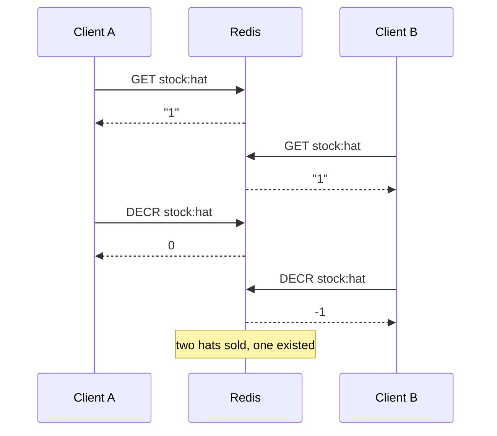

# Lesson 5: Atomicity — Transactions, WATCH and Lua

## 🎯 Lesson Objectives

After this lesson, you will be able to:

- Explain why one Redis command is always atomic but a sequence of commands is not
- Group commands with `MULTI` / `EXEC` so no other client can run between them
- Predict what happens when a command inside a transaction fails — and why Redis does not roll back
- Use `WATCH` to make a read-then-write safe with optimistic locking
- Move a read-decide-write sequence onto the server as a Lua script
- Choose between `MULTI`, `WATCH` and Lua for a given problem

## 📝 Detailed Content

### 1. The Problem: Read-Modify-Write

Redis executes commands **one at a time**. Nothing interleaves inside a single command, which is why `INCR` (Lesson 1) and `HINCRBY` (Lesson 2) can never lose an update.

The trouble starts when your application needs **several** commands and makes a decision between them. "Sell a hat if one is in stock" is a read followed by a write, and another client can run in the gap:



Each command was atomic; the **sequence** was not. This lesson covers the three tools Redis gives you for closing that gap.

### 2. MULTI and EXEC: Commands That Run Together

`MULTI` starts a transaction. The commands that follow are not executed — Redis replies `QUEUED` to each — until `EXEC` runs them **all at once, back to back**, with no other client's command in between. Lessons 2 and 3 each left a pair of writes that should never be seen half-done. Here are both, fixed:

```text
127.0.0.1:6379> MULTI
OK
127.0.0.1:6379> LPUSH events:shop "view:hat"
QUEUED
127.0.0.1:6379> LTRIM events:shop 0 4
QUEUED
127.0.0.1:6379> EXEC
1) (integer) 1
2) OK
```

```text
127.0.0.1:6379> MULTI
OK
127.0.0.1:6379> SADD article:7:tags "redis"
QUEUED
127.0.0.1:6379> SADD tag:redis 7
QUEUED
127.0.0.1:6379> EXEC
1) (integer) 1
2) (integer) 1
```

`EXEC` replies with an array holding each queued command's reply, in order. Nobody can now observe the timeline at six entries, or an article whose forward tag index disagrees with the reverse one.

What `MULTI` cannot do is **decide** anything: a queued command's reply only arrives with `EXEC`, so you cannot read a value inside a transaction and branch on it. That limitation is what `WATCH` and Lua exist to solve.

### 3. What Happens When a Command Fails

This part surprises people who know SQL transactions. There are two kinds of failure, and Redis treats them very differently.

A command that is **valid but fails when it runs** — here, `DECR` on a value that is not a number — fails on its own. **The other commands still run, and nothing is rolled back:**

```text
127.0.0.1:6379> SET stock:hat 10
OK
127.0.0.1:6379> SET stock:scarf "none"
OK
127.0.0.1:6379> MULTI
OK
127.0.0.1:6379> DECR stock:hat
QUEUED
127.0.0.1:6379> DECR stock:scarf
QUEUED
127.0.0.1:6379> DECR stock:hat
QUEUED
127.0.0.1:6379> EXEC
1) (integer) 9
2) (error) ERR value is not an integer or out of range
3) (integer) 8
127.0.0.1:6379> GET stock:hat
"8"
```

The middle command failed and both hats were still sold. A Redis transaction guarantees **isolation** — nothing runs in between — but not **rollback**.

A command that is **malformed** — wrong number of arguments, unknown command — is rejected while it is being queued, and then `EXEC` refuses to run **any** of the transaction:

```text
127.0.0.1:6379> MULTI
OK
127.0.0.1:6379> DECR stock:hat
QUEUED
127.0.0.1:6379> DECR
(error) ERR wrong number of arguments for 'decr' command
127.0.0.1:6379> EXEC
(error) EXECABORT Transaction discarded because of previous errors.
127.0.0.1:6379> GET stock:hat
"8"
```

And you can abandon a transaction yourself with `DISCARD`:

```text
127.0.0.1:6379> MULTI
OK
127.0.0.1:6379> DECR stock:hat
QUEUED
127.0.0.1:6379> DISCARD
OK
127.0.0.1:6379> GET stock:hat
"8"
```

::tip-item{title="Redis transactions do not roll back" type="warning"}
If a command fails at run time inside `EXEC`, every other command in the transaction still takes effect. Validate inputs — types, amounts, existence — before you queue, or do the check inside a Lua script where you can stop before writing anything.
::

### 4. WATCH: Optimistic Locking

`WATCH key` asks Redis to keep an eye on a key. If **anyone** modifies that key between your `WATCH` and your `EXEC`, the `EXEC` refuses to run and replies `(nil)`. That turns "read, decide, write" into something safe:

1. `WATCH` the key you are about to read
2. read it, and decide in your application
3. `MULTI`, queue the writes, `EXEC`
4. if `EXEC` replied `(nil)`, somebody changed the key under you — start again from step 1

When nobody interferes, it goes through:

```text
127.0.0.1:6379> WATCH stock:hat
OK
127.0.0.1:6379> GET stock:hat
"8"
127.0.0.1:6379> MULTI
OK
127.0.0.1:6379> DECR stock:hat
QUEUED
127.0.0.1:6379> EXEC
1) (integer) 7
```

When the key changes in between, it does not. In real life the change comes from another client; here it is simulated from the same connection, which works because `WATCH` reacts to **any** modification — even your own:

```text
127.0.0.1:6379> WATCH stock:hat
OK
127.0.0.1:6379> GET stock:hat
"7"
# meanwhile another client buys a hat - simulated here from the same connection:
127.0.0.1:6379> DECR stock:hat
(integer) 6
127.0.0.1:6379> MULTI
OK
127.0.0.1:6379> DECR stock:hat
QUEUED
127.0.0.1:6379> EXEC
(nil)
127.0.0.1:6379> GET stock:hat
"6"
```

Our decision was based on seeing `"7"`. By the time we tried to commit, the truth was `6`, so Redis threw the transaction away rather than act on stale information. The application loops back, reads `6`, and decides again.

This is **optimistic** locking: nobody is ever blocked, and conflicts are detected rather than prevented. It works well when conflicts are rare. Under heavy contention on one key, clients retry over and over — and that is the case for Lua. `EXEC`, `DISCARD` and `UNWATCH` all clear the watch list, so each attempt starts clean.

### 5. Lua Scripts: Deciding on the Server

`EVAL` runs a Lua script **inside** Redis. The whole script executes as one atomic step: no other command runs until it finishes. So the script can read, decide and write, and there is no gap for another client to slip into.

```text
127.0.0.1:6379> EVAL "return redis.call('DECR', KEYS[1])" 1 stock:hat
(integer) 5
127.0.0.1:6379> EVAL "return tonumber(ARGV[1]) + tonumber(ARGV[2])" 0 20 22
(integer) 42
127.0.0.1:6379> EVAL "return 3.7" 0
(integer) 3
127.0.0.1:6379> EVAL "return '3.7'" 0
"3.7"
```

The arguments after the script are: how many **keys** follow, then the keys (available to the script as `KEYS[1]`, `KEYS[2]`, …), then any other arguments (`ARGV[1]`, …). Always pass key names through `KEYS` rather than writing them into the script, so Redis — and Redis Cluster — can see which keys a script touches. `redis.call` runs a Redis command from inside the script.

Note the third and fourth commands. A Lua number returned to Redis is **truncated to an integer**, so `3.7` became `3`. Return fractional values as strings.

Here is "sell a hat only if one is in stock" as a script. It is the race from section 1, closed:

```lua
local stock = tonumber(redis.call('GET', KEYS[1]) or '0')
if stock > 0 then
  return redis.call('DECR', KEYS[1])
end
return -1
```

```text
127.0.0.1:6379> SET stock:gloves 1
OK
127.0.0.1:6379> EVAL "local stock = tonumber(redis.call('GET', KEYS[1]) or '0') if stock > 0 then return redis.call('DECR', KEYS[1]) end return -1" 1 stock:gloves
(integer) 0
127.0.0.1:6379> EVAL "local stock = tonumber(redis.call('GET', KEYS[1]) or '0') if stock > 0 then return redis.call('DECR', KEYS[1]) end return -1" 1 stock:gloves
(integer) -1
127.0.0.1:6379> GET stock:gloves
"0"
```

The first sale took the last pair of gloves and returned the new stock, `0`. The second found none and returned `-1` without writing anything, so stock can never go negative however many clients call the script at once. `redis.call('GET', ...)` returns `false` for a missing key, which is why the script falls back to `'0'`.

In an application you would not resend the script's source on every call: `SCRIPT LOAD` stores it and returns its SHA1 hash, and `EVALSHA <sha> ...` runs it by hash. Most client libraries do this for you. Redis 7.0 also added **functions** (`FUNCTION LOAD`, `FCALL`), which are named, persistent scripts — the same atomicity with better lifecycle management.

::tip-item{title="A slow script stops the world" type="warning"}
Atomic means nothing else runs while a script is executing. A script that loops over a large list blocks every client for as long as it takes, exactly like `KEYS`. Keep scripts short and bounded.
::

### 6. Choosing Between Them

| Tool | Use it when | Cost |
| ---- | ----------- | ---- |
| a single command | one command expresses the whole change (`INCR`, `SET ... NX`, `GETDEL`, `ZADD ... GT`) | none — always prefer this |
| `MULTI` / `EXEC` | several writes must happen together, with no decision in between | no reads inside; no rollback |
| `WATCH` + `MULTI` | you must read, decide in the application, then write — and conflicts are rare | retries under contention |
| Lua (`EVAL` / functions) | read-decide-write on the server, or contention is high | the script blocks the server while it runs |

The first row is the one people skip. Before reaching for a transaction, check whether a single command already does the job atomically — this course has met several, and there are many more.

Do not confuse any of these with **pipelining**, which is a client-side optimisation: it sends many commands without waiting for each reply, saving round trips, but other clients' commands can still interleave with them. Pipelining is about speed, not atomicity.

## 🏆 Hands-on Exercise with Detailed Solutions

### Exercise 1: A Transfer That Cannot Overdraw, With WATCH

Ada has 100 and Grace has 0. Move 30 from Ada to Grace — but only if Ada has at least 30, decided in your application. Then show what happens when another client withdraws from Ada after you checked her balance but before you committed.

**Solution:**

```text
127.0.0.1:6379> SET acct:ada 100
OK
127.0.0.1:6379> SET acct:grace 0
OK
127.0.0.1:6379> WATCH acct:ada
OK
127.0.0.1:6379> GET acct:ada
"100"
127.0.0.1:6379> MULTI
OK
127.0.0.1:6379> DECRBY acct:ada 30
QUEUED
127.0.0.1:6379> INCRBY acct:grace 30
QUEUED
127.0.0.1:6379> EXEC
1) (integer) 70
2) (integer) 30
```

The application read `100`, decided 100 ≥ 30, and committed both writes together. Now the conflict:

```text
127.0.0.1:6379> WATCH acct:ada
OK
127.0.0.1:6379> GET acct:ada
"70"
# another client withdraws 50 before we commit - simulated from the same connection:
127.0.0.1:6379> DECRBY acct:ada 50
(integer) 20
127.0.0.1:6379> MULTI
OK
127.0.0.1:6379> DECRBY acct:ada 30
QUEUED
127.0.0.1:6379> INCRBY acct:grace 30
QUEUED
127.0.0.1:6379> EXEC
(nil)
127.0.0.1:6379> MGET acct:ada acct:grace
1) "20"
2) "30"
```

The application decided on `70`, but by commit time Ada had only `20`. Without `WATCH`, both writes would have run and left Ada at `-10`. With it, `EXEC` returned `(nil)` and nothing changed. The application now retries: it reads `20`, finds 20 < 30, and refuses the transfer.

Notice that only `acct:ada` is watched. It is the only key the decision depends on — Grace's balance can change freely without making the transfer wrong.

### Exercise 2: The Same Transfer, With Lua

Do the same transfer as a single script that checks the balance itself and refuses with an error if funds are insufficient. The script, formatted for reading:

```lua
local balance = tonumber(redis.call('GET', KEYS[1]) or '0')
local amount = tonumber(ARGV[1])
if balance < amount then
  return redis.error_reply('insufficient funds')
end
redis.call('DECRBY', KEYS[1], amount)
redis.call('INCRBY', KEYS[2], amount)
return balance - amount
```

**Solution** — transferring 15 twice, starting from Ada's 20:

```text
127.0.0.1:6379> EVAL "local balance = tonumber(redis.call('GET', KEYS[1]) or '0') local amount = tonumber(ARGV[1]) if balance < amount then return redis.error_reply('insufficient funds') end redis.call('DECRBY', KEYS[1], amount) redis.call('INCRBY', KEYS[2], amount) return balance - amount" 2 acct:ada acct:grace 15
(integer) 5
127.0.0.1:6379> EVAL "local balance = tonumber(redis.call('GET', KEYS[1]) or '0') local amount = tonumber(ARGV[1]) if balance < amount then return redis.error_reply('insufficient funds') end redis.call('DECRBY', KEYS[1], amount) redis.call('INCRBY', KEYS[2], amount) return balance - amount" 2 acct:ada acct:grace 15
(error) insufficient funds
127.0.0.1:6379> MGET acct:ada acct:grace
1) "5"
2) "45"
```

The first transfer succeeded and returned Ada's new balance, `5`. The second found `5 < 15` and returned an error **before writing anything** — which is exactly what the `MULTI` failure in section 3 could not do. There is no retry loop: nothing can run between the check and the writes, so the check can never be stale.

The `redis-cli` line is long because the script travels inline. In application code you would keep the formatted script in a file, load it once, and call it with `EVALSHA`.

## 🔑 Key Points to Remember

1. **One command is atomic; a sequence is not.** Read-then-write in the application races.
2. **`MULTI` / `EXEC` runs queued commands back to back** — but cannot read and decide in between.
3. **A run-time failure inside `EXEC` does not roll back the rest.** A malformed command aborts the whole transaction with `EXECABORT`.
4. **`WATCH` makes `EXEC` fail with `(nil)` if a watched key changed** — retry on `(nil)`.
5. **A Lua script runs as one atomic step**, so it can read, decide and write with no gap.
6. **Pass keys through `KEYS`, return fractions as strings, and keep scripts short.**
7. **Pipelining is for speed, not atomicity.**

## 📝 Homework

1. Rewrite Exercise 1 as pseudocode for your language of choice, including the retry loop. How many retries would you allow before giving up, and what would you tell the user?
2. Write a Lua script that implements `SET key value` only if the key's current value equals an expected value — a compare-and-swap. What should it return on success and on failure?
3. In section 3, the transaction sold two hats even though a command failed. Rewrite that sale as a Lua script so that if any item is out of stock, **no** item is sold.
