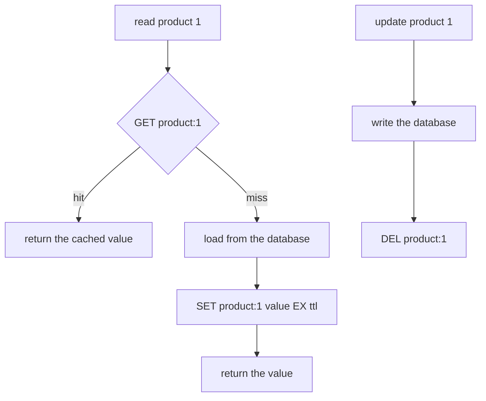
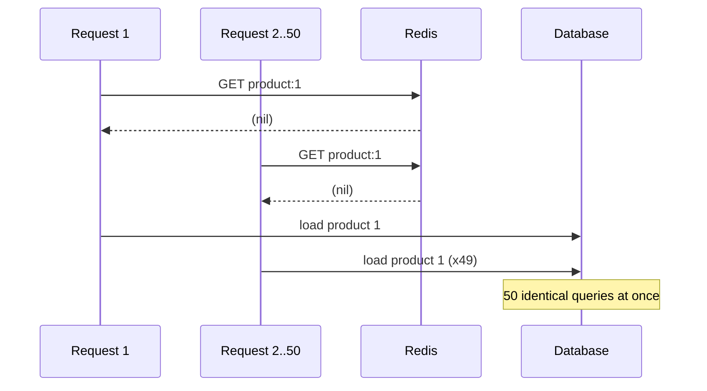

# Lesson 6: Cache Design

## 🎯 Lesson Objectives

After this lesson, you will be able to:

- Implement the cache-aside pattern and explain each step of its read and write paths
- Add jitter to expiry so keys written together do not expire together
- Explain a cache stampede and prevent it with a lock built from `SET ... NX PX`
- Release a lock safely, so a slow worker cannot delete a lock it no longer owns
- Choose between deleting and updating a cached value when the source changes
- Configure what Redis does when it runs out of memory

## 📝 Detailed Content

### 1. Why Cache at All

A cache trades freshness for speed. Reading a value that Redis already holds takes a fraction of a millisecond; rebuilding it — a database query with joins, a call to a slow API, a rendered page — can take hundreds. If the same value is read far more often than it changes, computing it once and serving the stored copy for a while saves almost all of that work.

The price is that the cached copy can be **stale**: the source changes and the cache still holds the old value. Every decision in this lesson is about controlling how stale, for how long, and what happens at the edges.

### 2. Cache-Aside

The most common caching pattern is **cache-aside** (also called lazy loading). The application talks to both the cache and the source of truth, and the cache is only ever filled on demand:



By hand, a miss, a fill, a hit and an invalidation look like this:

```text
127.0.0.1:6379> GET product:1
(nil)
127.0.0.1:6379> SET product:1 '{"id":1,"name":"Wool hat","priceCents":1999}' EX 60
OK
127.0.0.1:6379> GET product:1
"{\"id\":1,\"name\":\"Wool hat\",\"priceCents\":1999}"
127.0.0.1:6379> TTL product:1
(integer) 60
127.0.0.1:6379> DEL product:1
(integer) 1
127.0.0.1:6379> GET product:1
(nil)
```

The `(nil)` from the first `GET` is a **miss**: the application loads the product and writes it with `SET ... EX`. The expiry is attached in the same command, for the reason Lesson 4 gave. The second `GET` is a **hit**, served without touching the database. `redis-cli` shows the JSON with its quotes escaped, because the value is a string that happens to contain quote characters. When the product changes, the application writes the database and then deletes the key, so the next read is a miss that loads the new version.

The TTL is the safety net under all of this. Even if an invalidation is missed — a bug, a crashed process, a write made directly in the database — no cached value can be wrong for longer than its TTL.

### 3. Jitter: Do Not Expire Everything at Once

Suppose a deploy warms the cache by loading ten thousand products, each with `EX 3600`. An hour later all ten thousand expire in the same second, every request misses, and the database takes the full load at once. This is the **synchronized expiry** problem, and it is caused by the cache being too regular.

The fix is **jitter**: add a small random amount to each TTL so expiries spread out.

```js
function withJitter(ttlSeconds) {
  return ttlSeconds + Math.floor(Math.random() * ttlSeconds * 0.1)
}
```

With 10% jitter, keys written together with a 3600-second TTL expire anywhere across a six-minute window instead of in one instant. It also spreads the memory reclamation that Lesson 4 described across that window.

### 4. The Stampede

Jitter handles many keys expiring together. A **stampede** is the same problem concentrated on **one** hot key. When the key for the most-viewed product expires, every request arriving in the next 200 milliseconds misses — and every one of them starts the same expensive load:



The standard defence is a **lock**: on a miss, only the request that wins the lock loads; the rest wait briefly and read the cache again. `SET ... NX` (Lesson 1) is the lock, and `PX` gives it an expiry so a loader that crashes cannot hold it forever:

```text
127.0.0.1:6379> SET lock:product:1 "token-a" NX PX 5000
OK
127.0.0.1:6379> SET lock:product:1 "token-b" NX PX 5000
(nil)
127.0.0.1:6379> EVAL "if redis.call('GET', KEYS[1]) == ARGV[1] then return redis.call('DEL', KEYS[1]) end return 0" 1 lock:product:1 token-b
(integer) 0
127.0.0.1:6379> EVAL "if redis.call('GET', KEYS[1]) == ARGV[1] then return redis.call('DEL', KEYS[1]) end return 0" 1 lock:product:1 token-a
(integer) 1
127.0.0.1:6379> EXISTS lock:product:1
(integer) 0
```

Worker A took the lock and worker B was refused. The lock's value is a **token** unique to its holder, and releasing it is a Lua script (Lesson 5) that deletes the key only if it still holds **your** token. B's attempt to release A's lock did nothing.

The token is not ceremony. Picture A taking the lock with a 5-second expiry and then stalling for 6 seconds. The lock expires, B takes it, and then A finishes and runs a plain `DEL` — deleting **B's** lock, so a third worker can now take it while B is still loading. Compare-and-delete makes each worker able to release only its own lock.

::tip-item{title="Always release a lock by token" type="warning"}
Releasing a lock with a plain `DEL` can delete a lock another client now holds, if yours expired while you were still working. Store a unique token in the lock and delete it only if the token still matches — atomically, in Lua.
::

### 5. Invalidation: Delete, Don't Update

When the source changes, you can either **delete** the cached key or **overwrite** it with the new value. Prefer deleting.

Overwriting on write has a race. Two concurrent updates can write the database in one order and the cache in the other, leaving the cache holding the older value — and with no miss coming, it stays wrong until the TTL. Deleting avoids that: whatever order the deletes land in, the key is gone, and the next read loads whatever the database holds **then**.

The order matters too: **write the database first, then delete the cache.** Deleting first opens a window in which a reader misses, loads the **old** value from the not-yet-updated database, and caches it after your delete.

Even delete-after-write has one narrow window left. A reader can load the old value just before your write, and store it just after your delete. That is why the TTL remains the backstop: cache-aside keeps the cache **eventually** consistent, bounded by the TTL, not instantly consistent. Choose TTLs with that bound in mind: for a product price, a minute of staleness is probably fine; for an account balance, caching may be the wrong tool.

### 6. When Memory Runs Out

Redis keeps everything in memory, so a cache that only ever grows will eventually meet a limit. `maxmemory` sets that limit, and `maxmemory-policy` decides what happens when a write would exceed it:

```text
127.0.0.1:6379> CONFIG GET maxmemory
1) "maxmemory"
2) "0"
127.0.0.1:6379> CONFIG GET maxmemory-policy
1) "maxmemory-policy"
2) "noeviction"
127.0.0.1:6379> SET product:1 "cached"
OK
127.0.0.1:6379> CONFIG SET maxmemory 1
OK
127.0.0.1:6379> SET product:2 "cached"
(error) OOM command not allowed when used memory > 'maxmemory'.
127.0.0.1:6379> GET product:1
"cached"
127.0.0.1:6379> DEL product:1
(integer) 1
127.0.0.1:6379> CONFIG SET maxmemory 0
OK
127.0.0.1:6379> SET product:2 "cached"
OK
```

A `maxmemory` of `0` means no limit, and the default policy is `noeviction`. Setting the limit to one byte — far below what Redis already uses — shows what `noeviction` means: once over the limit, **writes are refused** with an `OOM` error, while reads and deletes keep working. The transcript then puts the limit back; do the same if you try this.

For a cache, refusing writes is usually the wrong behaviour — you would rather lose the least useful entries. That is what the other policies do. Redis 7.0 accepts eight:

| Policy | Evicts | Typical use |
| ------ | ------ | ----------- |
| `noeviction` | nothing — writes fail with `OOM` | Redis as a primary store, where losing data silently is worse than an error |
| `allkeys-lru` | any key, least recently used first | a dedicated cache |
| `allkeys-lfu` | any key, least frequently used first | a cache where some keys stay hot for a long time |
| `allkeys-random` | any key, at random | access patterns with no useful recency or frequency signal |
| `volatile-lru` | only keys **with a TTL**, least recently used first | cache and durable data sharing one instance |
| `volatile-lfu` | only keys with a TTL, least frequently used first | as above, frequency-based |
| `volatile-random` | only keys with a TTL, at random | as above, no signal |
| `volatile-ttl` | only keys with a TTL, shortest remaining TTL first | when TTL already encodes how disposable an entry is |

For a Redis that is only a cache, `allkeys-lru` or `allkeys-lfu` is the usual choice. The `volatile-*` policies protect keys that have no TTL — sessions, queues, counters — while evicting cache entries. That protection is also their trap: if memory fills with keys that have **no** TTL, there is nothing a `volatile-*` policy is allowed to evict, and writes fail with `OOM` just as they do under `noeviction`.

Redis's LRU and LFU are **approximations**. Rather than tracking a perfect ordering of every key, Redis samples a few candidates and evicts the best of the sample, which gives nearly the same result at a fraction of the memory.

## 🏆 Hands-on Exercise with Detailed Solutions

### Exercise: A Cache-Aside Wrapper With Stampede Protection

Build a small Node.js program that puts everything in this lesson together, and measure it: a deliberately slow "database", plain cache-aside, cache-aside with a lock, jitter and delete-on-write invalidation. Then fire 50 concurrent requests at a cold key with each version and count the database calls.

**Setup** (Node.js 20 or later, with Redis running locally):

```bash
mkdir cache-lab && cd cache-lab
npm init -y
npm pkg set type=module
npm install redis
```

**Solution** — save as `cache-lab.mjs`:

```js
import { createClient } from 'redis'
import { randomUUID } from 'node:crypto'
import { setTimeout as sleep } from 'node:timers/promises'

const redis = createClient({ url: process.env.REDIS_URL ?? 'redis://localhost:6379' })
redis.on('error', (err) => console.error('redis error:', err))
await redis.connect()

// --- A deliberately slow "database" that counts how often it is queried ---

const products = new Map([[1, { id: 1, name: 'Wool hat', priceCents: 1999 }]])
let dbCalls = 0

async function loadProduct(id) {
  dbCalls++
  await sleep(200) // stands in for an expensive query
  return { ...products.get(id) }
}

// --- Expiry with jitter: keys written together must not expire together ---

function withJitter(ttlSeconds) {
  return ttlSeconds + Math.floor(Math.random() * ttlSeconds * 0.1)
}

// --- 1. Plain cache-aside ---

async function cacheAside(key, ttlSeconds, load) {
  const hit = await redis.get(key)
  if (hit !== null) return JSON.parse(hit)

  const value = await load()
  await redis.set(key, JSON.stringify(value), {
    expiration: { type: 'EX', value: withJitter(ttlSeconds) },
  })
  return value
}

// --- 2. Cache-aside with a stampede lock ---

// Delete the lock only if it still holds our token. Without this check, a
// loader that ran past the lock's expiry would delete a lock another client
// now holds.
const RELEASE_LOCK = `
if redis.call('GET', KEYS[1]) == ARGV[1] then
  return redis.call('DEL', KEYS[1])
end
return 0`

async function cacheAsideLocked(key, ttlSeconds, load) {
  for (;;) {
    const hit = await redis.get(key)
    if (hit !== null) return JSON.parse(hit)

    const lockKey = `lock:${key}`
    const token = randomUUID()
    const acquired = await redis.set(lockKey, token, {
      condition: 'NX',
      expiration: { type: 'PX', value: 5000 }, // a crashed loader cannot hold it forever
    })

    if (acquired === 'OK') {
      try {
        // Check again now that we hold the lock: another loader may have
        // filled the cache between our GET above and our SET NX.
        const filled = await redis.get(key)
        if (filled !== null) return JSON.parse(filled)

        const value = await load()
        await redis.set(key, JSON.stringify(value), {
          expiration: { type: 'EX', value: withJitter(ttlSeconds) },
        })
        return value
      } finally {
        await redis.eval(RELEASE_LOCK, { keys: [lockKey], arguments: [token] })
      }
    }

    await sleep(25) // someone else is loading: wait, then look in the cache again
  }
}

// --- 3. Invalidation on write ---

async function updatePrice(id, priceCents) {
  products.get(id).priceCents = priceCents // write the source of truth first...
  await redis.del(`product:${id}`) //          ...then drop the cached copy
}

// --- The experiment ---

const key = 'product:1'
const fifty = (fn) => Promise.all(Array.from({ length: 50 }, () => fn(key, 60, () => loadProduct(1))))

await redis.del(key)
dbCalls = 0
await fifty(cacheAside)
console.log(`cold cache, no lock:   50 concurrent requests -> ${dbCalls} database calls`)

await redis.del(key)
dbCalls = 0
await fifty(cacheAsideLocked)
console.log(`cold cache, with lock: 50 concurrent requests -> ${dbCalls} database call`)

dbCalls = 0
await fifty(cacheAsideLocked)
console.log(`warm cache:            50 concurrent requests -> ${dbCalls} database calls`)

const ttl = await redis.ttl(key)
console.log(`TTL has jitter applied (60-65s): ${ttl >= 60 && ttl <= 65}`)

await updatePrice(1, 2499)
dbCalls = 0
const fresh = await cacheAsideLocked(key, 60, () => loadProduct(1))
console.log(`after a price update:  ${fresh.priceCents} cents, ${dbCalls} database call`)

await redis.close()
```

Run it with `node cache-lab.mjs` (set `REDIS_URL` if your Redis is not on `localhost:6379`):

```text
cold cache, no lock:   50 concurrent requests -> 50 database calls
cold cache, with lock: 50 concurrent requests -> 1 database call
warm cache:            50 concurrent requests -> 0 database calls
TTL has jitter applied (60-65s): true
after a price update:  2499 cents, 1 database call
```

That output was produced by running this exact file against Redis 7.0.15 with node-redis 6.2.1, six times, with the same result every time.

**What each line shows:**

1. **No lock:** all 50 requests missed before the first load finished, so all 50 queried the database — the stampede, reproduced.
2. **With lock:** one request won `SET ... NX`, loaded once and filled the cache; the other 49 slept 25 ms at a time and then found it. One database call instead of fifty.
3. **Warm cache:** every request was a hit.
4. **Jitter:** the stored TTL landed somewhere between 60 and 65 seconds rather than exactly on 60.
5. **Invalidation:** `updatePrice` changed the source and deleted the key, so the next read missed and loaded the new price.

**The re-check inside the lock.** After acquiring the lock, the code reads the cache **again** before loading. Without that, a waiter can see an empty cache, and then win the lock just after the first loader filled the cache and released it — and load a second time. This window is narrow, and on a local machine it may never show: removing the re-check and running 40 cold bursts against a local Redis produced **no** double loads. But a real network puts a round trip, and sometimes a pause, between the `GET` and the `SET NX`. Simulating a random 1–10 ms gap there, the same 40 bursts double-loaded in **38** of them without the re-check, and in **none** with it. A bug that only appears under real latency is exactly the kind that passes every local test.

Note the modern node-redis option shapes: `expiration: { type: 'EX', value }` and `condition: 'NX'`. The older `{ EX: 60, NX: true }` form still works in node-redis 6 but is deprecated, and much published example code still uses it.

## 🔑 Key Points to Remember

1. **Cache-aside:** on a miss, load and `SET ... EX`; on a write, update the source, then `DEL` the key.
2. **The TTL is the backstop** that bounds how stale a cached value can ever be.
3. **Add jitter to TTLs** so keys written together do not expire together.
4. **A stampede is many misses on one hot key.** A `SET ... NX PX` lock lets one request load while the rest wait.
5. **Release locks by token, atomically**, and re-check the cache after acquiring the lock.
6. **Delete on write, don't overwrite** — and write the source before deleting the cache.
7. **The default `noeviction` refuses writes when memory is full.** A dedicated cache wants `allkeys-lru` or `allkeys-lfu`.

## 📝 Homework

1. Change the lab's lock expiry to 100 ms while the load still takes 200 ms, and run the cold-cache-with-lock burst again. How many database calls do you get, and why? What does this tell you about choosing a lock's expiry?
2. The waiters in `cacheAsideLocked` poll every 25 ms. Sketch how Redis pub/sub (`SUBSCRIBE` / `PUBLISH`) could let them wait for "the cache is filled" instead of polling. What happens to a waiter that subscribes just after the notification was published?
3. You run one Redis for both a page cache and user sessions, and sessions must never be evicted. Which `maxmemory-policy` would you choose, what must be true of every cache key, and what goes wrong if one code path forgets?
