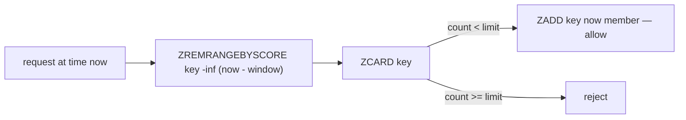

# Lesson 7: Capstone — Rate Limiting

## 🎯 Lesson Objectives

After this lesson, you will be able to:

- Build a fixed-window rate limiter from `INCR` and `EXPIRE`, and explain the burst it allows
- Build a sliding-window rate limiter from a sorted set of timestamps
- Make the sliding window atomic with a Lua script, and call it by hash with `EVALSHA`
- Compare the two designs on accuracy, memory and cost per request

A rate limiter is a good capstone because it needs everything in this course at once: strings and counters (Lesson 1), sorted sets (Lesson 3), expiry (Lesson 4) and atomicity (Lesson 5), assembled into a design with a real trade-off (Lesson 6's way of thinking).

## 📝 Detailed Content

### 1. The Requirement

Allow each client at most **3 requests per 60 seconds**. The numbers are deliberately small so you can watch the limit bite; production limits are larger, and the designs do not change.

### 2. Fixed Window: A Counter Per Minute

Chop time into 60-second windows and keep one counter per client per window. The window number is the current Unix time divided by 60, rounded down — so every request in the same minute increments the same key:

```text
127.0.0.1:6379> MULTI
OK
127.0.0.1:6379> INCR rl:fixed:ada:1000
QUEUED
127.0.0.1:6379> EXPIRE rl:fixed:ada:1000 60 NX
QUEUED
127.0.0.1:6379> EXEC
1) (integer) 1
2) (integer) 1
127.0.0.1:6379> INCR rl:fixed:ada:1000
(integer) 2
127.0.0.1:6379> INCR rl:fixed:ada:1000
(integer) 3
127.0.0.1:6379> INCR rl:fixed:ada:1000
(integer) 4
127.0.0.1:6379> TTL rl:fixed:ada:1000
(integer) 60
```

Here `1000` stands for "the 1000th minute"; your application computes it from the clock. Each request increments the counter and the application compares the reply with the limit: `1`, `2` and `3` are allowed, and the `4` means this request is over the limit and gets rejected — typically with HTTP status 429.

The first request sends `INCR` and `EXPIRE ... NX` together in a transaction. `NX` (Lesson 4) means only the first request of a window sets the expiry; later ones, shown here as bare `INCR`s for brevity, would get `0` from `EXPIRE ... NX` and leave it alone. The expiry is just cleanup: once the minute is over, its counter is never read again. Without it, one dead key would accumulate per client per minute, forever.

Fixed windows are cheap — one small integer per active client, and one round trip per request.

### 3. The Flaw: Bursts at the Boundary

A fixed window counts per **calendar** minute, not per **rolling** 60 seconds. Watch a client who sends three requests at the very end of one minute, and three more at the very start of the next:

```text
127.0.0.1:6379> INCR rl:fixed:bob:1000
(integer) 1
127.0.0.1:6379> INCR rl:fixed:bob:1000
(integer) 2
127.0.0.1:6379> INCR rl:fixed:bob:1000
(integer) 3
127.0.0.1:6379> INCR rl:fixed:bob:1001
(integer) 1
127.0.0.1:6379> INCR rl:fixed:bob:1001
(integer) 2
127.0.0.1:6379> INCR rl:fixed:bob:1001
(integer) 3
```

Every reply is within the limit of 3, so all six requests are allowed. But if the first three arrived in the last second of minute 1000 and the next three in the first second of minute 1001, Bob made **six requests in about two seconds** — double the limit. In the worst case, a fixed window allows up to twice its limit in a short burst straddling the boundary.

For many uses — keeping a runaway script from hammering an API — that is perfectly acceptable. When it is not, you need to count over a **sliding** window.

### 4. Sliding Window: A Sorted Set of Timestamps

To know how many requests arrived in **the last** 60 seconds, you have to remember when each one arrived. A sorted set does this naturally: one member per request, scored by its timestamp in milliseconds. The query "how many in the last 60 seconds?" becomes "drop members older than 60 seconds, then count":



Here are the three operations by hand, with timestamps chosen so the arithmetic is easy to follow:

```text
127.0.0.1:6379> ZADD rl:sliding:carol 60000 "60000-a"
(integer) 1
127.0.0.1:6379> ZADD rl:sliding:carol 80000 "80000-a"
(integer) 1
127.0.0.1:6379> ZADD rl:sliding:carol 100000 "100000-a"
(integer) 1
127.0.0.1:6379> ZREMRANGEBYSCORE rl:sliding:carol -inf 55000
(integer) 0
127.0.0.1:6379> ZCARD rl:sliding:carol
(integer) 3
127.0.0.1:6379> ZREMRANGEBYSCORE rl:sliding:carol -inf 70000
(integer) 1
127.0.0.1:6379> ZCARD rl:sliding:carol
(integer) 2
127.0.0.1:6379> ZRANGE rl:sliding:carol 0 -1 WITHSCORES
1) "80000-a"
2) "80000"
3) "100000-a"
4) "100000"
```

At time 115 000 ms, the window reaches back to 55 000, so nothing has aged out and the count is 3 — at the limit. At time 130 000 ms, the window reaches back to 70 000, the request at 60 000 drops out, and the count is 2 — room for one more.

Two details. Members must be **unique**, and two requests can arrive in the same millisecond, so each member is the timestamp plus a per-request suffix (in production, a random ID). And the three steps are a read, a decision and a write — exactly the pattern Lesson 5 warned about. Done as separate commands, two concurrent requests could both count 2 and both be allowed. So the real implementation runs on the server, as a script.

### 5. The Atomic Sliding Window

The whole check-and-record, as one Lua script:

```lua
local key = KEYS[1]
local now = tonumber(ARGV[1])
local window = tonumber(ARGV[2])
local limit = tonumber(ARGV[3])
redis.call('ZREMRANGEBYSCORE', key, '-inf', now - window)
local count = redis.call('ZCARD', key)
if count < limit then
  redis.call('ZADD', key, now, ARGV[4])
  redis.call('PEXPIRE', key, window)
  return {1, count + 1}
end
return {0, count}
```

It takes the current time in milliseconds, the window length, the limit and a unique member. It returns a pair: `1` or `0` for allowed or rejected, and the number of requests now counted in the window. `PEXPIRE` resets the key's lifetime to one window on each allowed request, so a client that goes quiet leaves nothing behind.

The application passes `now` in rather than the script reading the clock. That keeps the script's behaviour a pure function of its arguments, and it lets the transcripts below use fixed times you can check by hand.

Rather than sending the whole script with every request, load it once with `SCRIPT LOAD`, which returns its SHA1 hash, and call it by hash with `EVALSHA` — the workflow Lesson 5 mentioned:

```text
127.0.0.1:6379> SCRIPT LOAD "local key = KEYS[1] local now = tonumber(ARGV[1]) local window = tonumber(ARGV[2]) local limit = tonumber(ARGV[3]) redis.call('ZREMRANGEBYSCORE', key, '-inf', now - window) local count = redis.call('ZCARD', key) if count < limit then redis.call('ZADD', key, now, ARGV[4]) redis.call('PEXPIRE', key, window) return {1, count + 1} end return {0, count}"
"7ac5779dc9a6d35da6b91ca012e3725677298181"
127.0.0.1:6379> EVALSHA 7ac5779dc9a6d35da6b91ca012e3725677298181 1 rl:dave 119000 60000 3 119000-a
1) (integer) 1
2) (integer) 1
127.0.0.1:6379> EVALSHA 7ac5779dc9a6d35da6b91ca012e3725677298181 1 rl:dave 119500 60000 3 119500-a
1) (integer) 1
2) (integer) 2
127.0.0.1:6379> EVALSHA 7ac5779dc9a6d35da6b91ca012e3725677298181 1 rl:dave 119900 60000 3 119900-a
1) (integer) 1
2) (integer) 3
127.0.0.1:6379> EVALSHA 7ac5779dc9a6d35da6b91ca012e3725677298181 1 rl:dave 120100 60000 3 120100-a
1) (integer) 0
2) (integer) 3
127.0.0.1:6379> EVALSHA 7ac5779dc9a6d35da6b91ca012e3725677298181 1 rl:dave 120400 60000 3 120400-a
1) (integer) 0
2) (integer) 3
127.0.0.1:6379> EVALSHA 7ac5779dc9a6d35da6b91ca012e3725677298181 1 rl:dave 179001 60000 3 179001-a
1) (integer) 1
2) (integer) 3
127.0.0.1:6379> ZRANGE rl:dave 0 -1 WITHSCORES
1) "119500-a"
2) "119500"
3) "119900-a"
4) "119900"
5) "179001-a"
6) "179001"
```

This is Bob's boundary burst replayed against the sliding window. Dave's three requests at 119.0 s, 119.5 s and 119.9 s are allowed. His next two, at 120.1 s and 120.4 s, would have landed in a fresh minute under a fixed window and been allowed. Here they are **rejected**, because the last 60 seconds still hold three requests. Only at 179.001 s — just over a minute after his first request — has 119 000 aged out, so a fourth request is allowed and the count is back to 3.

The hash is a SHA1 of the script's exact text, so the same script always gets the same hash, and you will see `7ac5779d…` too if you load it character for character. The script cache is not permanent, though:

```text
127.0.0.1:6379> EVALSHA 7ac5779dc9a6d35da6b91ca012e3725677298181 1 rl:erin 1000 60000 2 1000-a
1) (integer) 1
2) (integer) 1
127.0.0.1:6379> SCRIPT FLUSH
OK
127.0.0.1:6379> EVALSHA 7ac5779dc9a6d35da6b91ca012e3725677298181 1 rl:erin 2000 60000 2 2000-a
(error) NOSCRIPT No matching script. Please use EVAL.
```

After a restart or a `SCRIPT FLUSH`, the hash is unknown and `EVALSHA` fails with `NOSCRIPT`. Applications handle this by catching `NOSCRIPT` and retrying with `EVAL`, which also reloads the cache; most client libraries do it for you. Redis 7.0's functions (`FUNCTION LOAD`) are the alternative when you want scripts that persist.

### 6. Choosing Between Them

| | Fixed window | Sliding window |
| --- | --- | --- |
| Accuracy | up to 2× the limit across a boundary | exact over any rolling window |
| Memory per client | one integer | one sorted-set member per request in the window |
| Work per request | `INCR` — constant | remove old + count + add — logarithmic in the limit |
| Atomicity | `INCR` is atomic on its own | needs a script |

The sliding window's cost grows with the **limit**: a limit of 10 000 requests per hour keeps up to 10 000 members per client. That is why high-volume systems often use approximations between the two — for example, weighting the previous fixed window's count by how much of it still overlaps the rolling window. It costs two counters instead of a sorted set, and it is usually accurate enough.

## 🏆 Hands-on Exercise with Detailed Solutions

### Exercise: Make the Fixed Window One Command

The fixed-window limiter in section 2 needed a transaction on the first request of each window, and bare `INCR`s after that — which means the application must know whether this is the first request. Replace both with one Lua script that increments the counter, sets the expiry only when the counter was just created, and returns the count.

**Solution:**

```text
127.0.0.1:6379> EVAL "local count = redis.call('INCR', KEYS[1]) if count == 1 then redis.call('EXPIRE', KEYS[1], ARGV[1]) end return count" 1 rl:fixed:frank:1000 60
(integer) 1
127.0.0.1:6379> EVAL "local count = redis.call('INCR', KEYS[1]) if count == 1 then redis.call('EXPIRE', KEYS[1], ARGV[1]) end return count" 1 rl:fixed:frank:1000 60
(integer) 2
127.0.0.1:6379> TTL rl:fixed:frank:1000
(integer) 60
```

`INCR` returning `1` means the counter was just created, which is exactly when an expiry is needed. Because the script is atomic, no other request can observe the counter between its creation and its expiry, so there is no window in which a crash could leave an immortal counter behind. The application now sends one identical command for every request.

## 🎓 Course Summary

Across eight lessons you worked from single keys up to designs:

- **Structures (Lessons 1–3).** Strings and counters, hashes and lists, sets and sorted sets — each with the operations it makes cheap, and the order guarantees it does and does not give.
- **Time (Lesson 4).** Expiry, the `-1` / `-2` distinction, the `SET` trap, conditional and absolute expiry, and how keys really disappear.
- **Correctness (Lesson 5).** Why single commands are atomic and sequences are not, and the three tools for closing the gap.
- **Designs (Lessons 6–7).** A cache with jitter, stampede protection and invalidation, and two rate limiters with a real trade-off between them.

The thread running through all of it: **find the single command, or single script, that does the whole job.** Most Redis bugs are two correct commands with a gap between them.

## ✅ Mastery Checklist

- [ ] I can name keys with the `object:id:field` convention and find them with `SCAN`, never `KEYS`
- [ ] I can explain why `INCR` never loses an update and a `GET`-then-`SET` does
- [ ] I can choose between a hash and a JSON string for a given object, and say why
- [ ] I know which replies have a guaranteed order (sorted sets, lists, small hashes) and which do not (sets)
- [ ] I can read a `TTL` of `-1` and `-2` correctly, and I never refresh a cached value with a plain `SET`
- [ ] I can predict what `EXEC` does when a queued command fails, and when to reach for `WATCH` or Lua instead
- [ ] I can build cache-aside with jitter, a token-checked stampede lock and delete-on-write invalidation
- [ ] I can pick an eviction policy for a dedicated cache and for a shared instance
- [ ] I can build fixed- and sliding-window rate limiters and explain the burst that separates them

## 📝 Homework

1. Add a second limit to the sliding window: at most 3 requests per 60 seconds **and** at most 10 per hour. Can you do it with one sorted set, or do you need two? What does the script return when the hourly limit is the one exceeded?
2. The sliding-window script rejects a request without recording it. Some systems record rejected requests too, so that a client hammering the limit stays blocked. Change the script to do that, and explain what it does to a client that retries in a tight loop.
3. Implement the approximation from section 6: keep a fixed-window counter for the current and the previous minute, and estimate the rolling count as `current + previous × (fraction of the previous minute still inside the rolling window)`. Test it against Bob's boundary burst from section 3.
