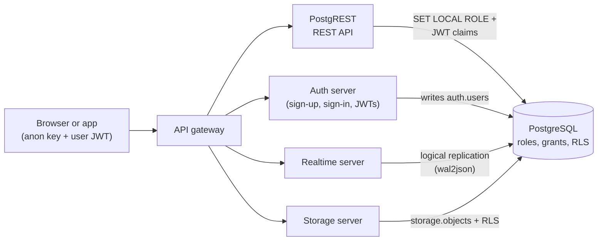

# Supabase: Postgres, Row-Level Security and Realtime

Supabase is often described as "an open-source Firebase", and that description hides the one thing a developer most needs to understand about it: **a Supabase project is a PostgreSQL database**, and almost everything else in the product is a server that talks to that database on your behalf. The REST API is generated from your tables. Sign-up writes a row into a table. Realtime reads the database's own replication stream. Access control is not a setting in a dashboard; it is SQL — roles, grants and row-level security policies — enforced by Postgres itself.

That makes the security model unusual. With a classic backend, your server code sits between the browser and the database, and it decides what each user may do. With Supabase, the browser talks almost directly to the database through the generated API, using a public key that anyone can read out of your JavaScript bundle. The only thing standing between an anonymous visitor and your data is what the database itself refuses to do. This course is about making the database refuse the right things.

## How the pieces fit



Every arrow ends at the same database, and every server identifies the caller to it in the same way: by switching to a database role (`anon` for a visitor, `authenticated` for a signed-in user) and handing over the claims from the user's JSON Web Token. The policies you write then decide, row by row, what that role and that user can see and change.

## What this course verifies, and what it does not

**Every `psql` transcript in this course is tested.** `learning-doc/scripts/verify-psql-transcripts.mjs` types each lesson's lines into a real, interactive `psql` connected to a throwaway **PostgreSQL 16** server, in lesson order, and fails if a single character differs from what is printed here — results, errors, notices and the prompts themselves. They were last verified against **PostgreSQL 16.13**.

What is *not* run is everything outside the database: the Auth server, PostgREST, the Realtime server, Storage and the dashboard. Where a lesson depends on how one of those behaves, it says so, and it points at the source it relies on rather than asking you to take it on trust. Lesson 1 builds a small, clearly labelled stand-in for the parts of a Supabase database those servers depend on — the roles, the `auth` schema and `auth.uid()` — copied from Supabase's own open-source migrations, so that everything after it runs on plain PostgreSQL exactly as it would on a project.

## How to read the transcripts

```text
postgres=# select current_user, current_database(), current_setting('server_version_num')::int / 10000 as major;
 current_user | current_database | major
--------------+------------------+-------
 postgres     | postgres         |    16
(1 row)
```

Everything after a prompt is what you type; everything up to the next prompt is what `psql` prints. The prompt is worth reading too, because `psql` uses it to tell you things:

| Prompt | Meaning |
|---|---|
| `postgres=#` | ready for a new statement; `#` means you are a superuser |
| `postgres=>` | ready, but you are **not** a superuser — you will see this after switching to `anon` or `authenticated` |
| `postgres=*#` | inside an open transaction (`BEGIN`) |
| `postgres=!#` | inside a transaction that has hit an error: nothing more will run until `ROLLBACK` |
| `postgres-#` | the statement is not finished yet (no semicolon) |
| `postgres(#` | …and a parenthesis is still open |
| `postgres$#` | …and you are inside a `$$`-quoted function body |

### Running PostgreSQL locally

The lessons need PostgreSQL 16 with `wal_level=logical` (for the Realtime lesson) and the `wal2json` plugin, which is what Supabase Realtime itself decodes changes with. With Docker:

```bash
docker run -d --name supabase-course -e POSTGRES_PASSWORD=course postgres:16 -c wal_level=logical
docker exec supabase-course sh -c 'apt-get update -qq && apt-get install -y -qq postgresql-16-wal2json'
docker exec -it supabase-course psql -U postgres
```

The official image is built on the PostgreSQL project's own package repository, which is where `postgresql-16-wal2json` comes from. On Ubuntu or Debian without Docker, install `postgresql-16` and `postgresql-16-wal2json` and set `wal_level = logical` in `postgresql.conf`.

Use a fresh, empty database, and run the lessons **in order**: unlike a set of independent exercises, each lesson builds on the schema the previous one left behind, exactly as a real project grows.

**Why not a Supabase project, or `supabase start`?** You can follow along in one — but a Supabase database already has the roles and the `auth` schema that lesson 1 creates, so skip lesson 1's setup statements, and expect small differences: on a hosted project `postgres` is not a true superuser, so your prompt ends in `>` rather than `#`, and some errors are worded differently. The transcripts are only guaranteed on the plain PostgreSQL 16 described above.

## Part 1: The Model

### Lesson 1: What Supabase Adds to Postgres

**Content:**

- The four roles every request runs as — `anon`, `authenticated`, `service_role` — and `authenticator`, the one PostgREST actually logs in as
- `noinherit`, and why `authenticator` has no privileges of its own until it switches role
- The `auth` schema, `auth.users`, and how `auth.uid()` reads the caller's identity out of the JWT claims
- Building a faithful stand-in from Supabase's own migrations

**Activities:**

- Impersonate an HTTP request by hand: `SET LOCAL ROLE`, then JWT claims, then `auth.uid()`

### Lesson 2: Tables, Grants and the Exposed Schema

**Content:**

- Supabase table conventions: identity keys, `uuid` references to `auth.users`, `timestamptz`, `check` constraints
- Default privileges: why a new table in `public` is readable **and writable** by `anon` the moment it exists
- Reading privileges with `\dp` and `has_table_privilege()`
- Grants decide *which operations*; they cannot decide *which rows*

**Activities:**

- Create a `notes` table, then delete another user's note as an anonymous visitor

## Part 2: Row-Level Security

### Lesson 3: Row-Level Security

**Content:**

- `enable row level security`: from "everyone sees everything" to "nobody sees anything"
- Policies: `for select | insert | update | delete`, `to <role>`, `using` and `with check`
- Why an `UPDATE` of someone else's row reports `UPDATE 0` instead of an error
- Who bypasses RLS: table owners, superusers, `bypassrls` roles such as `service_role` — and `force row level security`

**Activities:**

- Owner-only notes, then notes their owner can publish for anyone to read

### Lesson 4: Policies That Scale

**Content:**

- Team membership: policies that look up another table
- The recursion trap when a policy queries its own table, and `security definer` helper functions that avoid it
- `(select auth.uid())` versus `auth.uid()`: reading the difference in `EXPLAIN`
- Indexing the columns policies filter on

**Activities:**

- Team-shared projects where members read and admins write

## Part 3: The Database as Backend

### Lesson 5: Functions and Triggers

**Content:**

- An `updated_at` trigger
- Creating a profile row whenever a user signs up: a trigger on `auth.users`
- `security definer` done safely: `set search_path = ''` and fully qualified names
- Database functions as API endpoints, and why new functions are executable by `anon` until you revoke it

**Activities:**

- A `join_team(code)` function that does something no policy could express

### Lesson 6: Realtime Under the Hood

**Content:**

- The write-ahead log, logical decoding and replication slots
- The `supabase_realtime` publication: only published tables produce events
- `wal2json`, the plugin Realtime reads changes with
- `replica identity full`: getting the old row on `UPDATE` and `DELETE`

**Activities:**

- Watch inserts, updates and deletes arrive through a replication slot, with and without the old values

### Lesson 7: Capstone — A Team Chat

**Content:**

- Channels, memberships and messages, with policies for each operation
- Publishing messages to Realtime, and why Realtime's own authorisation check depends on your `select` policy
- Testing policies in SQL: impersonate each kind of user and assert what they can and cannot do

**Activities:**

- Build the schema, then attack it: read another team's messages, post as someone else, edit a message after leaving a channel
