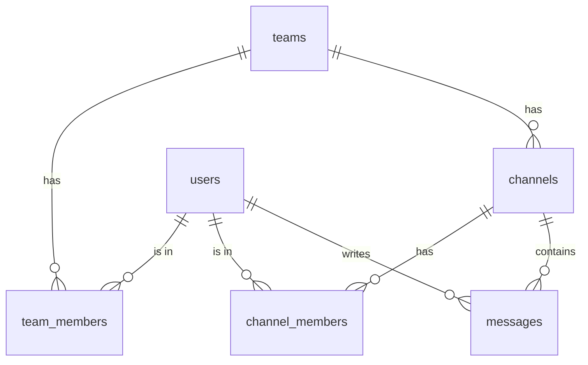

# Lesson 7: Capstone — A Team Chat

## 🎯 Lesson Objectives

After this lesson, you will be able to:

- Design a multi-table schema whose every access rule is enforced by the database
- Combine grants, column privileges, policies, helper functions and a publication into one coherent design
- Attack your own design the way a hostile client would
- Write policy tests in SQL that fail when a policy regresses

## 📝 Detailed Content

### 1. The Design

Teams (lesson 4) get chat channels. The rules, in plain language:

1. A team member can see the team's channels and join any of them.
2. A channel member can read its messages and post as themselves — never as someone else.
3. An author can edit the text of their own message, but only while they are still in the channel; nobody can change who wrote a message or where it was posted.
4. Authors can delete their own messages.
5. New messages are delivered live, through Realtime, to channel members only.



Every rule will be enforced in the database, because every rule has to hold for every client.

### 2. Tables

```text
postgres=# create table public.channels (
postgres(#   id bigint generated always as identity primary key,
postgres(#   team_id bigint not null references teams (id) on delete cascade,
postgres(#   name text not null check (name ~ '^[a-z0-9-]{1,32}$'),
postgres(#   unique (team_id, name)
postgres(# );
CREATE TABLE
postgres=# create table public.channel_members (
postgres(#   channel_id bigint not null references channels (id) on delete cascade,
postgres(#   user_id uuid not null references auth.users (id) on delete cascade,
postgres(#   primary key (channel_id, user_id)
postgres(# );
CREATE TABLE
postgres=# create table public.messages (
postgres(#   id bigint generated always as identity primary key,
postgres(#   channel_id bigint not null references channels (id) on delete cascade,
postgres(#   author_id uuid not null default auth.uid() references auth.users (id) on delete cascade,
postgres(#   body text not null check (char_length(body) between 1 and 2000),
postgres(#   created_at timestamptz not null default now()
postgres(# );
CREATE TABLE
postgres=# alter table channels enable row level security;
ALTER TABLE
postgres=# alter table channel_members enable row level security;
ALTER TABLE
postgres=# alter table messages enable row level security;
ALTER TABLE
postgres=# create index channel_members_user_id_idx on channel_members (user_id);
CREATE INDEX
postgres=# create index messages_channel_id_idx on messages (channel_id);
CREATE INDEX
postgres=# create index messages_author_id_idx on messages (author_id);
CREATE INDEX
```

RLS is on before any policy exists, so the tables are closed until the policies open them. Every foreign key a policy filters by is indexed.

### 3. Grants: The First Filter

Anonymous visitors have no business with chat at all, and rule 3 says only a message's text may change. Both are grant-level decisions, made before any policy runs:

```text
postgres=# revoke all on channels, channel_members, messages from anon;
REVOKE
postgres=# revoke update, truncate on channels, channel_members, messages from authenticated;
REVOKE
postgres=# grant update (body) on messages to authenticated;
GRANT
postgres=# \dp messages
                                         Access privileges
 Schema |   Name   | Type  |       Access privileges       |     Column privileges      | Policies
--------+----------+-------+-------------------------------+----------------------------+----------
 public | messages | table | postgres=arwdDxt/postgres    +| body:                     +|
        |          |       | authenticated=ardxt/postgres +|   authenticated=w/postgres |
        |          |       | service_role=arwdDxt/postgres |                            |
(1 row)
```

`authenticated` may update `messages`, but only its `body` column — a column privilege. No policy is needed to stop anyone changing `author_id` or `channel_id`: the statement fails before policies are considered.

### 4. Policies

One helper, in the style of lesson 4:

```text
postgres=# create function private.my_channel_ids() returns setof bigint
postgres-#   language sql stable security definer set search_path = ''
postgres-# as $$
postgres$#   select channel_id from public.channel_members where user_id = auth.uid()
postgres$# $$;
CREATE FUNCTION
```

Then one policy per rule:

```text
postgres=# create policy "team members see channels" on channels for select to authenticated using (team_id in (select private.my_team_ids()));
CREATE POLICY
postgres=# create policy "members see channel members" on channel_members for select to authenticated using (channel_id in (select private.my_channel_ids()));
CREATE POLICY
postgres=# create policy "team members join channels" on channel_members for insert to authenticated with check (user_id = (select auth.uid()) and channel_id in (select id from public.channels));
CREATE POLICY
postgres=# create policy "members leave channels" on channel_members for delete to authenticated using (user_id = (select auth.uid()));
CREATE POLICY
postgres=# create policy "members read messages" on messages for select to authenticated using (channel_id in (select private.my_channel_ids()));
CREATE POLICY
postgres=# create policy "members post as themselves" on messages for insert to authenticated with check (author_id = (select auth.uid()) and channel_id in (select private.my_channel_ids()));
CREATE POLICY
postgres=# create policy "authors edit while members" on messages for update to authenticated using (author_id = (select auth.uid()) and channel_id in (select private.my_channel_ids()));
CREATE POLICY
postgres=# create policy "authors delete their messages" on messages for delete to authenticated using (author_id = (select auth.uid()));
CREATE POLICY
```

Two of these are worth a second look:

- **"team members join channels"** checks `channel_id in (select id from public.channels)` — a plain query, *subject to `channels`' own select policy*. A user can only join a channel they can see, and they can only see their teams' channels. Policies compose: one table's policy can lean on another's.
- **"authors edit while members"** has no `with check`, so PostgreSQL applies its `using` expression to the new row too. That is correct here, and because of the column grant the new row can only differ in `body` anyway.

### 5. Data and Realtime

Acme gets `general` and `random`, Globex gets `hq`. Memberships and messages are inserted as `postgres`, standing in for history:

```text
postgres=# insert into channels (team_id, name) values (1, 'general'), (1, 'random'), (2, 'hq');
INSERT 0 3
postgres=# insert into channel_members values
postgres-#   (1, '11111111-1111-1111-1111-111111111111'), (1, '22222222-2222-2222-2222-222222222222'),
postgres-#   (2, '11111111-1111-1111-1111-111111111111'), (2, '22222222-2222-2222-2222-222222222222'),
postgres-#   (3, '33333333-3333-3333-3333-333333333333');
INSERT 0 5
postgres=# insert into messages (channel_id, author_id, body) values
postgres-#   (1, '11111111-1111-1111-1111-111111111111', 'Welcome to Acme!'),
postgres-#   (2, '22222222-2222-2222-2222-222222222222', 'Anyone seen my magnet?'),
postgres-#   (3, '33333333-3333-3333-3333-333333333333', 'Globex eyes only: the volcano lair is ready.');
INSERT 0 3
postgres=# alter publication supabase_realtime add table messages;
ALTER PUBLICATION
```

Publishing `messages` is the whole of rule 5. Realtime delivers a new message only to subscribers who pass "members read messages" (lesson 6); that policy is already the right one.

### 6. Using It

Dave is in Acme but in no channel yet. He sees Acme's channels, not Globex's, and no messages:

```text
postgres=# begin;
BEGIN
postgres=*# set local role authenticated;
SET
postgres=*> set local request.jwt.claims = '{"sub": "44444444-4444-4444-4444-444444444444", "role": "authenticated"}';
SET
postgres=*> select id, name from channels order by id;
 id |  name
----+---------
  1 | general
  2 | random
(2 rows)

postgres=*> select count(*) as visible_messages from messages;
 visible_messages
------------------
                0
(1 row)

postgres=*> insert into channel_members (channel_id) values (1);
ERROR:  new row violates row-level security policy for table "channel_members"
postgres=!# rollback;
ROLLBACK
```

His attempt to join `general` was refused — but not for the reason you might guess. There is no default for `user_id`, so the new row's `user_id` is `NULL`, and `NULL = auth.uid()` is not true: the policy's check fails before the `not null` constraint is even reached. Rather than have clients send their own ID, give `user_id` the same default as `notes.owner_id`:

```text
postgres=# alter table channel_members alter column user_id set default auth.uid();
ALTER TABLE
postgres=# begin;
BEGIN
postgres=*# set local role authenticated;
SET
postgres=*> set local request.jwt.claims = '{"sub": "44444444-4444-4444-4444-444444444444", "role": "authenticated"}';
SET
postgres=*> insert into channel_members (channel_id) values (1);
INSERT 0 1
postgres=*> select m.id, p.username, m.body from messages m join profiles p on p.id = m.author_id order by m.id;
 id | username |       body
----+----------+------------------
  1 | alice    | Welcome to Acme!
(1 row)

postgres=*> insert into messages (channel_id, body) values (1, 'Hi all, Dave here.') returning id, channel_id, body;
 id | channel_id |        body
----+------------+--------------------
  4 |          1 | Hi all, Dave here.
(1 row)

INSERT 0 1
postgres=*> commit;
COMMIT
```

He joins `general`, reads its history, and posts.

### 7. Attacking It

Now play the hostile client. Every attack below is something a user could send through the API with their own valid token.

**Join a channel of another team.** Dave tries to join Globex's `hq`, whose ID he guessed:

```text
postgres=# begin;
BEGIN
postgres=*# set local role authenticated;
SET
postgres=*> set local request.jwt.claims = '{"sub": "44444444-4444-4444-4444-444444444444", "role": "authenticated"}';
SET
postgres=*> insert into channel_members (channel_id) values (3);
ERROR:  new row violates row-level security policy for table "channel_members"
postgres=!# rollback;
ROLLBACK
```

**Read another team's messages** — or another channel's. Bob filters by channel, then asks for everything:

```text
postgres=# begin;
BEGIN
postgres=*# set local role authenticated;
SET
postgres=*> set local request.jwt.claims = '{"sub": "22222222-2222-2222-2222-222222222222", "role": "authenticated"}';
SET
postgres=*> select id, body from messages where channel_id = 3;
 id | body
----+------
(0 rows)

postgres=*> select channel_id, count(*) from messages group by channel_id order by channel_id;
 channel_id | count
------------+-------
          1 |     2
          2 |     1
(2 rows)

postgres=*> rollback;
ROLLBACK
```

**Post as someone else.** Bob posts in Alice's name:

```text
postgres=# begin;
BEGIN
postgres=*# set local role authenticated;
SET
postgres=*> set local request.jwt.claims = '{"sub": "22222222-2222-2222-2222-222222222222", "role": "authenticated"}';
SET
postgres=*> insert into messages (channel_id, author_id, body) values (1, '11111111-1111-1111-1111-111111111111', 'I, Alice, resign.');
ERROR:  new row violates row-level security policy for table "messages"
postgres=!# rollback;
ROLLBACK
```

**Move a message, or steal its authorship.** Bob edits his own message's channel and author:

```text
postgres=# begin;
BEGIN
postgres=*# set local role authenticated;
SET
postgres=*> set local request.jwt.claims = '{"sub": "22222222-2222-2222-2222-222222222222", "role": "authenticated"}';
SET
postgres=*> update messages set channel_id = 1 where id = 2;
ERROR:  permission denied for table messages
postgres=!# rollback;
ROLLBACK
postgres=# begin;
BEGIN
postgres=*# set local role authenticated;
SET
postgres=*> set local request.jwt.claims = '{"sub": "22222222-2222-2222-2222-222222222222", "role": "authenticated"}';
SET
postgres=*> update messages set author_id = '11111111-1111-1111-1111-111111111111' where id = 2;
ERROR:  permission denied for table messages
postgres=!# rollback;
ROLLBACK
```

Refused by the column grant, before any policy is consulted.

**Edit after leaving.** Bob edits his message in `random`, which works; then he leaves `random` and tries again:

```text
postgres=# begin;
BEGIN
postgres=*# set local role authenticated;
SET
postgres=*> set local request.jwt.claims = '{"sub": "22222222-2222-2222-2222-222222222222", "role": "authenticated"}';
SET
postgres=*> update messages set body = 'Found the magnet.' where id = 2;
UPDATE 1
postgres=*> delete from channel_members where channel_id = 2;
DELETE 1
postgres=*> update messages set body = 'Edited after leaving' where id = 2;
UPDATE 0
postgres=*> select count(*) as messages_bob_can_see_in_random from messages where channel_id = 2;
 messages_bob_can_see_in_random
--------------------------------
                              0
(1 row)

postgres=*> rollback;
ROLLBACK
```

`UPDATE 0`: once he has left, his message is outside `my_channel_ids()`, so the update policy — and the select policy — no longer match it. He can no longer even see it.

Every attack failed, and each failure came from a specific, named piece of the design: a policy, a column grant, or another table's policy that one of them relies on.

### 8. Policy Tests in SQL

Attacks typed by hand prove the design today. Tests prove it after the next migration. Policies are SQL, so their tests can be too: impersonate a user, run a query, assert the result. A plain function in `private` is enough — no test framework needed:

```text
postgres=# create function private.test_chat_policies() returns text language plpgsql as $$
postgres$# declare
postgres$#   n int;
postgres$# begin
postgres$#   perform set_config('request.jwt.claims', '{"sub": "44444444-4444-4444-4444-444444444444", "role": "authenticated"}', true);
postgres$#   set local role authenticated;
postgres$#   select count(*) into n from public.messages where channel_id = 3;
postgres$#   assert n = 0, 'Dave can read Globex''s hq channel';
postgres$#   begin
postgres$#     insert into public.messages (channel_id, author_id, body) values (1, '11111111-1111-1111-1111-111111111111', 'forged');
postgres$#     raise exception 'Dave posted as Alice';
postgres$#   exception when insufficient_privilege then null;
postgres$#   end;
postgres$#   begin
postgres$#     insert into public.channel_members (channel_id) values (3);
postgres$#     raise exception 'Dave joined a Globex channel';
postgres$#   exception when insufficient_privilege then null;
postgres$#   end;
postgres$#   reset role;
postgres$#   perform set_config('request.jwt.claims', '{"role": "anon"}', true);
postgres$#   set local role anon;
postgres$#   begin
postgres$#     perform count(*) from public.messages;
postgres$#     raise exception 'anon can query messages';
postgres$#   exception when insufficient_privilege then null;
postgres$#   end;
postgres$#   reset role;
postgres$#   return 'all chat policy tests passed';
postgres$# end $$;
CREATE FUNCTION
postgres=# revoke execute on function private.test_chat_policies() from public;
REVOKE
postgres=# begin;
BEGIN
postgres=*# select private.test_chat_policies();
      test_chat_policies
------------------------------
 all chat policy tests passed
(1 row)

postgres=*# rollback;
ROLLBACK
```

The pattern for each check:

- *Must see nothing:* count, and `assert` the count.
- *Must be refused:* try the write inside a `begin ... exception` block. If the write succeeds, the next line raises a failure; if it is refused with `insufficient_privilege` — SQLSTATE `42501`, raised both for "permission denied" and for "violates row-level security policy" — the exception is swallowed and the test continues.
- The whole call runs inside a transaction that is rolled back, so tests leave no trace, and `set local` changes end with it.

A test suite is only worth something if it fails when it should. Break the insert policy the way a hurried migration might — dropping the author check — and run it again:

```text
postgres=# begin;
BEGIN
postgres=*# alter policy "members post as themselves" on messages with check (channel_id in (select private.my_channel_ids()));
ALTER POLICY
postgres=*# select private.test_chat_policies();
ERROR:  Dave posted as Alice
CONTEXT:  PL/pgSQL function private.test_chat_policies() line 11 at RAISE
postgres=!# rollback;
ROLLBACK
```

The regression is caught, with a message that says exactly which rule broke. (The broken policy was created inside the same transaction and rolled back with it: DDL in PostgreSQL is transactional.) Run a function like this in CI against a database built from your migrations, and a policy mistake fails a build instead of leaking data.

## 🏆 Hands-on Exercise with Detailed Solutions

### Exercise 1: Extend the Test Suite

Add two checks to `test_chat_policies()`: Bob cannot change a message's author, and Bob cannot edit a message in a channel he has left. Which SQLSTATE does each failure produce — or does one of them not raise at all?

**Solution:** They fail differently, and the tests must reflect that. Changing `author_id` is refused by the column grant — an error, `insufficient_privilege`. Editing after leaving is filtered by a policy — no error, `UPDATE 0` — so the test must check the row count, with `get diagnostics`:

```text
postgres=# create function private.test_bob_edits() returns text language plpgsql as $$
postgres$# declare
postgres$#   n int;
postgres$# begin
postgres$#   perform set_config('request.jwt.claims', '{"sub": "22222222-2222-2222-2222-222222222222", "role": "authenticated"}', true);
postgres$#   set local role authenticated;
postgres$#   begin
postgres$#     update public.messages set author_id = '11111111-1111-1111-1111-111111111111' where id = 2;
postgres$#     raise exception 'Bob changed an author';
postgres$#   exception when insufficient_privilege then null;
postgres$#   end;
postgres$#   delete from public.channel_members where channel_id = 2 and user_id = auth.uid();
postgres$#   update public.messages set body = 'after leaving' where id = 2;
postgres$#   get diagnostics n = row_count;
postgres$#   assert n = 0, 'Bob edited a message after leaving the channel';
postgres$#   reset role;
postgres$#   return 'bob edit tests passed';
postgres$# end $$;
CREATE FUNCTION
postgres=# revoke execute on function private.test_bob_edits() from public;
REVOKE
postgres=# begin;
BEGIN
postgres=*# select private.test_bob_edits();
    test_bob_edits
-----------------------
 bob edit tests passed
(1 row)

postgres=*# rollback;
ROLLBACK
```

The "edit after leaving" test is the more valuable of the two: a policy that silently filters is exactly the kind of mistake that no error message will ever point you to.

### Exercise 2: The Final Audit

Run lesson 3's audit across the whole course schema: every table in `public`, whether RLS is on, how many policies it has, and whether `anon` can read it.

**Solution:**

```text
postgres=# select c.relname as table_name, c.relrowsecurity as rls_on, count(p.polname) as policies, has_table_privilege('anon', c.oid, 'select') as anon_select from pg_class c join pg_namespace n on n.oid = c.relnamespace left join pg_policy p on p.polrelid = c.oid where n.nspname = 'public' and c.relkind = 'r' group by c.relname, c.relrowsecurity, c.oid order by 1;
   table_name    | rls_on | policies | anon_select
-----------------+--------+----------+-------------
 channel_members | t      |        3 | f
 channels        | t      |        1 | f
 messages        | t      |        4 | f
 notes           | t      |        5 | t
 profiles        | t      |        2 | t
 projects        | t      |        4 | t
 team_members    | t      |        4 | t
 teams           | t      |        1 | t
(8 rows)
```

Every table has RLS on and at least one policy. Where `anon` still holds `select` — `notes`, `profiles`, and the team tables, which were created with Supabase's default privileges and never revoked — row-level security is what decides what it sees: public notes, usernames, and nothing at all from the team tables, which have no policy for `anon`. That is the shape of a well-secured Supabase schema: grants as a coarse first filter, policies as the precise one, and nothing left open by accident.

## 🔑 Key Points to Remember

- Write the rules in plain language first, then map each one to a mechanism: grant, column privilege, policy, trigger or function.
- Revoke what a role should never do; use column privileges for "only this field may change".
- Policies compose: a check that queries another RLS-protected table is filtered by that table's policies.
- Publishing a table to Realtime is safe exactly when its select policy is right.
- Attack your own schema with real tokens' worth of access, then turn the attacks into SQL tests that run in CI.

## 📝 Homework

1. Add message reactions: a `reactions` table (message, user, emoji) where channel members can react once per emoji and remove only their own reactions. Write the policies and a test function.
2. Add a `private` flag to channels: private channels are visible only to their members, and can only be joined by invitation from a member. Which existing policies change?
3. Supabase Storage keeps file metadata in `storage.objects` and protects files with policies on that table. Read Supabase's Storage access control guide, and write the policies that would let channel members read files stored under a path beginning with their channel's ID.
