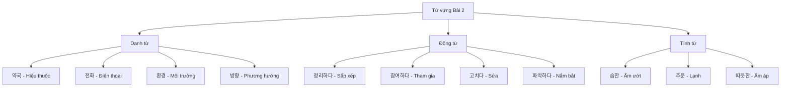
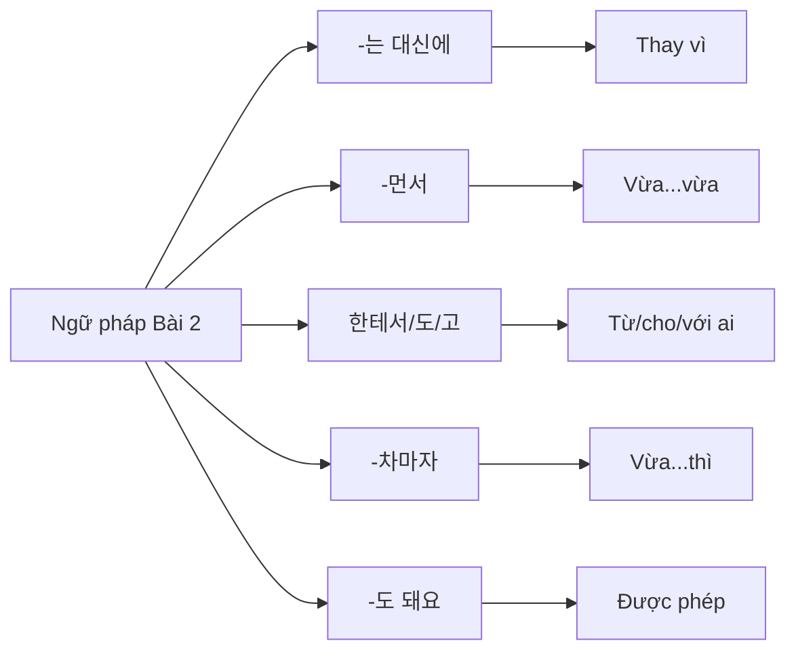
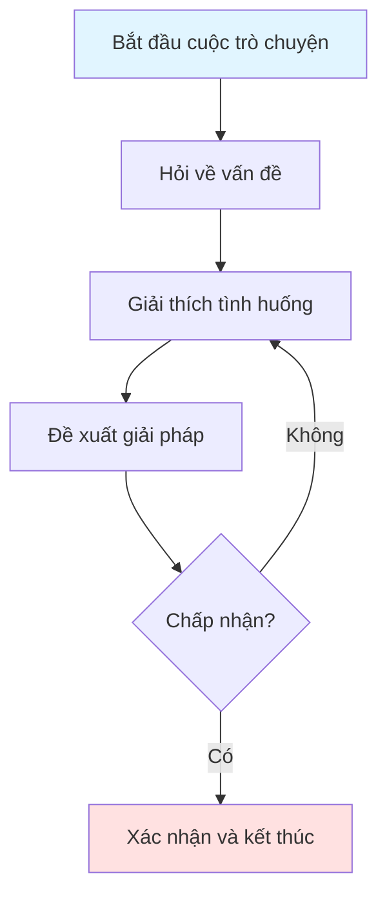
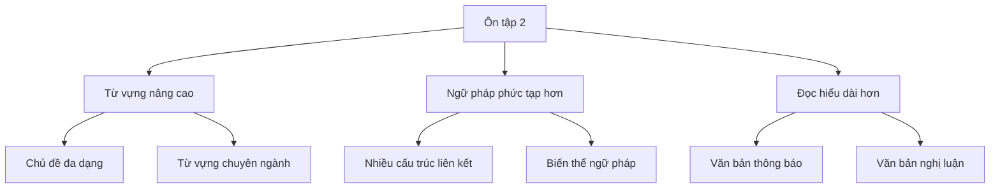

# 복습 2 - Ôn tập 2

## 📚 Giới thiệu

Bài ôn tập này tiếp tục củng cố kiến thức từ vựng và ngữ pháp đã học. Nội dung được trình bày theo phong cách sư phạm, tập trung vào việc hệ thống hóa kiến thức một cách logic và dễ hiểu.

---

## 📖 Phần 1: TỪ VỰNG (어휘)

### 1.1. Bảng từ vựng theo chủ đề

#### 🏥 Chủ đề: Địa điểm và Cơ sở

| Từ vựng | Nghĩa tiếng Việt | Ví dụ |
|---------|------------------|-------|
| 약국 | Hiệu thuốc | 머리가 아파요. 그래서 약국에 가요 |
| 학교 | Trường học | 학교에 가야 합니다 |
| 시장 | Chợ | 시장에서 물건을 삽니다 |
| 공항 | Sân bay | 공항에서 비행기를 탑니다 |

#### 📞 Chủ đề: Liên lạc và Giao tiếp

| Từ vựng | Nghĩa tiếng Việt | Ví dụ |
|---------|------------------|-------|
| 전화 | Điện thoại | 영화관에서는 휴대 전화의 소리를 꺼세요 |
| 진동 | Rung | 전화를 진동으로 설정하세요 |
| 출처 | Nguồn gốc | 정보의 출처를 확인해야 합니다 |
| 화면 | Màn hình | 화면이 깨졌어요 |

#### 📝 Chủ đề: Công việc và Hoạt động

| Từ vựng | Nghĩa tiếng Việt | Ví dụ |
|---------|------------------|-------|
| 습도 | Độ ẩm | 10도가 넘는 습도에 감기 환자가 갑자기 많아졌다고 합니다 |
| 호우 | Mưa lớn | 오늘은 호우가 내린다고 합니다 |
| 한파 | Rét đậm | 한파가 몰려옵니다 |
| 일교차 | Chênh lệch nhiệt độ ngày đêm | 일교차가 크니 조심하세요 |

#### 📖 Chủ đề: Đọc và Học tập

| Từ vựng | Nghĩa tiếng Việt | Ví dụ |
|---------|------------------|-------|
| 새다 | Rò rỉ | 파이프에서 물이 새요 |
| 잡지 | Tạp chí | 새로운 잡지를 샀어요 |
| 막히다 | Bị tắc | 하수구가 막혀서 물이 안 내려가요 |
| 깨지다 | Bị vỡ | 유리창이 깨져서 고쳐야 해요 |

#### 🏠 Chủ đề: Nhà cửa và Sinh hoạt

| Từ vựng | Nghĩa tiếng Việt | Ví dụ |
|---------|------------------|-------|
| 보냈어요 | Đã gửi | 가: 정월 대보름에 보통 뭐 해요? |
| 보낼게요 | Sẽ gửi | 나: 보름달을 보며 소원을 빌어요 |
| 보낼까요 | Gửi nhé | 편지를 보낼까요? |
| 보내요 | Gửi | 선물을 보내요 |

#### 🎯 Chủ đề: Hành động

| Từ vựng | Nghĩa tiếng Việt | Ví dụ |
|---------|------------------|-------|
| 정리하고 | Sắp xếp và | 동생이 지난달부터 학업과 직장 생활을 정리하고 있어서 정신없이 바빠요 |
| 참여하고 | Tham gia và | 동아리 활동에 참여하고 싶어요 |
| 되풀이하고 | Lặp lại và | 같은 실수를 되풀이하고 있어요 |
| 병행하고 | Song hành và | 일과 학업을 병행하고 있어요 |

#### 🚗 Chủ đề: Dịch vụ

| Từ vựng | Nghĩa tiếng Việt | Ví dụ |
|---------|------------------|-------|
| 통신사에 | Tại công ty viễn thông | 나는 얼마 전에 휴대 전화를 바꾸면서 다른 통신사에 갔어요 |
| 개통했다 | Đã khai trương | 새로운 노선을 개통했어요 |
| 가입했다 | Đã gia nhập | 동아리에 가입했어요 |
| 입력했다 | Đã nhập | 비밀번호를 입력했어요 |
| 접속했다 | Đã kết nối | 인터넷에 접속했어요 |

#### 🌍 Chủ đề: Môi trường

| Từ vựng | Nghĩa tiếng Việt | Ví dụ |
|---------|------------------|-------|
| 환경 | Môi trường | 가: 라민 씨, 이사한 집은 어때요? |
| 경치 | Cảnh quan | 경치가 아름다워요 |
| 방향 | Phương hướng | 어느 방향으로 가야 해요? |
| 형태 | Hình thái | 건물의 형태가 독특해요 |

#### 🔧 Chủ đề: Sửa chữa

| Từ vựng | Nghĩa tiếng Việt | Ví dụ |
|---------|------------------|-------|
| 고치려고 | Để sửa | 냉장고가 고장이 나서 수리하려고 서비스 센터에 전화했어요 |
| 연결하려고 | Để kết nối | 컴퓨터를 연결하려고 해요 |
| 사용하려고 | Để sử dụng | 이 기계를 사용하려고 해요 |
| 삭제하려고 | Để xóa | 파일을 삭제하려고 해요 |

#### 📊 Chủ đề: Hiểu biết

| Từ vựng | Nghĩa tiếng Việt | Ví dụ |
|---------|------------------|-------|
| 파악하지 | Nắm bắt | 입사한 지 얼마 되지 않아서 아직 업무를 다 파악하지 못했습니다 |
| 적응하지 | Thích nghi | 아직 환경에 적응하지 못했어요 |
| 완성하지 | Hoàn thành | 과제를 완성하지 못했어요 |
| 준비하지 | Chuẩn bị | 시험 준비를 준비하지 못했어요 |

### 1.2. Biểu đồ phân loại từ vựng

---

## 📘 Phần 2: NGỮ PHÁP (문법)

### 2.1. Cấu trúc ngữ pháp chính

#### 📌 Ngữ pháp 1: **보는 대신에**

**Chức năng:** Thay vì, thay cho

**Cấu trúc:**
- Động từ + -는 대신에

**Bảng chia động từ:**

| Động từ gốc | Dạng -는 대신에 | Ý nghĩa |
|-------------|----------------|---------|
| 보다 | 보는 대신에 | Thay vì xem |
| 먹다 | 먹는 대신에 | Thay vì ăn |
| 가다 | 가는 대신에 | Thay vì đi |

**Ví dụ minh họa:**

| Câu tiếng Hàn | Nghĩa tiếng Việt |
|---------------|------------------|
| 가: 이번 주말에 영화 보러 갈까요? | Cuối tuần này đi xem phim nhé? |
| 나: 날씨가 좋으니까 영화를 ( ) 공원에서 산책해요 | Thời tiết đẹp nên thay vì xem phim, đi dạo công viên |
| **보는 대신에** (Đáp án đúng) | **thay vì xem** |

#### 📌 Ngữ pháp 2: **마시면서**

**Chức năng:** Vừa... vừa..., trong khi

**Cấu trúc:**
- Động từ + -면서

**Bảng chia động từ:**

| Động từ gốc | Dạng -면서 | Ý nghĩa |
|-------------|-----------|---------|
| 마시다 | 마시면서 | Vừa uống |
| 먹다 | 먹으면서 | Vừa ăn |
| 듣다 | 들으면서 | Vừa nghe |

**Ví dụ minh họa:**

| Câu tiếng Hàn | Nghĩa tiếng Việt |
|---------------|------------------|
| 가: 후엔 씨, 무슨 일이 있었어요? 피곤해 보여요 | Huen, có chuyện gì không? Trông có vẻ mệt |
| 나: 어제 저녁에 커피를 ( ) 잠을 못 잤어요 | Tối qua vì uống cà phê nên không ngủ được |
| **마셔서** (Đáp án đúng) | **vì đã uống** |

#### 📌 Ngữ pháp 3: **한테서/한테도/한테/에게**

**Chức năng:** Từ ai đó, cho ai đó, với ai đó

**Cấu trúc:**
- Danh từ + 한테서/한테도/한테/에게

**Bảng so sánh:**

| Cấu trúc | Ý nghĩa | Ví dụ |
|----------|---------|-------|
| 한테서 | Từ (ai đó) | 친구한테서 선물을 받았어요 |
| 한테도 | Cho (ai đó) cũng | 동생한테도 주세요 |
| 한테 | Cho (ai đó) | 엄마한테 말했어요 |
| 에게 | Cho (ai đó) (lịch sự) | 선생님께 드리세요 |

**Ví dụ minh họa:**

| Câu tiếng Hàn | Nghĩa tiếng Việt |
|---------------|------------------|
| 가: 안젤라 씨는 매일 한국어를 공부해요? | Angela học tiếng Hàn mỗi ngày à? |
| 나: 네, 저는 아무리 ( ) 매일 한 시간씩 한국어를 공부해요 | Vâng, dù thế nào tôi cũng học tiếng Hàn 1 tiếng mỗi ngày |
| **힘들어도** (Đáp án đúng) | **dù vất vả** |

#### 📌 Ngữ pháp 4: **가면/가다가/가야만/가자마자**

**Chức năng:** Các cấu trúc liên quan đến động từ 가다

**Bảng so sánh:**

| Cấu trúc | Ý nghĩa | Ví dụ |
|----------|---------|-------|
| 가면 | Nếu đi | 학교에 가면 친구를 만나요 |
| 가다가 | Đi mà | 집에 가다가 넘어졌어요 |
| 가야만 | Chỉ khi đi | 직접 가야만 알 수 있어요 |
| 가자마자 | Vừa đi đến | 집에 가자마자 잤어요 |

**Ví dụ minh họa:**

| Câu tiếng Hàn | Nghĩa tiếng Việt |
|---------------|------------------|
| 가: 잠시도 씨, 어젯밤에 전화했는데 왜 안 받았어요? | Jamshid, tối qua gọi anh sao không nghe? |
| 나: 그랬어요? 어제 너무 피곤해서 집에 ( ) 곧 잠이 들었거든요 | Thế à? Hôm qua mệt quá nên về nhà là ngủ luôn |
| **가자마자** (Đáp án đúng) | **vừa về đến** |

#### 📌 Ngữ pháp 5: **전화하도 돼요**

**Chức năng:** Được phép, có thể

**Cấu trúc:**
- Động từ + -도 돼요

**Ví dụ minh họa:**

| Câu tiếng Hàn | Nghĩa tiếng Việt |
|---------------|------------------|
| 가: 이렇 씨에게 약속 장소를 말했어요? | Đã nói với Irene về địa điểm hẹn chưa? |
| 나: 그렇지 않아도 지금 이렇 씨에게 ( ) | Đúng lúc, tôi định gọi cho Irene |
| **전화하도 돼요** (Đáp án đúng) | **được phép gọi** |

#### 📌 Ngữ pháp 6: **하나요/하거든요/하잖아요/하는지 알아요**

**Chức năng:** Các dạng kết thúc câu khác nhau

**Bảng so sánh:**

| Cấu trúc | Ý nghĩa | Ví dụ |
|----------|---------|-------|
| 하나요? | Có... không? | 시간이 있나요? |
| 하거든요 | Vì/Là | 바쁘거든요 |
| 하잖아요 | Mà/Chứ | 알잖아요 |
| 하는지 알아요 | Có biết... không | 어디 가는지 알아요? |

**Ví dụ minh họa:**

| Câu tiếng Hàn | Nghĩa tiếng Việt |
|---------------|------------------|
| 가: 시간이 있을 때 보통 뭘 ( )? | Khi rảnh thường làm gì? |
| 나: 저는 영화를 보거나 친구를 만나요 | Tôi xem phim hoặc gặp bạn bè |
| **하나요** (Đáp án đúng) | **làm** |

#### 📌 Ngữ pháp 7: **일어나려면/일어나면서/일어나는데/일어나자마자**

**Chức năng:** Các cấu trúc liên quan thời gian

**Bảng so sánh:**

| Cấu trúc | Ý nghĩa | Ví dụ |
|----------|---------|-------|
| 일어나려면 | Nếu định dậy | 일찍 일어나려면 일찍 자야 해요 |
| 일어나면서 | Vừa dậy | 일어나면서 샤워해요 |
| 일어나는데 | Dậy mà | 늦게 일어나는데 지각했어요 |
| 일어나자마자 | Vừa dậy | 일어나자마자 밥을 먹어요 |

**Ví dụ minh họa:**

| Câu tiếng Hàn | Nghĩa tiếng Việt |
|---------------|------------------|
| 저는 아침에 ( ) 바로 세수를 해요 | Tôi dậy là rửa mặt ngay |
| **일어나자마자** (Đáp án đúng) | **vừa dậy** |

#### 📌 Ngữ pháp 8: **활발하고/활발하면/활발하다가/활발한 데다가**

**Chức năng:** Hoạt bát và các biến thể

**Bảng so sánh:**

| Cấu trúc | Ý nghĩa | Ví dụ |
|----------|---------|-------|
| 활발하고 | Hoạt bát và | 성격이 활발하고 친절해요 |
| 활발하면 | Nếu hoạt bát | 활발하면 친구가 많아져요 |
| 활발하다가 | Hoạt bát rồi | 활발하다가 갑자기 조용해졌어요 |
| 활발한 데다가 | Hoạt bát hơn nữa | 활발한 데다가 똑똑해요 |

#### 📌 Ngữ pháp 9: **먹을 것 같은데**

**Chức năng:** Có vẻ như sẽ

**Cấu trúc:**
- Động từ + -을 것 같은데

**Ví dụ minh họa:**

| Câu tiếng Hàn | Nghĩa tiếng Việt |
|---------------|------------------|
| 주말이라 사람이 ( ) 빨리 예약하세요 | Cuối tuần nên có vẻ đông người, đặt chỗ sớm nhé |
| **많을 것 같은데** (Đáp án đúng) | **có vẻ nhiều** |

#### 📌 Ngữ pháp 10: **준비하려고/준비할 수 있어요/준비하게 하셨어요/준비하는지 알아요**

**Chức năng:** Các dạng liên quan đến chuẩn bị

**Bảng so sánh:**

| Cấu trúc | Ý nghĩa | Ví dụ |
|----------|---------|-------|
| 준비하려고 | Để chuẩn bị | 시험을 준비하려고 공부해요 |
| 준비할 수 있어요 | Có thể chuẩn bị | 혼자 준비할 수 있어요 |
| 준비하게 하셨어요 | Bắt chuẩn bị | 선생님이 준비하게 하셨어요 |
| 준비하는지 알아요 | Biết chuẩn bị không | 어떻게 준비하는지 알아요? |

### 2.2. Biểu đồ cấu trúc ngữ pháp

### 2.3. Bảng tổng hợp ngữ pháp

| Ngữ pháp | Chức năng | Ví dụ | Nghĩa |
|----------|-----------|-------|-------|
| -는 대신에 | Thay vì | 영화 보는 대신에 산책해요 | Thay vì xem phim đi dạo |
| -먼서 | Vừa...vừa | 음악을 들으먼서 공부해요 | Vừa nghe nhạc vừa học |
| 한테서 | Từ ai đó | 친구한테서 들었어요 | Nghe từ bạn |
| -자마자 | Vừa...thì | 집에 가자마자 잤어요 | Về nhà là ngủ ngay |
| -도 돼요 | Được phép | 여기서 사진을 찍어도 돼요 | Ở đây được chụp ảnh |

---

## 📖 Phần 3: BÀI TẬP VẬN DỤNG

### 3.1. Bài tập từ vựng (Câu 1-10)

#### Câu 1:
영화관에서는 휴대 전화의 ( )을 꺼세요.

**Đáp án:**
- ① 액정
- ② **진동** ✓
- ③ 소리
- ④ 화면

#### Câu 2:
10도가 넘는 ( ) 때문에 감기 환자가 갑자기 많아졌다고 합니다.

**Đáp án:**
- ① 습도
- ② 호우
- ③ 한파
- ④ **일교차** ✓

#### Câu 3:
가: 욕실에 무슨 문제 있어요?
나: 네, 하수구가 ( ) 물이 잘 내려가지 않네요.

**Đáp án:**
- ① 새서
- ② 잡지서
- ③ **막혀서** ✓
- ④ 깨져서

### 3.2. Bài tập ngữ pháp (Câu 1-15)

#### Câu 1:
가: 후엔 씨, 무슨 일이 있었어요? 피곤해 보여요.
나: 어제 저녁에 커피를 ( ) 잠을 못 잤어요.

**Đáp án:**
- ① 마시면서
- ② 마시려고
- ③ 마셔야만
- ④ **마셔서** ✓

#### Câu 2:
가: 안젤라 씨는 매일 한국어를 공부해요?
나: 네, 저는 아무리 ( ) 매일 한 시간씩 한국어를 공부해요.

**Đáp án:**
- ① 힘들어서
- ② **힘들어도** ✓
- ③ 힘들고 해서
- ④ 힘들어 가지고

#### Câu 3:
가: 잠시도 씨, 어젯밤에 전화했는데 왜 안 받았어요?
나: 그랬어요? 어제 너무 피곤해서 집에 ( ) 곧 잠이 들었거든요.

**Đáp án:**
- ① 가면
- ② 가다가
- ③ 가야만
- ④ **가자마자** ✓

---

## 📖 Phần 4: ĐỌC HIỂU (읽기)

### 4.1. Đoạn văn 1: Thông báo tuyển sinh

**Nội dung:**

**나리 초등학교에서 방과 후 선생님을 모집합니다**

**모집 분야:** 중국어, 컴퓨터, 축구

**모집 인원:** 각 1명씩, 총 3명

**모집 기간:** 20XX. 1. 17.~1. 24.

**지원 자격:** 각 분야 대졸자, 또는 교사 자격증 소지자

**제출 서류:**
- 이력서, 자기 소개서, 졸업 증명서, 자격증

**지원 방법:**
- 방문(총 교무실) 또는 이메일 (nari_school@naver.com) 접수

**지원 문의:** (02) 345-9876

**Bản dịch:**

Trường tiểu học Nari tuyển giáo viên sau giờ học

**Lĩnh vực tuyển:** Tiếng Trung, Máy tính, Bóng đá

**Số lượng:** Mỗi lĩnh vực 1 người, tổng 3 người

**Thời gian tuyển:** Từ 17/1 đến 24/1/20XX

**Tư cách:** Tốt nghiệp đại học từng lĩnh vực hoặc có chứng chỉ giáo viên

**Hồ sơ nộp:**
- Sơ yếu lý lịch, tự giới thiệu, bằng tốt nghiệp, chứng chỉ

**Cách nộp:**
- Trực tiếp (phòng giáo vụ) hoặc email (nari_school@naver.com)

**Liên hệ:** (02) 345-9876

**Câu hỏi:**
다음 내용과 같은 것을 고르세요.

**Đáp án:**
- ① 이 학교에는 방과 후 영어 교실이 있다
- ② 대학교에서 컴퓨터를 전공한 사람은 지원할 수 있다 ✓
- ③ 지원자는 학적 후에 자격증을 제출하먼 된다
- ④ 지원 서류를 내기 위해서 반드시 학교에 가야 한다

### 4.2. Đoạn văn 2: Thông tin cho thuê phòng

**Nội dung:**

**원룸 - 보증금 500, 월세 40**

**주소:** OO시 OO동 OO빌라

**층/건물 층수:** 2층/4층

**상세 설명:**
- 근처에 지하철역, 편의점, 마트 있음
- 전방이 좋고 햇빛이 잘 들어옴
- 냉난방 시설, 냉장고, 싱크대, 인터넷 와이파이 있음

**문의:** OO공인 중개사(010-123-4989)

**Bản dịch:**

Phòng trọ - Đặt cọc 500, thuê tháng 40

**Địa chỉ:** Villa OO, phường OO, quận OO

**Tầng/Tổng tầng:** Tầng 2/4 tầng

**Mô tả chi tiết:**
- Gần ga tàu điện ngầm, cửa hàng tiện lợi, siêu thị
- Hướng tốt, ánh sáng tốt
- Có hệ thống điều hòa, tủ lạnh, bồn rửa, internet wifi

**Liên hệ:** Môi giới OO (010-123-4989)

**Câu hỏi:**
다음 내용과 같은 것을 고르세요.

**Đáp án:**
- ① 집에서 지하철역이 가깝지 않다
- ② **집에서 보는 전망이 좋다** ✓
- ③ 이사 올 사람은 냉장고를 사야 한다
- ④ 보증금 500만 원으로 계약할 수 있다

### 4.3. Đoạn văn 3: Về lễ tết

**Nội dung:**

가: 무슨 고민이 있어요? 기분이 안 좋아 보여요.
나: 요즘 계속 우울하고 잠도 잘 못 자요. 식욕도 없고요.
가: 지금 제가 막 산책하려 ( ). 그럼 기분이 좀 나아질 거예요. 그리고 일시적인 게 아니라면 상담을 좀 받아 보는 것도 좋고요.
나: 네, 알겠어요. 고마워요.

**Bản dịch:**

A: Có chuyện gì không? Trông có vẻ không vui.
B: Dạo này cứ buồn bã và cũng không ngủ được. Cũng không có cảm giác muốn ăn.
A: Bây giờ tôi định đi dạo. Vậy tâm trạng sẽ tốt hơn một chút. Và nếu không phải là tạm thời thì nên đi tư vấn một chút.
B: Vâng, hiểu rồi. Cảm ơn.

**Câu hỏi:**
ㅁ에 들어갈 알맞은 말을 고르세요.

**Đáp án:**
- ① 갈 만한 곳을 다녀왔어요
- ② 가차마자 기분이 좋아졌어요
- ③ 가게 왔는데 가 보러고 하세요
- ④ **가러던 참이었는데 같이 산책해요** ✓

### 4.4. Đoạn văn 4-5: Về căn nhà hợp

**Nội dung (Câu 4-5):**

겨울에서 봄으로 계절이 바뀌는 기간에 사람들은 쉽게 피로를 느끼게 된다. 온몸이 나른하고 졸음이 오는 상태가 보통 1~3주 정도 계속되는데 질병은 아니다. 이러한 ( ㅁ ) 남씨의 변화에 몸이 적응을 하지 못했기 때문이다. 춘곤증은 평소 규칙적이고 적당한 운동을 통해 예방할 수 있다. 또한 충분한 시간 동안 잠을 자는 것과 비타민을 먹는 것도 춘곤증 예방에 도움이 된다.

**Bản dịch:**

Trong giai đoạn chuyển mùa từ đông sang xuân, mọi người dễ cảm thấy mệt mỏi. Tình trạng toàn thân uể oải và buồn ngủ thường kéo dài khoảng 1-3 tuần nhưng không phải là bệnh. ( ㅁ ) là vì cơ thể chưa thích nghi với sự thay đổi thời tiết. Chứng buồn ngủ mùa xuân có thể phòng ngừa thông qua việc tập thể dục đều đặn và phù hợp bình thường. Ngoài ra, ngủ đủ thời gian và uống vitamin cũng giúp phòng ngừa chứng buồn ngủ mùa xuân.

**Câu 4:**
ㅁ에 들어갈 알맞은 말을 고르세요.

**Đáp án:**
- ① 춘곤증 문제의 해결법은
- ② **춘곤증이 나타나는 이유는** ✓
- ③ 춘곤증을 예방하기 위해서는
- ④ 춘곤증을 없앨 수 있는 방법은

**Câu 5:**
글의 내용과 같은 것을 고르세요.

**Đáp án:**
- ① 춘곤증은 가을에 주로 나타나는 증상이다
- ② 춘곤증은 병이 아니므로 따로 치료받을 필요가 없다
- ③ **규칙적으로 적당히 운동하면 춘곤증을 예방할 수 있다** ✓
- ④ 충분한 수면 시간과 춘곤증은 특별한 관계가 없다

### 4.5. Đoạn văn 6: Về căng thẳng trong cuộc sống

**Nội dung:**

직장 생활을 하다 보면 대인 관계나 야근 등으로 스트레스를 받을 때가 있다. 사람들은 보통 직장 생활의 어려움을 극복하기 위해 아무것도 하지 않고 휴식을 취한다고 한다. 그러나 아무것도 하지 않는 것보다 조금 더 적극적으로 자신의 문제를 해결해 보는 것이 좋다. 취미를 가지고 취미 생활을 해 보거나 야외 활동이나 동호회 활동을 하면 재충전의 시간을 가질 수 있을 것이다.

**Bản dịch:**

Khi làm việc ở công ty, có lúc bị căng thẳng do quan hệ với người khác hoặc làm thêm giờ. Người ta thường nói rằng để vượt qua khó khăn trong công việc, họ không làm gì cả và nghỉ ngơi. Tuy nhiên, tốt hơn là chủ động giải quyết vấn đề của mình một chút thay vì không làm gì. Nếu có sở thích và hoạt động sở thích, hoặc tham gia hoạt động ngoài trời hay câu lạc bộ thì có thể có thời gian tái tạo năng lượng.

**Câu hỏi:**
다음 글의 중심 내용으로 옳은 것을 고르세요.

**Đáp án:**
- ① 직장 생활을 할 때 스트레스를 받지 않아야 한다
- ② 직장에서 야근을 하먼 스트레스를 더 많이 받게 된다
- ③ 직장 생활의 스트레스는 적극적인 활동으로 푸는 것이 좋다 ✓
- ④ 직장에서 스트레스를 받을 때 휴식을 취하는 사람들이 많다

### 4.6. Đoạn văn 7-8: Về smartphone

**Nội dung:**

스마트폰 덕분에 많은 일을 쉽고 신속하게 해결할 수 있게 되었지만 스마트폰 때문에 생기는 문제점도 많다. 사람을 직접 만나서 소통하는 일이 줄어들었고 스마트폰에 중독되는 사람들이 많아졌다. 특히 어린이나 청소년들의 스마트폰 중독 문제는 심각하다. 또한 개인 정보나 사생활이 유출되기도 해서 사회적으로 문제가 되고 있다. 과유불급이라는 말처럼 ( ㅁ ), 스마트폰에 의존하지 않고 스마트폰을 잘 사용해야 한다.

**Bản dịch:**

Nhờ smartphone mà nhiều việc có thể giải quyết dễ dàng và nhanh chóng, nhưng cũng có nhiều vấn đề phát sinh do smartphone. Việc gặp gỡ trực tiếp và giao tiếp với người khác đã giảm, và số người nghiện smartphone đã tăng. Đặc biệt, vấn đề nghiện smartphone ở trẻ em hoặc thanh thiếu niên nghiêm trọng. Ngoài ra, thông tin cá nhân hoặc đời tư bị rò rỉ cũng đang trở thành vấn đề xã hội. Giống như câu nói "quá đáng thì không tốt" ( ㅁ ), không nên phụ thuộc vào smartphone mà phải sử dụng smartphone tốt.

**Câu 7:**
ㅁ에 들어갈 알맞은 말을 고르세요.

**Đáp án:**
- ① 어떤 일을 오래 하게 되먼 잘할 수 있게 된다
- ② 어떤 일을 많이 해서 모자라지 않게 해야 한다
- ③ 어떤 일의 정도가 심하먼 모자람이 없는 상황보다 좋다
- ④ **어떤 일의 정도가 지나친 것은 모자란 것보다 좋지 않다** ✓

**Câu 8:**
읽글의 중심 내용으로 옳은 것을 고르세요.

**Đáp án:**
- ① 스마트폰은 단점보다 장점이 더 많다
- ② 스마트폰을 지혜롭게 사용하는 것이 좋다 ✓
- ③ 문제가 많은 스마트폰을 사용하지 않아야 한다
- ④ 어린이들이 스마트폰 중독에 빠지먼 고치기 어렵다

---

## 🗣️ Phần 5: LUYỆN NÓI (말하기)

### 5.1. Tình huống 1: Dịch vụ trung tâm và sửa chữa

**Chủ đề thảo luận:**
- 무엇에 문제가 있어요?
- 어떤 문제가 있어요?

**Khung câu gợi ý:**

| Người | Câu nói |
|-------|---------|
| 가: | _________________________________ |
| 나: | _________________________________ |
| 가: | _________________________________ |
| 나: | _________________________________ |
| 가: | _________________________________ |
| 나: | _________________________________ |

### 5.2. Tình huống 2: Về bất động sản và nhà cửa

**Chủ đề thảo luận:**
- 집이 얼마예요?
- 두 집은 어떤 특징이 있어요?

**Khung câu gợi ý:**

| Người | Câu nói |
|-------|---------|
| 가: | _________________________________ |
| 나: | _________________________________ |
| 가: | _________________________________ |
| 나: | _________________________________ |
| 가: | _________________________________ |
| 나: | _________________________________ |

### 5.3. Sơ đồ luồng hội thoại

---

## ✍️ Phần 6: LUYỆN VIẾT (쓰기)

### 6.1. Bài tập viết 1: Hoàn thành đoạn hội thoại

**Đề bài:**
가: 요즘 일을 찾고 있다고 했지요? 무슨 일을 하고 싶어요?
나: 저는 병원에서 통역하는 일을 하고 싶어요.
가: 병원에서 통역을 하려먼 의료 통역 자격증을 미리 _____________.

**Yêu cầu:** Hoàn thành câu cuối cùng.

### 6.2. Bài tập viết 2: Về văn hóa Hàn Quốc

**Đề bài:**
가: 한국에서는 설날에 꼭 떡국을 먹어야 돼요?
나: 한국에서는 새해가 되먼 나이가 한 살 많아지잖아요. 설날에 떡국을 먹어야 나이가 한 살 더 많아진다고 생각해요.
가: 그렇군요. 선생님 덕분에 한국 문화를 잘 _____________.

**Yêu cầu:** Hoàn thành câu cuối cùng.

### 6.3. Bài tập viết 3: Viết về SNS

**Đề bài:**
다음 내용을 포함하여 '에스엔에스(SNS)와 의사소통'이라는 제목으로 글을 쓰세요.

**Nội dung cần bao gồm:**
- 에스엔에스(SNS)로 하는 의사소통의 장점
- 에스엔에스(SNS)로 하는 의사소통의 문제점
- 바람직한 의사소통 방법

**Khung bài viết:**

|  |  |  |  |  |  |  |  |  |  |  |  |  |  |  |  |
|--|--|--|--|--|--|--|--|--|--|--|--|--|--|--|--|
|  |  |  |  |  |  |  |  |  |  |  |  |  |  |  |  |
|  |  |  |  |  |  |  |  |  |  |  |  |  |  |  |  |

---

## 📊 Tổng kết và Đánh giá

### Bảng tự đánh giá

| Kỹ năng | Mức độ hoàn thành | Ghi chú |
|---------|-------------------|---------|
| Từ vựng | ☐ Tốt ☐ Khá ☐ Cần cải thiện | |
| Ngữ pháp | ☐ Tốt ☐ Khá ☐ Cần cải thiện | |
| Đọc hiểu | ☐ Tốt ☐ Khá ☐ Cần cải thiện | |
| Nói | ☐ Tốt ☐ Khá ☐ Cần cải thiện | |
| Viết | ☐ Tốt ☐ Khá ☐ Cần cải thiện | |

### Lộ trình học tập

```mermaid
graph LR
    A[Ôn từ vựng] --> B[Luyện ngữ pháp]
    B --> C[Thực hành bài tập]
    C --> D[Đọc hiểu văn bản]
    D --> E[Luyện giao tiếp]
    E --> F[Viết bài luận]
    F --> G[Kiểm tra tổng hợp]
    G --> H[Đánh giá kết quả]

    style A fill:#ffcccc
    style B fill:#ccffcc
    style C fill:#ccccff
    style D fill:#ffffcc
    style E fill:#ffccff
    style F fill:#ccffff
    style G fill:#ffddaa
    style H fill:#aaffdd
```

---

## 💡 Lời khuyên cho người học

### So sánh Bài 1 và Bài 2

### Phương pháp học hiệu quả

1. **Học từ vựng:**
   - Tập trung vào từ vựng chuyên đề
   - Học theo ngữ cảnh thực tế
   - Luyện tập với các tình huống

2. **Học ngữ pháp:**
   - Nắm vững các cấu trúc cơ bản
   - So sánh các dạng biến thể
   - Áp dụng vào viết và nói

3. **Luyện đọc:**
   - Đọc nhiều dạng văn bản
   - Phân tích cấu trúc bài
   - Tóm tắt ý chính

4. **Luyện nói:**
   - Thực hành các tình huống
   - Mở rộng vốn từ vựng
   - Tự tin giao tiếp

5. **Luyện viết:**
   - Viết theo chủ đề
   - Sử dụng ngữ pháp đã học
   - Kiểm tra và sửa lỗi

---

**📌 Ghi chú:** Tài liệu này được biên soạn từ "서울종합프로젝트(KIP) 한국어와 한국문화 중급 1" (Trang 214-223)
