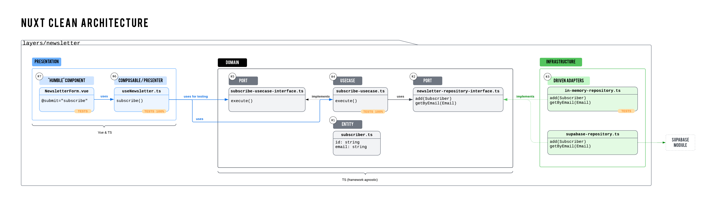

# Nuxt Clean Architecture with Layers

This project is structured around a **newsletter subscription feature**. It highlights how to organize code into distinct layers using the new Nuxt 4 file structure, making it modular, testable, and scalable.



## Key Concepts

0. **Shared Utils** (`app/shared`)
   - The `Result` type alias serves as a common type for success and failure responses.
   - The `Email` validation mechanism can be shared across the app.

1. **Presentation Layer**:
   - This includes the Vue component (`NewsletterForm.vue`) and a composable (`useNewsletter.ts`).
   - The component is designed as a "Humble Object" to be as simple as possible, with logic managed through the composable, keeping the component clean and focused on the view.

2. **Domain Layer**:
   - Contains the core business logic.
   - Includes the `Subscriber` entity, the `subscribe` use case, and interfaces for dependency inversion (`newsletter-repository-interface.ts` and `subscribe-usecase-interface.ts`).
   - This layer is framework-agnostic and does not depend on any Nuxt or Vue code, allowing for easy testing and high reusability.

3. **Infrastructure Layer**:
   - Contains adapters that implement the domain interfaces.
   - For example, `supabase-repository.ts` integrates with Supabase, while `in-memory-repository.ts` provides in-memory storage, ideal for testing.
   - This layer isolates external dependencies, making it easier to swap implementations if necessary.

## File Structure

The file structure follows Clean Architecture principles, divided as follows:

- **layers/newsletter**
  - `presentation`: Contains Vue components and composables. To simplify managing folders in the Nuxt context, components, composables, and pages folders are used directly within this layer.
  - `domain`: Contains entities, use cases, and interface definitions.
  - `infrastructure`: Contains adapters for interacting with external systems.
  - `__tests__`: Contains unit, integration, component, and e2e tests.

## Note on Driver Port

It was easier to use a repository factory for development and production purposes rather than relying on the `ISubscribeUseCase` argument for testing.

```ts
export const useNewsletter = (customSubscribeUseCase?: ISubscribeUseCase) => {
  const subscribeUseCase = customSubscribeUseCase || createSubscribeUseCase(createNewsletterRepository())
  //...
}
```

## Getting Started

1. **Install dependencies**: `pnpm install`
2. **Run tests**: `pnpm test` - This project includes 100% test coverage for use cases and in-memory repositories.
3. **Start the development server**: `pnpm dev`