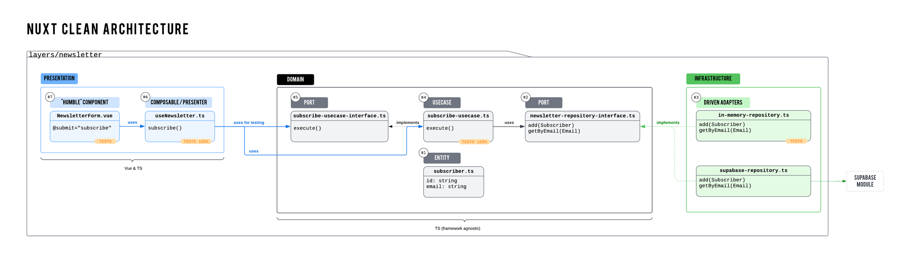

# nuxt-clean-architecture

Two things live here, and the first one is the reason to read it.

1. **A six-stage refactor**, `layers/version-01` through `version-06`, taking one
   small component from "everything inline" to "use case behind a repository
   interface" — one step at a time, each step runnable, each step's tests included.
2. **`layers/newsletter`**, the finished pattern applied to a real feature.

Most Clean Architecture examples show you the destination. This one shows the six
moves that get there and what each one actually buys, which is the part that is
hard to learn from a finished layer map.



---

## The refactor, stage by stage

The subject is deliberately mundane: a banner that appears when the app version
changes and hides once dismissed. Small enough to hold in your head, real enough
to have a bug in it.

| Stage | The move | What it buys | Test files |
|:--|:--|:--|--:|
| **01** | Everything in `VersionBanner01.vue` — `useRuntimeConfig()`, `localStorage`, `onMounted`, all inline | Nothing yet. This is the baseline, and the three `// CATCH:` comments mark a latent bug: the version can be `undefined` | 0 |
| **02** | Logic lifted into a `useVersion()` composable | The logic becomes reachable from a test at all | 3 |
| **03** | Presentation split from container — `VersionBannerUI.vue` renders, `VersionBanner03.vue` wires | The markup can be tested on props alone, with no `localStorage` in sight | 1 |
| **04** | The composable gets its own unit tests | Behaviour is pinned before it gets moved again | 4 |
| **05** | `onMounted` replaced by an explicit `init()` | The composable stops depending on the Vue lifecycle, so a test can drive it directly instead of mounting a component | 3 |
| **06** | `useVersion(repository)` takes an `IVersionRepository`; in-memory and `localStorage` implementations satisfy it | `localStorage` disappears from the composable entirely | 4 |

### The payoff is visible in stage 06

The interface declares `storeVersion: (version: string) => void`. The current
version, though, is `string | undefined`. So the moment the dependency is inverted,
the type checker refuses the call — and the bug that stage 01 could only mark with
a comment has to be handled:

```ts
const close = () => {
  isVisible.value = false
  if (version) repository.storeVersion(version)
}
```

That is the argument for the abstraction, in three lines. Not that it is tidier —
that it made a latent bug impossible to ignore.

Stage 06 also drops `VERSION_KEY` from the composable. Where the value is stored
stopped being the composable's business.

---

## The newsletter layer

The same shape, applied to a feature with rules worth having: subscribing an email
address to a newsletter.

```
layers/newsletter/
  domain/
    entities/subscriber.ts
    ports/newsletter-repository-interface.ts    ← declared here, implemented outside
    usecases/subscribe-use-case.ts
  repositories/
    in-memory-newsletter-repository.ts
    supabase-newsletter-repository.ts
    newsletter-repository-factory.ts
  composables/useNewsletter.ts
  components/NewsletterForm.vue                 ← a Humble Object: markup and events only
  pages/newsletter/
  __tests__/                                    unit · component · e2e
```

`subscribe-use-case.ts` is where the rules live: validate the address, reject a
duplicate, translate repository failures into messages a person can act on. It
imports its repository as an interface and never learns whether the answer came
from Supabase or a Map.

Failures are values, not exceptions. `app/shared/result.ts` defines a `Result`
type, so a use case returns `success(subscriber)` or
`failure('Email address already exists')` and callers must handle both.
`app/shared/email.ts` does the same for validation.

### On the repository factory

`useNewsletter` takes an optional use case and falls back to a factory:

```ts
export const useNewsletter = (customSubscribeUseCase?: ISubscribeUseCase) => {
  const subscribeUseCase = customSubscribeUseCase
    ?? createSubscribeUseCase(createNewsletterRepository())
  // …
}
```

A pragmatic compromise, and worth naming as one: strict constructor injection
would mean threading the use case through every caller, which in a Nuxt app means
provide/inject or a plugin. The optional argument keeps tests able to substitute a
double while production code stays terse. The cost is that the composable knows a
factory exists.

---

## Running it

The lockfile is pnpm's, and the project also installs cleanly with npm:

```bash
pnpm install       # or: npm install
pnpm dev

pnpm test:unit     # vitest, single run
pnpm test          # vitest in watch mode
pnpm test:coverage
pnpm test:e2e      # playwright
pnpm lint
pnpm build
```

CI runs install and build for this project. The Playwright e2e specs need browser
binaries and are not part of it.

Layers under `layers/` are auto-registered by Nuxt, so all six stages compile and
their tests all run. The home page deliberately renders only two of them —
`VersionBanner01` and `VersionBanner06`, the before and the after, stacked. The
intermediate banners exist and are labelled `(02)` … `(05)`; drop one into
`app/pages/index.vue` to see that stage running.

---

## Read alongside

- [`vue3-clean-architecture`](../vue3-clean-architecture/) — the same destination in a
  plain Vite SPA. Read it after this one to see what the pattern looks like with the
  meta-framework removed.
- [`rn_clean_architecture`](../rn_clean_architecture/) — the same layering on mobile.
- [`ARCHITECTURE.md`](../ARCHITECTURE.md) — the repository-wide contract.
