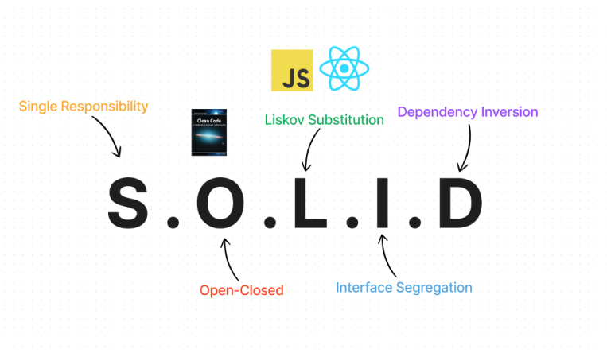

# React S.O.L.I.D Principles for writing clean-code



- SRP: Single Responsibility Principle
- OCP: Open-Closed Principle
- LSP: Liskov Substitution Principle
- ISP: Interface Segregation Principle
- DIP: Dependency Inversion Principle

## Code

This direcotry has examples for all principles implemented in React. Go inside `src/principle` there will be all principles there with isolated demos.

You can run the dev server using:

```bash
yarn install
yarn dev
```

### Or

```bash
npm install 
npm run dev
```

Change the component in `App.tsx` with the corresponding Principle's component name to see the demo.

### Example

```tsx
function App() {
  return (
    <div className="flex min-w-full h-full justify-center items-center p-8">
      {/* <SRP /> */}
      {/* <OCP /> */}
      {/* <LSP /> */}
      <DIP />
    </div>
  );
}
```
